# 📐 AIRA — Kiến trúc Hệ thống & Thiết kế Chi tiết

> **AIRA** (Academic Integrity & Research Assistant) — Nền tảng hỗ trợ nghiên cứu khoa học tích hợp AI  
> Phiên bản: 2.0 | Cập nhật: 2026-04-03

---

## 0. Verified Implementation Snapshot (Authoritative)

Đây là snapshot đã đối chiếu trực tiếp với mã nguồn hiện tại trong `~/NT208` (ngày kiểm tra: 2026-04-03).  
Nếu bất kỳ phần/diagram cũ bên dưới mâu thuẫn, ưu tiên snapshot này và `CODEX.md`.

- LLM runtime: `GroqLLMService` (`backend/app/services/llm_service.py`) với Groq chat-completions + function calling.
- Context protection: sliding window 4 messages, truncate history 2000 chars/message, truncate active input 10000 chars.
- Pass-by-reference routing: văn bản dài hoặc `<Attached_Document>` được cache in-memory và gửi sang LLM bằng metadata (`document_id`, `length`) thay vì raw text.
- Với input dài không tách được query rõ ràng, router nhận query suy diễn an toàn (intent-based), không nhận đoạn trích raw body.
- Document cache policy: cache in-memory có TTL và giới hạn số entry để tránh tăng trưởng vô hạn.
- Tool execution: `_execute_tool_call()` resolve `document_id` -> full text ngay trước khi chạy tool local.
- Với request explicit citation/retraction, backend có đường thực thi xác định (deterministic direct execution), không phụ thuộc Groq chọn tool.
- Khi request cố ý yêu cầu cả citation + retraction, backend trả grouped payload (`tool_results.type = "multi_tool_report"`, `groups[]`) để frontend render nhiều card riêng theo từng tool family.
- Với `detect_ai_writing` và `check_grammar`, Groq chỉ được phép gọi tool bằng `document_id`; không còn contract text-based ở Groq-facing schema.
- Nếu request không có `document_id` hợp lệ trong scope hiện tại, Groq sẽ không được cấp schema của các tool document-only (`detect_ai_writing`, `check_grammar`).
- FC loop hygiene: chỉ tool non-terminal mới gửi compact tool feedback về model; tool terminal (AI detection/grammar) trả kết quả sớm từ backend.
- Khi có nhiều tool_calls trong một response, assistant text được đồng bộ theo grouped tool-state để tránh lệch nghĩa với card dữ liệu.
- Pseudo tool syntax không có native `tool_calls` được coi là đường đi không hợp lệ và sẽ chuyển fallback hoặc trả warning hợp lệ.
- Grammar corrected_text dùng cơ chế auto-apply bảo thủ: chỉ áp dụng low-risk fixes; các sửa đổi rủi ro (thuật ngữ khoa học, acronym, DOI-like identifiers...) chỉ được report trong `issues`, không tự sửa.
- AI-writing verdict là ước lượng xác suất từ mô hình/heuristics, không được diễn đạt như bằng chứng kết luận tuyệt đối.
- Retraction scan khi không có DOI được biểu diễn rõ là `total_checked=0` và `no_doi_found=true`.
- Journal vector pipeline: ChromaDB `journal_cfps` + `allenai/specter2_base` (768-dim) cho ingest và retrieval.
- Heuristic fallback: `all-MiniLM-L6-v2` chỉ còn dùng cho fallback intent classification (`heuristic_router.py`), không dùng cho JournalFinder vector retrieval.
- Heuristic fallback chỉ được gọi các tool thuộc tập đã expose ở request hiện tại (`allowed_tool_names`).
- Crawler stack: `UniversalScraper` dùng DrissionPage (CDP Chromium automation), không dùng `cloudscraper`.
- Session title UX: backend tự sinh title ngắn cho message đầu tiên và trả session đã cập nhật để frontend sync sidebar ngay.

---

## Mục lục

1. [Sơ đồ Kiến trúc Hệ thống (System Architecture)](#1-sơ-đồ-kiến-trúc-hệ-thống)
2. [Mô tả Module chính](#2-mô-tả-module-chính)
3. [Thiết kế Luồng dữ liệu (DFD)](#3-thiết-kế-luồng-dữ-liệu-dfd)
4. [Sơ đồ Component — Luồng Upload & Xử lý file PDF](#4-sơ-đồ-component--luồng-upload--xử-lý-file-pdf)
5. [Sơ đồ UML](#5-sơ-đồ-uml)
   - 5.1 [Use-case Diagram](#51-use-case-diagram)
   - 5.2 [Component Flow Diagrams](#52-component-flow-diagrams) (incl. 5.2.8 Grammar Checker)
6. [Thiết kế Cơ sở dữ liệu (ERD)](#6-thiết-kế-cơ-sở-dữ-liệu-erd)
7. [Tích hợp API & Dịch vụ bên ngoài](#7-tích-hợp-api--dịch-vụ-bên-ngoài) (incl. 7.2.6 Resiliency & Fallback 3-tier)

---

## 1. Sơ đồ Kiến trúc Hệ thống

### 1.1 Kiến trúc Tổng quan (System Architecture Overview)

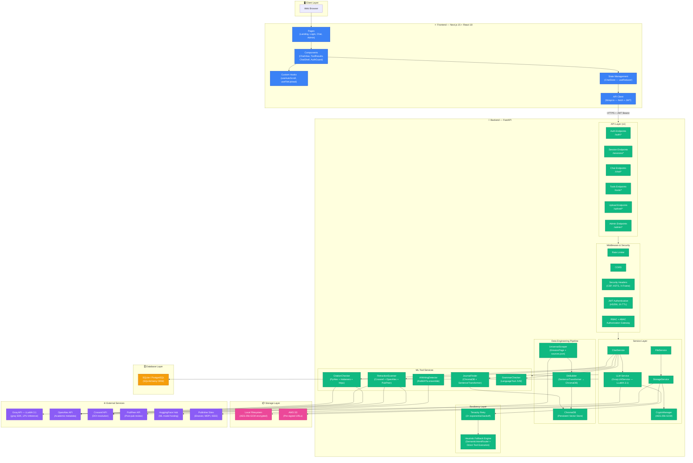
```mermaid
graph TB
    subgraph CLIENT["🖥️ Client Layer"]
        Browser["Web Browser"]
    end

    subgraph FRONTEND["⚛️ Frontend — Next.js 15 + React 18"]
        direction TB
        Pages["Pages<br/>(Landing, Login, Chat, Admin)"]
        Components["Components<br/>(ChatView, ToolResults,<br/>ChatShell, AuthGuard)"]
        Hooks["Custom Hooks<br/>(useAutoScroll, useFileUpload)"]
        Store["State Management<br/>(ChatStore — useReducer)"]
        APIClient["API Client<br/>(lib/api.ts — fetch + JWT)"]
    end

    subgraph BACKEND["🐍 Backend — FastAPI"]
        direction TB

        subgraph API_LAYER["API Layer (v1)"]
            AuthEP["Auth Endpoints<br/>/auth/*"]
            SessionEP["Session Endpoints<br/>/sessions/*"]
            ChatEP["Chat Endpoints<br/>/chat/*"]
            ToolsEP["Tools Endpoints<br/>/tools/*"]
            UploadEP["Upload Endpoints<br/>/upload/*"]
            AdminEP["Admin Endpoints<br/>/admin/*"]
        end

        subgraph MIDDLEWARE["Middleware & Security"]
            RateLimit["Rate Limiter"]
            CORS["CORS"]
            SecurityHeaders["Security Headers<br/>(CSP, HSTS, X-Frame)"]
            JWTAuth["JWT Authentication<br/>(HS256, 1h TTL)"]
            RBAC["RBAC + ABAC<br/>Authorization Gateway"]
        end

        subgraph SERVICE_LAYER["Service Layer"]
            ChatSvc["ChatService"]
            FileSvc["FileService"]
            LLMSvc["LLM Service<br/>(GroqLLMService — LLaMA 3.1)"]
            StorageSvc["StorageService"]
            CryptoMgr["CryptoManager<br/>(AES-256-GCM)"]
        end

        subgraph TOOL_LAYER["ML Tool Services"]
            CitChecker["CitationChecker<br/>(PyAlex + Habanero + httpx)"]
            JournalFinder["JournalFinder<br/>(ChromaDB + SentenceTransformer)"]
            RetractScan["RetractionScanner<br/>(Crossref + OpenAlex + PubPeer)"]
            AIDetector["AIWritingDetector<br/>(RoBERTa ensemble)"]
            GrammarCheck["GrammarChecker<br/>(LanguageTool JVM)"]
        end

        subgraph DATA_PIPELINE["Data Engineering Pipeline"]
            Crawler["UniversalScraper<br/>(DrissionPage + sources.json)"]
            DbBuilder["DbBuilder<br/>(SentenceTransformer → ChromaDB)"]
            ChromaDB["ChromaDB<br/>(Persistent Vector Store)"]
        end

        subgraph FALLBACK_LAYER["Resiliency Layer"]
            Tenacity["Tenacity Retry<br/>(3× exponential backoff)"]
            HeuristicEngine["Heuristic Fallback Engine<br/>(SemanticIntentRouter +<br/>Direct Tool Execution)"]
        end
    end

    subgraph DATABASE["🗄️ Database Layer"]
        SQLite["SQLite / PostgreSQL<br/>(SQLAlchemy ORM)"]
    end

    subgraph STORAGE["📦 Storage Layer"]
        LocalFS["Local Filesystem<br/>(AES-256-GCM encrypted)"]
        S3["AWS S3<br/>(Pre-signed URLs)"]
    end

    subgraph EXTERNAL["🌐 External Services"]
        GroqAPI["Groq API — LLaMA 3.1<br/>(groq SDK, LPU inference)"]
        OpenAlex["OpenAlex API<br/>(Academic metadata)"]
        Crossref["Crossref API<br/>(DOI resolution)"]
        PubPeer["PubPeer API<br/>(Post-pub review)"]
        HuggingFace["HuggingFace Hub<br/>(ML model hosting)"]
        Publishers["Publisher Sites<br/>(Elsevier, MDPI, IEEE)"]
    end

    Browser --> Pages
    Pages --> Components
    Components --> Hooks
    Components --> Store
    Store --> APIClient
    APIClient -->|"HTTPS + JWT Bearer"| API_LAYER

    API_LAYER --> MIDDLEWARE
    MIDDLEWARE --> SERVICE_LAYER
    SERVICE_LAYER --> TOOL_LAYER

    ChatSvc --> LLMSvc
    LLMSvc --> Tenacity
    Tenacity --> HeuristicEngine
    ChatSvc --> CitChecker
    ChatSvc --> JournalFinder
    ChatSvc --> RetractScan
    ChatSvc --> GrammarCheck
    FileSvc --> StorageSvc
    StorageSvc --> CryptoMgr

    SERVICE_LAYER --> SQLite
    StorageSvc --> LocalFS
    StorageSvc --> S3

    LLMSvc --> GroqAPI
    CitChecker --> OpenAlex
    CitChecker --> Crossref
    RetractScan --> Crossref
    RetractScan --> OpenAlex
    RetractScan --> PubPeer
    JournalFinder --> ChromaDB
    Crawler --> Publishers
    Crawler --> DbBuilder
    DbBuilder --> ChromaDB
    AIDetector --> HuggingFace

    classDef frontend fill:#3b82f6,color:#fff,stroke:#1e40af
    classDef backend fill:#10b981,color:#fff,stroke:#047857
    classDef database fill:#f59e0b,color:#fff,stroke:#b45309
    classDef external fill:#8b5cf6,color:#fff,stroke:#6d28d9
    classDef storage fill:#ec4899,color:#fff,stroke:#be185d

    class Pages,Components,Hooks,Store,APIClient frontend
    class AuthEP,SessionEP,ChatEP,ToolsEP,UploadEP,AdminEP,RateLimit,CORS,SecurityHeaders,JWTAuth,RBAC,ChatSvc,FileSvc,LLMSvc,StorageSvc,CryptoMgr,CitChecker,JournalFinder,RetractScan,AIDetector,GrammarCheck,Tenacity,HeuristicEngine,Crawler,DbBuilder,ChromaDB backend
    class SQLite database
    class GroqAPI,OpenAlex,Crossref,PubPeer,HuggingFace,Publishers external
    class LocalFS,S3 storage
```

### 1.2 Kiến trúc Phân tầng (Layered Architecture)

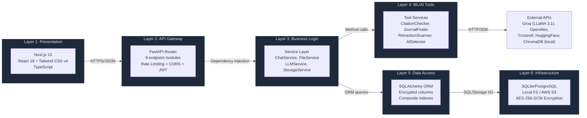
```mermaid
graph LR
    subgraph L1["Layer 1: Presentation"]
        FE["Next.js 15<br/>React 18 + Tailwind CSS v4<br/>TypeScript"]
    end

    subgraph L2["Layer 2: API Gateway"]
        GW["FastAPI Router<br/>6 endpoint modules<br/>Rate Limiting + CORS + JWT"]
    end

    subgraph L3["Layer 3: Business Logic"]
        BL["Service Layer<br/>ChatService, FileService<br/>LLMService, StorageService"]
    end

    subgraph L4["Layer 4: ML/AI Tools"]
        ML["Tool Services<br/>CitationChecker, JournalFinder<br/>RetractionScanner, AIDetector"]
    end

    subgraph L5["Layer 5: Data Access"]
        DA["SQLAlchemy ORM<br/>Encrypted columns<br/>Composite indexes"]
    end

    subgraph L6["Layer 6: Infrastructure"]
        INFRA["SQLite/PostgreSQL<br/>Local FS / AWS S3<br/>AES-256-GCM Encryption"]
    end

    L1 -->|"HTTPS/JSON"| L2
    L2 -->|"Dependency Injection"| L3
    L3 -->|"Method calls"| L4
    L3 -->|"ORM queries"| L5
    L5 -->|"SQL/Storage I/O"| L6
    L4 -->|"HTTP/SDK"| EXT["External APIs<br/>Groq (LLaMA 3.1), OpenAlex,<br/>Crossref, HuggingFace,<br/>ChromaDB (local)"]

    classDef layer fill:#1e293b,color:#e2e8f0,stroke:#334155
    class L1,L2,L3,L4,L5,L6 layer
```

---

## 2. Mô tả Module chính

### 2.1 Frontend Modules

| Module | File(s) | Chức năng |
|--------|---------|-----------|
| **Pages** | `app/page.tsx`, `app/login/page.tsx`, `app/chat/page.tsx`, `app/admin/page.tsx` | 4 trang chính: Landing, Đăng nhập/Đăng ký, Chat AI, Admin Dashboard |
| **ChatView** | `components/chat-view.tsx` | Giao diện chat chính: hiển thị tin nhắn, input area, file attachment, Markdown rendering |
| **ToolResults** | `components/tool-results.tsx` (~515 LOC) | 6 component render kết quả tools: `JournalListCard`, `CitationReportCard`, `RetractionReportCard`, `AIDetectionCard`, `PdfSummaryCard`, `ToolResultRenderer` |
| **ChatShell** | `components/chat-shell.tsx` | Sidebar: danh sách sessions, chuyển theme, thông tin user |
| **AuthGuard** | `components/auth-guard.tsx` | HOC bảo vệ route: redirect nếu chưa đăng nhập hoặc không phải admin |
| **ChatStore** | `lib/chat-store.tsx` | State management dùng `useReducer`: quản lý sessions, messages, loading states |
| **API Client** | `lib/api.ts` | 25 API methods + error handling + JWT token injection |
| **Auth Context** | `lib/auth.tsx` | React Context cho authentication: login, register, logout, token management |
| **Hooks** | `hooks/useAutoScroll.ts`, `hooks/useFileUpload.ts` | Smart scroll (chỉ scroll khi có message mới), Drag-and-drop file upload |

### 2.2 Backend Modules

| Module | File(s) | Chức năng |
|--------|---------|-----------|
| **Auth Endpoints** | `api/v1/endpoints/auth.py` | `POST /register`, `POST /login`, `GET /me`, `POST /promote` — Đăng ký, đăng nhập, lấy user info, promote role |
| **Session Endpoints** | `api/v1/endpoints/sessions.py` | `POST/GET/PATCH/DELETE /sessions` — CRUD sessions với pagination |
| **Chat Endpoints** | `api/v1/endpoints/chat.py` | `POST /chat/completions`, `POST /chat/{session_id}` — Gửi message, nhận AI response |
| **Tools Endpoints** | `api/v1/endpoints/tools.py` | 6 tool APIs: verify-citation, journal-match, retraction-scan, summarize-pdf, detect-ai-writing, ai-detect |
| **Upload Endpoints** | `api/v1/endpoints/upload.py` | `POST /upload`, `GET /upload/{file_id}`, `GET /upload/list_files` — Upload, download, list files |
| **Admin Endpoints** | `api/v1/endpoints/admin.py` | `GET /admin/overview`, `GET /admin/users`, `GET /admin/files` — Dashboard stats, quản lý users & files |

### 2.3 Service Layer

| Service | File | Chức năng |
|---------|------|-----------|
| **ChatService** | `services/chat_service.py` | Orchestration: tạo session, lưu message, gọi LLM/tools theo mode, auto-detect title |
| **LLMService** (GroqLLMService) | `services/llm_service.py` | Wrapper Groq (LLaMA 3.1) với **Function Calling**: `generate_response()` (FC loop + 5 tools), `summarize_text()`, `generate_simple()` — dùng `groq` SDK với OpenAI-compatible tool schemas |
| **FileService** | `services/file_service.py` | Upload workflow: validate → encrypt → store → extract text (PDF via PyMuPDF) |
| **StorageService** | `services/storage_service.py` | Dual-backend abstraction: Local FS hoặc AWS S3, AES-256-GCM encryption, pre-signed URLs |
| **CryptoManager** | `core/crypto.py` | Master key management, AES-256-GCM encrypt/decrypt cho files và DB columns |
| **Bootstrap** | `services/bootstrap.py` | Tạo admin account mặc định khi startup (skip nếu non-dev + insecure password) |

### 2.4 ML Tool Services

| Tool | File | ML Model / API | Chức năng |
|------|------|----------------|-----------|
| **CitationChecker** | `tools/citation_checker.py` | PyAlex + Habanero + httpx | Verify citations: extract DOI → query OpenAlex/Crossref → fuzzy match → confidence score |
| **JournalFinder** | `tools/journal_finder.py` | ChromaDB + SentenceTransformer (`allenai/specter2_base`) | Recommend journals: query ChromaDB `journal_cfps` collection with Specter2 embeddings (768-dim) + bounded similarity scoring. Data seeded by `backend/crawler/` pipeline |
| **RetractionScanner** | `tools/retraction_scan.py` | Crossref + OpenAlex + PubPeer | Scan DOIs: check retraction status, risk level, title-based detection, PubPeer comments |
| **AIWritingDetector** | `tools/ai_writing_detector.py` | RoBERTa (`roberta-base-openai-detector`) | Detect AI text: ensemble 70% ML (RoBERTa) + 30% rule-based (7 features) |
| **GrammarChecker** | `tools/grammar_checker.py` | LanguageTool (JVM server) | Offline grammar & spell checking: singleton JVM, lazy init, full issues + conservative auto-correct (risky edits are skipped) |

### 2.5 Security & Middleware

| Component | File | Chức năng |
|-----------|------|-----------|
| **JWT Auth** | `core/security.py` | HS256 tokens: `iat`, `jti`, `exp` claims, 1h TTL, bcrypt password hashing |
| **RBAC + ABAC** | `core/authorization.py` | Role-based (ADMIN/RESEARCHER) + Attribute-based (ownership check) access control |
| **Rate Limiter** | `core/rate_limit.py` | IP-based rate limiting, X-Forwarded-For protection, periodic memory cleanup |
| **Security Headers** | `core/middleware.py` | CSP, HSTS, X-Frame-Options, X-Content-Type-Options |
| **Encrypted Types** | `core/encrypted_types.py` | SQLAlchemy custom types: `EncryptedText`, `EncryptedJSON` — transparent AES-256-GCM |
| **Audit Logger** | `core/audit.py` | Structured audit events: login, register, admin actions, file operations |

---

## 3. Thiết kế Luồng dữ liệu (DFD)

### 3.1 DFD Level 0 — Context Diagram

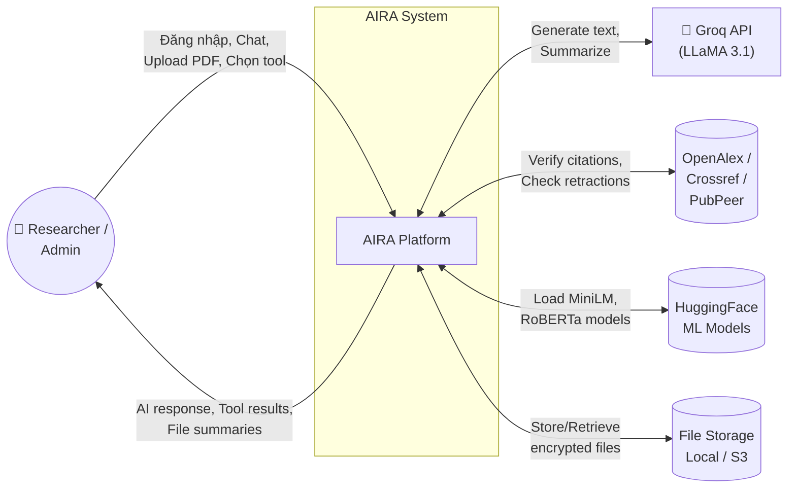
```mermaid
graph LR
    User(("👤 Researcher /<br/>Admin"))

    subgraph AIRA["AIRA System"]
        System["AIRA Platform"]
    end

    GroqLLM["🤖 Groq API<br/>(LLaMA 3.1)"]
    AcademicDB[("OpenAlex /<br/>Crossref /<br/>PubPeer")]
    HF[("HuggingFace<br/>ML Models")]
    Storage[("File Storage<br/>Local / S3")]

    User -->|"Đăng nhập, Chat,<br/>Upload PDF, Chọn tool"| System
    System -->|"AI response, Tool results,<br/>File summaries"| User

    System <-->|"Generate text,<br/>Summarize"| GroqLLM
    System <-->|"Verify citations,<br/>Check retractions"| AcademicDB
    System <-->|"Load MiniLM,<br/>RoBERTa models"| HF
    System <-->|"Store/Retrieve<br/>encrypted files"| Storage
```

### 3.2 DFD Level 1 — Main Processes

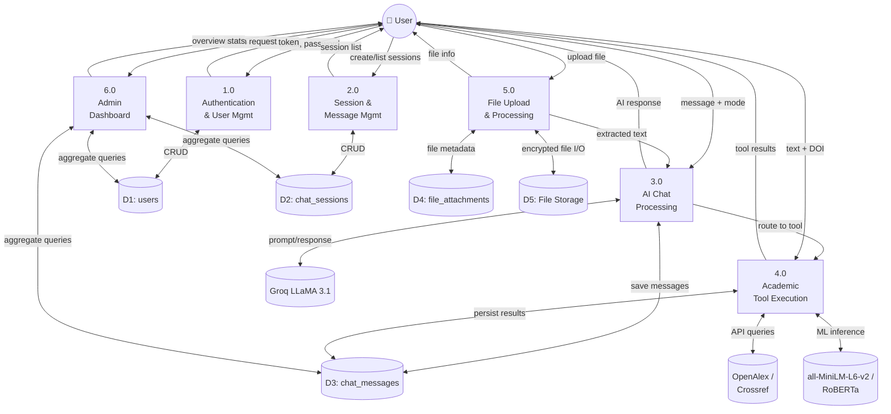
```mermaid
graph TB
    User(("👤 User"))

    P1["1.0<br/>Authentication<br/>& User Mgmt"]
    P2["2.0<br/>Session &<br/>Message Mgmt"]
    P3["3.0<br/>AI Chat<br/>Processing"]
    P4["4.0<br/>Academic<br/>Tool Execution"]
    P5["5.0<br/>File Upload<br/>& Processing"]
    P6["6.0<br/>Admin<br/>Dashboard"]

    DS1[("D1: users")]
    DS2[("D2: chat_sessions")]
    DS3[("D3: chat_messages")]
    DS4[("D4: file_attachments")]
    DS5[("D5: File Storage")]

    GroqLLM[("Groq LLaMA 3.1")]
    ExtAPIs[("OpenAlex /<br/>Crossref")]
    MLModels[("all-MiniLM-L6-v2 /<br/>RoBERTa")]

    User -->|"email, password"| P1
    P1 -->|"JWT token"| User
    P1 <-->|"CRUD"| DS1

    User -->|"create/list sessions"| P2
    P2 <-->|"CRUD"| DS2
    P2 -->|"session list"| User

    User -->|"message + mode"| P3
    P3 <-->|"save messages"| DS3
    P3 -->|"AI response"| User
    P3 <-->|"prompt/response"| GroqLLM
    P3 -->|"route to tool"| P4

    User -->|"text + DOI"| P4
    P4 <-->|"persist results"| DS3
    P4 -->|"tool results"| User
    P4 <-->|"API queries"| ExtAPIs
    P4 <-->|"ML inference"| MLModels

    User -->|"upload file"| P5
    P5 <-->|"file metadata"| DS4
    P5 <-->|"encrypted file I/O"| DS5
    P5 -->|"file info"| User
    P5 -->|"extracted text"| P3

    User -->|"admin request"| P6
    P6 <-->|"aggregate queries"| DS1
    P6 <-->|"aggregate queries"| DS2
    P6 <-->|"aggregate queries"| DS3
    P6 -->|"overview stats"| User
```

### 3.3 DFD Level 2 — Chi tiết Process 4.0 (Academic Tool Execution)

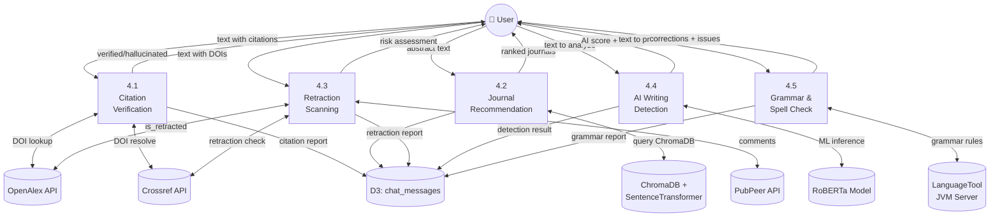
```mermaid
graph TB
    User(("👤 User"))
    DS3[("D3: chat_messages")]

    P4_1["4.1<br/>Citation<br/>Verification"]
    P4_2["4.2<br/>Journal<br/>Recommendation"]
    P4_3["4.3<br/>Retraction<br/>Scanning"]
    P4_4["4.4<br/>AI Writing<br/>Detection"]
    P4_5["4.5<br/>Grammar &<br/>Spell Check"]

    OpenAlex[("OpenAlex API")]
    Crossref[("Crossref API")]
    PubPeer[("PubPeer API")]
    ChromaDB[("ChromaDB +<br/>SentenceTransformer")]
    RoBERTa[("RoBERTa Model")]
    LangTool[("LanguageTool<br/>JVM Server")]

    User -->|"text with citations"| P4_1
    P4_1 <-->|"DOI lookup"| OpenAlex
    P4_1 <-->|"DOI resolve"| Crossref
    P4_1 -->|"citation report"| DS3
    P4_1 -->|"verified/hallucinated"| User

    User -->|"abstract text"| P4_2
    P4_2 <-->|"query ChromaDB"| ChromaDB
    P4_2 -->|"journal list"| DS3
    P4_2 -->|"ranked journals"| User

    User -->|"text with DOIs"| P4_3
    P4_3 <-->|"retraction check"| Crossref
    P4_3 <-->|"is_retracted"| OpenAlex
    P4_3 <-->|"comments"| PubPeer
    P4_3 -->|"retraction report"| DS3
    P4_3 -->|"risk assessment"| User

    User -->|"text to analyze"| P4_4
    P4_4 <-->|"ML inference"| RoBERTa
    P4_4 -->|"detection result"| DS3
    P4_4 -->|"AI score + verdict"| User

    User -->|"text to proofread"| P4_5
    P4_5 <-->|"grammar rules"| LangTool
    P4_5 -->|"grammar report"| DS3
    P4_5 -->|"corrections + issues"| User
```

---

## 4. Sơ đồ Component — Luồng Upload & Xử lý file PDF

### 4.1 Component Diagram — Tổng quan luồng Upload PDF


```mermaid
graph TB
    subgraph FRONTEND["⚛️ Frontend (Next.js)"]
        direction TB
        ChatView["ChatView<br/>components/chat-view.tsx"]
        FileHook["useFileUpload Hook<br/>lib/useFileUpload.ts"]
        FileInput["&lt;input type=file&gt;<br/>Drag-and-Drop zone"]
        APIClient["API Client<br/>lib/api.ts"]
        PdfCard["PdfSummaryCard<br/>components/tool-results.tsx"]

        FileInput -->|"onFileChange()"| FileHook
        FileHook -->|"validate (type, size)"| FileHook
        FileHook -->|"api.uploadFile(token, sessionId, file)"| APIClient
        ChatView -->|"openFilePicker()"| FileInput
        ChatView -->|"render kết quả"| PdfCard
    end

    subgraph API_GATEWAY["🔒 API Gateway (FastAPI)"]
        direction TB
        UploadEP["POST /api/v1/upload<br/>endpoints/upload.py"]
        SummarizeEP["POST /api/v1/tools/summarize-pdf<br/>endpoints/tools.py"]
        DownloadEP["GET /api/v1/upload/{file_id}<br/>endpoints/upload.py"]

        subgraph AUTH["Middleware Chain"]
            RateLimit["Rate Limiter"]
            JWT["JWT Verification<br/>(HS256, 1h TTL)"]
            RBAC["RBAC Check<br/>Permission.FILE_UPLOAD /<br/>Permission.TOOL_EXECUTE"]
            SessionACL["Session Access Control<br/>ABAC — ownership check"]
        end

        RateLimit --> JWT --> RBAC --> SessionACL
    end

    subgraph SERVICES["⚙️ Service Layer"]
        direction TB
        FileSvc["FileService<br/>services/file_service.py"]
        ChatSvc["ChatService<br/>services/chat_service.py"]
        LLMSvc["GroqLLMService<br/>services/llm_service.py"]

        subgraph FILE_OPS["FileService Operations"]
            Validate["validate_mime_type()<br/>sanitize_filename()<br/>_is_pdf_payload()"]
            ExtractText["extract_pdf_text()<br/>→ PyMuPDF (fitz)"]
            SaveUpload["save_upload()"]
            DownloadFile["download_file()"]
        end
    end

    subgraph STORAGE_LAYER["📦 Storage Layer"]
        direction TB
        StorageSvc["StorageService<br/>services/storage_service.py"]

        subgraph STORAGE_OPS["StorageService Operations"]
            GenKey["generate_key()<br/>→ {user_id}/{session_id}/{uuid}-{filename}"]
            Upload["upload(data, key, encrypt=True)"]
            Download["download(key, decrypt=True)"]
            Checksum["calculate_checksum()<br/>→ MD5"]
        end

        subgraph BACKENDS["Storage Backends"]
            LocalFS["LocalStorage<br/>📂 local_storage/<br/>AES-256-GCM encrypted files"]
            S3["S3Storage<br/>☁️ AWS S3 bucket<br/>Pre-signed URLs"]
        end

        StorageSvc --> LocalFS
        StorageSvc --> S3
    end

    subgraph CRYPTO_LAYER["🔐 Encryption Layer"]
        CryptoMgr["CryptoManager<br/>core/crypto.py"]

        subgraph CRYPTO_OPS["AES-256-GCM Operations"]
            EncBytes["encrypt_bytes(plaintext)<br/>→ random IV(12B) + auth tag(16B)"]
            DecBytes["decrypt_bytes(token)<br/>→ verify tag + decrypt"]
            MasterKey["Master Key (32 bytes)<br/>Source: ENV / file / auto-gen"]
        end
    end

    subgraph DATABASE["🗄️ Database"]
        FileTable["file_attachments<br/>(id, session_id, user_id,<br/>file_name, mime_type, size_bytes,<br/>storage_key🔒, storage_url🔒,<br/>extracted_text🔒, created_at)"]
        MsgTable["chat_messages<br/>(message_type=FILE_UPLOAD /<br/>PDF_SUMMARY)"]
    end

    subgraph EXTERNAL["🌐 External"]
        GroqLLM["Groq API (LLaMA 3.1)<br/>→ summarize_text()"]
    end

    %% Upload flow connections
    APIClient -->|"POST multipart/form-data"| UploadEP
    UploadEP --> AUTH
    SessionACL --> FileSvc

    FileSvc --> Validate
    Validate -->|"bytes payload"| ExtractText
    FileSvc --> StorageSvc
    StorageSvc --> GenKey
    GenKey --> Upload
    Upload --> CryptoMgr
    CryptoMgr --> EncBytes
    EncBytes -->|"encrypted bytes"| LocalFS

    ExtractText -->|"extracted_text"| FileTable
    SaveUpload -->|"INSERT file_attachments"| FileTable
    FileSvc -->|"log_file_upload()"| ChatSvc
    ChatSvc -->|"INSERT message (FILE_UPLOAD)"| MsgTable

    %% Summarize flow
    APIClient -->|"POST {session_id, file_id}"| SummarizeEP
    SummarizeEP --> AUTH
    SessionACL --> FileSvc
    FileSvc -->|"get_attachment()"| FileTable
    FileTable -->|"extracted_text (decrypted)"| LLMSvc
    LLMSvc -->|"summarize_text()"| GroqLLM
    GroqLLM -->|"summary"| LLMSvc
    LLMSvc -->|"summary text"| SummarizeEP
    ChatSvc -->|"persist_tool_interaction<br/>(PDF_SUMMARY)"| MsgTable

    %% Download flow
    APIClient -->|"GET /upload/{file_id}"| DownloadEP
    DownloadEP --> AUTH
    SessionACL --> FileSvc
    FileSvc --> DownloadFile
    DownloadFile --> StorageSvc
    StorageSvc --> Download
    Download --> CryptoMgr
    CryptoMgr --> DecBytes
    DecBytes -->|"decrypted bytes"| DownloadEP

    %% Styles
    classDef frontend fill:#3b82f6,color:#fff,stroke:#1e40af
    classDef api fill:#f59e0b,color:#fff,stroke:#b45309
    classDef service fill:#10b981,color:#fff,stroke:#047857
    classDef storage fill:#ec4899,color:#fff,stroke:#be185d
    classDef crypto fill:#8b5cf6,color:#fff,stroke:#6d28d9
    classDef db fill:#06b6d4,color:#fff,stroke:#0e7490
    classDef external fill:#f97316,color:#fff,stroke:#c2410c

    class ChatView,FileHook,FileInput,APIClient,PdfCard frontend
    class UploadEP,SummarizeEP,DownloadEP,RateLimit,JWT,RBAC,SessionACL api
    class FileSvc,ChatSvc,LLMSvc,Validate,ExtractText,SaveUpload,DownloadFile service
    class StorageSvc,GenKey,Upload,Download,Checksum,LocalFS,S3 storage
    class CryptoMgr,EncBytes,DecBytes,MasterKey crypto
    class FileTable,MsgTable db
    class GroqLLM external
```

### 4.2 Component Diagram — Chi tiết xử lý nội bộ FileService

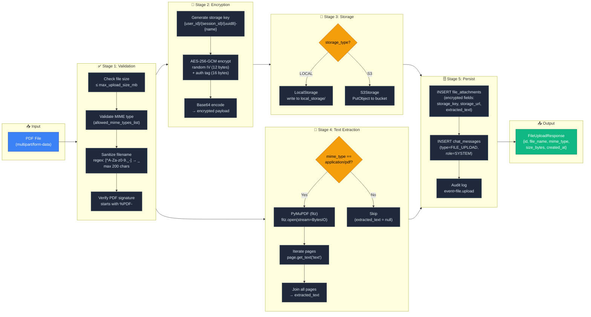
```mermaid
graph LR
    subgraph INPUT["📥 Input"]
        PDF["PDF File<br/>(multipart/form-data)"]
    end

    subgraph VALIDATION["✅ Stage 1: Validation"]
        direction TB
        V1["Check file size<br/>≤ max_upload_size_mb"]
        V2["Validate MIME type<br/>(allowed_mime_types_list)"]
        V3["Sanitize filename<br/>regex: [^A-Za-z0-9._-] → _<br/>max 200 chars"]
        V4["Verify PDF signature<br/>starts with %PDF-"]
        V1 --> V2 --> V3 --> V4
    end

    subgraph ENCRYPTION["🔐 Stage 2: Encryption"]
        direction TB
        E1["Generate storage key<br/>{user_id}/{session_id}/{uuid8}-{name}"]
        E2["AES-256-GCM encrypt<br/>random IV (12 bytes)<br/>+ auth tag (16 bytes)"]
        E3["Base64 encode<br/>→ encrypted payload"]
        E1 --> E2 --> E3
    end

    subgraph STORAGE["💾 Stage 3: Storage"]
        direction TB
        S1{"storage_type?"}
        S2["LocalStorage<br/>write to local_storage/"]
        S3["S3Storage<br/>PutObject to bucket"]
        S1 -->|"LOCAL"| S2
        S1 -->|"S3"| S3
    end

    subgraph EXTRACT["📄 Stage 4: Text Extraction"]
        direction TB
        X1{"mime_type ==<br/>application/pdf?"}
        X2["PyMuPDF (fitz)<br/>fitz.open(stream=BytesIO)"]
        X3["Iterate pages<br/>page.get_text('text')"]
        X4["Join all pages<br/>→ extracted_text"]
        X5["Skip<br/>(extracted_text = null)"]
        X1 -->|"Yes"| X2 --> X3 --> X4
        X1 -->|"No"| X5
    end

    subgraph PERSIST["🗄️ Stage 5: Persist"]
        direction TB
        P1["INSERT file_attachments<br/>(encrypted fields:<br/>storage_key, storage_url,<br/>extracted_text)"]
        P2["INSERT chat_messages<br/>(type=FILE_UPLOAD,<br/>role=SYSTEM)"]
        P3["Audit log<br/>event=file.upload"]
        P1 --> P2 --> P3
    end

    subgraph OUTPUT["📤 Output"]
        Resp["FileUploadResponse<br/>{id, file_name, mime_type,<br/>size_bytes, created_at}"]
    end

    PDF --> VALIDATION
    VALIDATION --> ENCRYPTION
    ENCRYPTION --> STORAGE
    VALIDATION --> EXTRACT
    STORAGE --> PERSIST
    EXTRACT --> PERSIST
    PERSIST --> Resp

    classDef stage fill:#1e293b,color:#e2e8f0,stroke:#334155
    classDef input fill:#3b82f6,color:#fff,stroke:#1e40af
    classDef output fill:#10b981,color:#fff,stroke:#047857
    classDef decision fill:#f59e0b,color:#000,stroke:#b45309

    class V1,V2,V3,V4,E1,E2,E3,S2,S3,X2,X3,X4,X5,P1,P2,P3 stage
    class PDF input
    class Resp output
    class S1,X1 decision
```

### 4.3 Component Diagram — Luồng Tóm tắt PDF (Summarize)

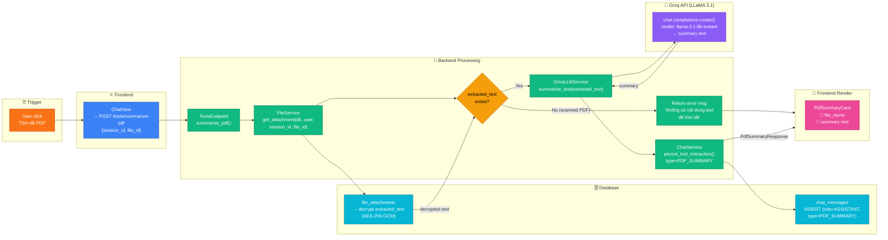
```mermaid
graph LR
    subgraph TRIGGER["🖱️ Trigger"]
        User["User click<br/>'Tóm tắt PDF'"]
    end

    subgraph FRONTEND_FLOW["⚛️ Frontend"]
        FE1["ChatView<br/>→ POST /tools/summarize-pdf<br/>{session_id, file_id}"]
    end

    subgraph BACKEND_FLOW["🐍 Backend Processing"]
        direction TB
        T1["ToolsEndpoint<br/>summarize_pdf()"]
        T2["FileService<br/>get_attachment(db, user,<br/>session_id, file_id)"]
        T3{"extracted_text<br/>exists?"}
        T4["GroqLLMService<br/>summarize_text(extracted_text)"]
        T5["Return error msg<br/>'Không có nội dung text<br/>để tóm tắt'"]
        T6["ChatService<br/>persist_tool_interaction()<br/>type=PDF_SUMMARY"]

        T1 --> T2 --> T3
        T3 -->|"Yes"| T4
        T3 -->|"No (scanned PDF)"| T5
        T4 --> T6
    end

    subgraph DB_LAYER["🗄️ Database"]
        DB1["file_attachments<br/>→ decrypt extracted_text<br/>(AES-256-GCM)"]
        DB2["chat_messages<br/>INSERT (role=ASSISTANT,<br/>type=PDF_SUMMARY)"]
    end

    subgraph GROQ_API["🤖 Groq API (LLaMA 3.1)"]
        GEM["chat.completions.create()<br/>model: llama-3.1-8b-instant<br/>→ summary text"]
    end

    subgraph RENDER["🎨 Frontend Render"]
        Card["PdfSummaryCard<br/>📄 file_name<br/>📝 summary text"]
    end

    User --> FE1
    FE1 --> T1
    T2 --> DB1
    DB1 -->|"decrypted text"| T3
    T4 --> GEM
    GEM -->|"summary"| T4
    T6 --> DB2
    T5 --> RENDER
    T6 -->|"PdfSummaryResponse"| RENDER

    classDef trigger fill:#f97316,color:#fff,stroke:#c2410c
    classDef frontend fill:#3b82f6,color:#fff,stroke:#1e40af
    classDef backend fill:#10b981,color:#fff,stroke:#047857
    classDef db fill:#06b6d4,color:#fff,stroke:#0e7490
    classDef groq fill:#8b5cf6,color:#fff,stroke:#6d28d9
    classDef render fill:#ec4899,color:#fff,stroke:#be185d
    classDef decision fill:#f59e0b,color:#000,stroke:#b45309

    class User trigger
    class FE1 frontend
    class T1,T2,T4,T5,T6 backend
    class DB1,DB2 db
    class GEM groq
    class Card render
    class T3 decision
```

### 4.4 Component Diagram — Luồng Retraction Scan

#### 4.4.1 Tổng quan luồng Retraction Scan

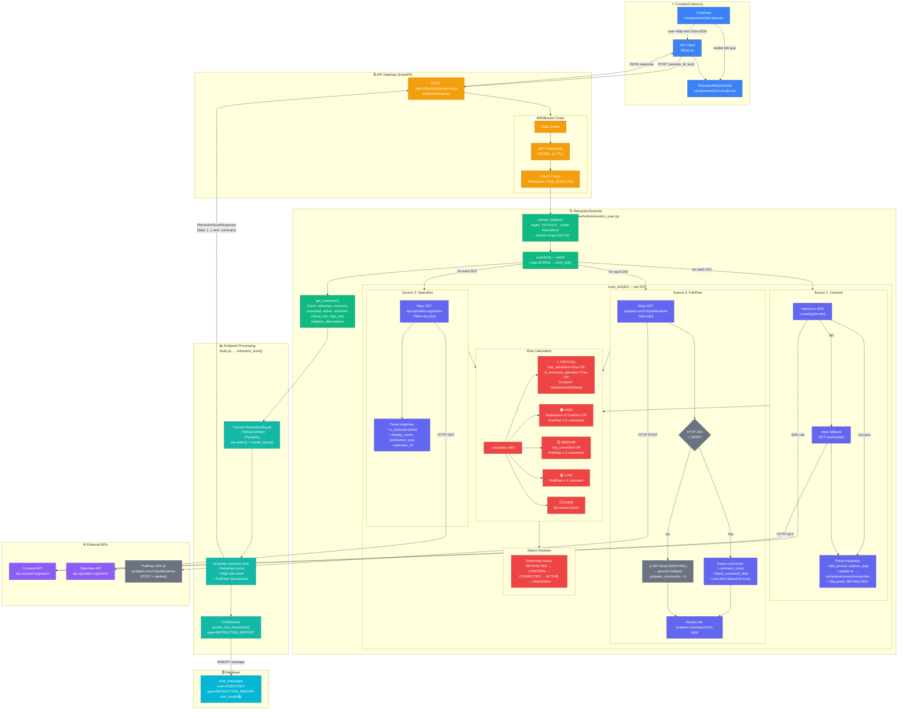
```mermaid
graph TB
    subgraph FRONTEND["⚛️ Frontend (Next.js)"]
        direction TB
        ChatView["ChatView<br/>components/chat-view.tsx"]
        APIClient["API Client<br/>lib/api.ts"]
        RetractCard["RetractionReportCard<br/>components/tool-results.tsx"]

        ChatView -->|"user nhập text chứa DOIs"| APIClient
        ChatView -->|"render kết quả"| RetractCard
    end

    subgraph API_GATEWAY["🔒 API Gateway (FastAPI)"]
        direction TB
        RetractEP["POST /api/v1/tools/retraction-scan<br/>endpoints/tools.py"]

        subgraph AUTH["Middleware Chain"]
            RateLimit["Rate Limiter"]
            JWT["JWT Verification<br/>(HS256, 1h TTL)"]
            RBAC["RBAC Check<br/>Permission.TOOL_EXECUTE"]
        end

        RateLimit --> JWT --> RBAC
    end

    subgraph SCANNER["🔍 RetractionScanner<br/>services/tools/retraction_scan.py"]
        direction TB
        ExtractDOI["extract_doi(text)<br/>regex: 10.XXXX/... (case-insensitive)<br/>→ sorted unique DOI list"]

        subgraph SCAN_DOI["scan_doi(doi) — per DOI"]
            direction TB

            subgraph SRC1["Source 1: Crossref"]
                CR_Hab["Habanero SDK<br/>cr.works(ids=doi)"]
                CR_HTTP["httpx fallback<br/>GET /works/{doi}"]
                CR_Parse["Parse metadata:<br/>• title, journal, authors, year<br/>• update-to → retraction/concern/correction<br/>• Title prefix: RETRACTED:"]
                CR_Hab -->|"fail"| CR_HTTP
                CR_Hab -->|"success"| CR_Parse
                CR_HTTP --> CR_Parse
            end

            subgraph SRC2["Source 2: OpenAlex"]
                OA_Query["httpx GET<br/>api.openalex.org/works<br/>?filter=doi:{doi}"]
                OA_Parse["Parse response:<br/>• is_retracted (bool)<br/>• display_name, publication_year<br/>• openalex_id"]
                OA_Query --> OA_Parse
            end

            subgraph SRC3["Source 3: PubPeer"]
                PP_Query["httpx GET<br/>pubpeer.com/v1/publications<br/>?doi={doi}"]
                PP_Check{"HTTP 200<br/>+ JSON?"}
                PP_Parse["Parse comments:<br/>• comment_count<br/>• latest_comment_date<br/>• concerns (keyword scan)"]
                PP_Dead["⚠️ API Dead (404/HTML)<br/>→ graceful fallback<br/>pubpeer_comments = 0"]
                PP_URL["Always set:<br/>pubpeer.com/search?q={doi}"]
                PP_Query --> PP_Check
                PP_Check -->|"Yes"| PP_Parse
                PP_Check -->|"No"| PP_Dead
                PP_Parse --> PP_URL
                PP_Dead --> PP_URL
            end

            subgraph RISK_CALC["Risk Calculation"]
                CalcRisk["_calculate_risk()"]
                R_CRIT["🔴 CRITICAL<br/>has_retraction=True OR<br/>is_retracted_openalex=True OR<br/>Crossref: retraction/withdrawal"]
                R_HIGH["🟠 HIGH<br/>Expression of Concern OR<br/>PubPeer ≥ 5 comments"]
                R_MED["🟡 MEDIUM<br/>has_correction OR<br/>PubPeer ≥ 2 comments"]
                R_LOW["🟢 LOW<br/>PubPeer ≥ 1 comment"]
                R_NONE["⚪ NONE<br/>No issues found"]
                CalcRisk --> R_CRIT
                CalcRisk --> R_HIGH
                CalcRisk --> R_MED
                CalcRisk --> R_LOW
                CalcRisk --> R_NONE
            end

            subgraph STATUS_DECIDE["Status Decision"]
                StatusLogic["Determine status:<br/>RETRACTED → CONCERN →<br/>CORRECTED → ACTIVE → UNKNOWN"]
            end
        end

        ScanBatch["scan(text) — batch<br/>Loop all DOIs → scan_doi()"]
        Summary["get_summary()<br/>Count: retracted, concerns,<br/>corrected, active, unknown,<br/>critical_risk, high_risk,<br/>pubpeer_discussions"]
    end

    subgraph ENDPOINT_LOGIC["📊 Endpoint Processing<br/>tools.py → retraction_scan()"]
        Convert["Convert RetractionResult<br/>→ RetractionItem (Pydantic)<br/>via asdict() + model_dump()"]
        GenSummary["Generate summary text:<br/>• Retracted count<br/>• High risk count<br/>• PubPeer discussions"]
        Persist["ChatService<br/>persist_tool_interaction()<br/>type=RETRACTION_REPORT"]
    end

    subgraph DATABASE["🗄️ Database"]
        MsgTable["chat_messages<br/>(role=ASSISTANT,<br/>type=RETRACTION_REPORT,<br/>tool_results🔒)"]
    end

    subgraph EXTERNAL["🌐 External APIs"]
        CrossrefAPI["Crossref API<br/>api.crossref.org/works"]
        OpenAlexAPI["OpenAlex API<br/>api.openalex.org/works"]
        PubPeerAPI["PubPeer API v3<br/>pubpeer.com/v3/publications<br/>(POST + devkey)"]
    end

    %% Main flow
    APIClient -->|"POST {session_id, text}"| RetractEP
    RetractEP --> AUTH
    RBAC --> ExtractDOI
    ExtractDOI --> ScanBatch

    ScanBatch -->|"for each DOI"| SRC1
    ScanBatch -->|"for each DOI"| SRC2
    ScanBatch -->|"for each DOI"| SRC3

    CR_Hab -->|"SDK call"| CrossrefAPI
    CR_HTTP -->|"HTTP GET"| CrossrefAPI
    OA_Query -->|"HTTP GET"| OpenAlexAPI
    PP_Query -->|"HTTP POST"| PubPeerAPI

    SRC1 --> RISK_CALC
    SRC2 --> RISK_CALC
    SRC3 --> RISK_CALC
    RISK_CALC --> STATUS_DECIDE

    ScanBatch --> Summary
    Summary --> Convert
    Convert --> GenSummary
    GenSummary --> Persist
    Persist -->|"INSERT message"| MsgTable

    GenSummary -->|"RetractionScanResponse<br/>{data: [...], text: summary}"| RetractEP
    RetractEP -->|"JSON response"| APIClient
    APIClient --> RetractCard

    %% Styles
    classDef frontend fill:#3b82f6,color:#fff,stroke:#1e40af
    classDef api fill:#f59e0b,color:#fff,stroke:#b45309
    classDef scanner fill:#10b981,color:#fff,stroke:#047857
    classDef source fill:#6366f1,color:#fff,stroke:#4338ca
    classDef risk fill:#ef4444,color:#fff,stroke:#b91c1c
    classDef db fill:#06b6d4,color:#fff,stroke:#0e7490
    classDef external fill:#8b5cf6,color:#fff,stroke:#6d28d9
    classDef endpoint fill:#14b8a6,color:#fff,stroke:#0d9488
    classDef dead fill:#6b7280,color:#fff,stroke:#4b5563

    class ChatView,APIClient,RetractCard frontend
    class RetractEP,RateLimit,JWT,RBAC api
    class ExtractDOI,ScanBatch,Summary scanner
    class CR_Hab,CR_HTTP,CR_Parse,OA_Query,OA_Parse,PP_Query,PP_Parse,PP_URL source
    class CalcRisk,R_CRIT,R_HIGH,R_MED,R_LOW,R_NONE,StatusLogic risk
    class MsgTable db
    class CrossrefAPI,OpenAlexAPI external
    class PubPeerAPI,PP_Dead,PP_Check dead
    class Convert,GenSummary,Persist endpoint
```

#### 4.4.2 Chi tiết xử lý nội bộ scan_doi()

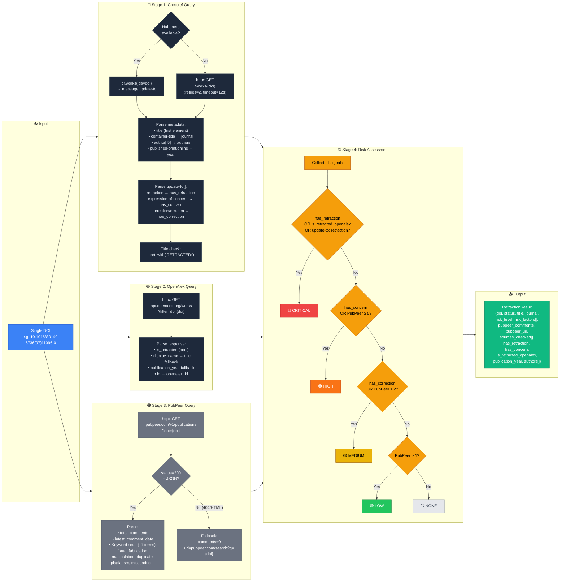
```mermaid
graph LR
    subgraph INPUT["📥 Input"]
        DOI["Single DOI<br/>e.g. 10.1016/S0140-6736(97)11096-0"]
    end

    subgraph CROSSREF["🔵 Stage 1: Crossref Query"]
        direction TB
        C1{"Habanero<br/>available?"}
        C2["cr.works(ids=doi)<br/>→ message.update-to"]
        C3["httpx GET<br/>/works/{doi}<br/>(retries=2, timeout=12s)"]
        C4["Parse metadata:<br/>• title (first element)<br/>• container-title → journal<br/>• author[:5] → authors<br/>• published-print/online → year"]
        C5["Parse update-to[]:<br/>retraction → has_retraction<br/>expression-of-concern → has_concern<br/>correction/erratum → has_correction"]
        C6["Title check:<br/>startswith('RETRACTED:')"]
        C1 -->|"Yes"| C2
        C1 -->|"No"| C3
        C2 --> C4
        C3 --> C4
        C4 --> C5
        C5 --> C6
    end

    subgraph OPENALEX["🟢 Stage 2: OpenAlex Query"]
        direction TB
        O1["httpx GET<br/>api.openalex.org/works<br/>?filter=doi:{doi}"]
        O2["Parse response:<br/>• is_retracted (bool)<br/>• display_name → title fallback<br/>• publication_year fallback<br/>• id → openalex_id"]
        O1 --> O2
    end

    subgraph PUBPEER["🟠 Stage 3: PubPeer Query"]
        direction TB
        P1["httpx GET<br/>pubpeer.com/v1/publications<br/>?doi={doi}"]
        P2{"status=200<br/>+ JSON?"}
        P3["Parse:<br/>• total_comments<br/>• latest_comment_date<br/>• Keyword scan (11 terms):<br/>fraud, fabrication,<br/>manipulation, duplicate,<br/>plagiarism, misconduct..."]
        P4["Fallback:<br/>comments=0<br/>url=pubpeer.com/search?q={doi}"]
        P1 --> P2
        P2 -->|"Yes"| P3
        P2 -->|"No (404/HTML)"| P4
    end

    subgraph RISK["⚖️ Stage 4: Risk Assessment"]
        direction TB
        R1["Collect all signals"]
        R2{"has_retraction<br/>OR is_retracted_openalex<br/>OR update-to: retraction?"}
        R3["🔴 CRITICAL"]
        R4{"has_concern<br/>OR PubPeer ≥ 5?"}
        R5["🟠 HIGH"]
        R6{"has_correction<br/>OR PubPeer ≥ 2?"}
        R7["🟡 MEDIUM"]
        R8{"PubPeer ≥ 1?"}
        R9["🟢 LOW"]
        R10["⚪ NONE"]

        R1 --> R2
        R2 -->|"Yes"| R3
        R2 -->|"No"| R4
        R4 -->|"Yes"| R5
        R4 -->|"No"| R6
        R6 -->|"Yes"| R7
        R6 -->|"No"| R8
        R8 -->|"Yes"| R9
        R8 -->|"No"| R10
    end

    subgraph OUTPUT["📤 Output"]
        Result["RetractionResult<br/>{doi, status, title, journal,<br/>risk_level, risk_factors[],<br/>pubpeer_comments, pubpeer_url,<br/>sources_checked[],<br/>has_retraction, has_concern,<br/>is_retracted_openalex,<br/>publication_year, authors[]}"]
    end

    DOI --> CROSSREF
    DOI --> OPENALEX
    DOI --> PUBPEER
    CROSSREF --> RISK
    OPENALEX --> RISK
    PUBPEER --> RISK
    RISK --> OUTPUT

    classDef input fill:#3b82f6,color:#fff,stroke:#1e40af
    classDef crossref fill:#1e293b,color:#e2e8f0,stroke:#334155
    classDef openalex fill:#1e293b,color:#e2e8f0,stroke:#334155
    classDef pubpeer fill:#6b7280,color:#fff,stroke:#4b5563
    classDef risk fill:#7c3aed,color:#fff,stroke:#5b21b6
    classDef output fill:#10b981,color:#fff,stroke:#047857
    classDef decision fill:#f59e0b,color:#000,stroke:#b45309
    classDef critical fill:#ef4444,color:#fff,stroke:#b91c1c
    classDef high fill:#f97316,color:#fff,stroke:#c2410c
    classDef medium fill:#eab308,color:#000,stroke:#a16207
    classDef low fill:#22c55e,color:#fff,stroke:#15803d
    classDef none fill:#e5e7eb,color:#374151,stroke:#9ca3af

    class DOI input
    class C1,C2,C3,C4,C5,C6 crossref
    class O1,O2 openalex
    class P1,P2,P3,P4 pubpeer
    class R1,R2,R4,R6,R8 decision
    class R3 critical
    class R5 high
    class R7 medium
    class R9 low
    class R10 none
    class Result output
```

---

## 5. Sơ đồ UML

### 5.1 Use-case Diagram

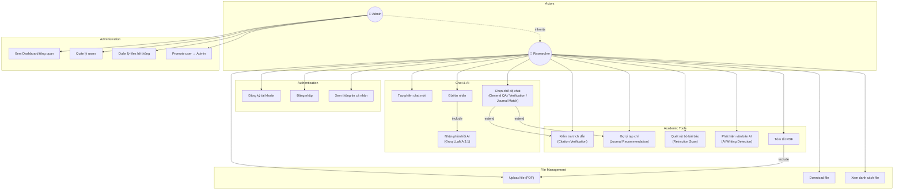
```mermaid
graph TB
    subgraph actors["Actors"]
        Researcher(("👤 Researcher"))
        Admin(("👑 Admin"))
    end

    subgraph uc_auth["Authentication"]
        UC1["Đăng ký tài khoản"]
        UC2["Đăng nhập"]
        UC3["Xem thông tin cá nhân"]
    end

    subgraph uc_chat["Chat & AI"]
        UC4["Tạo phiên chat mới"]
        UC5["Gửi tin nhắn"]
        UC6["Nhận phản hồi AI<br/>(Groq LLaMA 3.1)"]
        UC7["Chọn chế độ chat<br/>(General QA / Verification /<br/>Journal Match)"]
    end

    subgraph uc_tools["Academic Tools"]
        UC8["Kiểm tra trích dẫn<br/>(Citation Verification)"]
        UC9["Gợi ý tạp chí<br/>(Journal Recommendation)"]
        UC10["Quét rút bỏ bài báo<br/>(Retraction Scan)"]
        UC11["Phát hiện văn bản AI<br/>(AI Writing Detection)"]
        UC12["Tóm tắt PDF"]
    end

    subgraph uc_file["File Management"]
        UC13["Upload file (PDF)"]
        UC14["Download file"]
        UC15["Xem danh sách file"]
    end

    subgraph uc_admin["Administration"]
        UC16["Xem Dashboard tổng quan"]
        UC17["Quản lý users"]
        UC18["Quản lý files hệ thống"]
        UC19["Promote user → Admin"]
    end

    Researcher --> UC1
    Researcher --> UC2
    Researcher --> UC3
    Researcher --> UC4
    Researcher --> UC5
    UC5 -->|"include"| UC6
    Researcher --> UC7
    Researcher --> UC8
    Researcher --> UC9
    Researcher --> UC10
    Researcher --> UC11
    Researcher --> UC12
    Researcher --> UC13
    Researcher --> UC14
    Researcher --> UC15

    Admin --> UC16
    Admin --> UC17
    Admin --> UC18
    Admin --> UC19

    Admin -.->|"inherits"| Researcher

    UC7 -->|"extend"| UC8
    UC7 -->|"extend"| UC9
    UC12 -->|"include"| UC13
```

### 5.2 Component Flow Diagrams

#### 5.2.1 Component Diagram — Đăng nhập & Xác thực

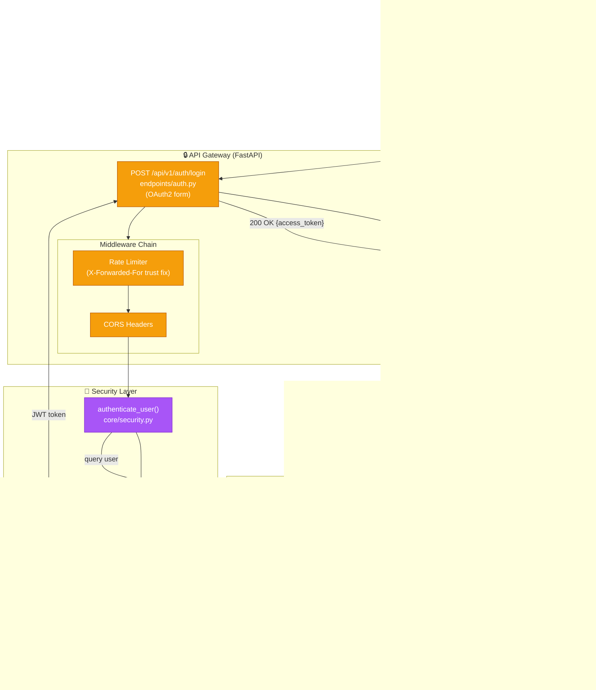
```mermaid
graph TB
    subgraph USER["👤 User"]
        InputForm["Nhập email + password"]
    end

    subgraph FRONTEND["⚛️ Frontend (Next.js)"]
        LoginPage["LoginPage<br/>app/login/page.tsx"]
        AuthCtx["AuthContext<br/>lib/auth.tsx"]
        Storage["localStorage<br/>setItem('token', jwt)"]
        Redirect["Redirect → /chat"]

        LoginPage --> AuthCtx
        AuthCtx --> Storage
        Storage --> Redirect
    end

    subgraph API_GATEWAY["🔒 API Gateway (FastAPI)"]
        AuthEP["POST /api/v1/auth/login<br/>endpoints/auth.py<br/>(OAuth2 form)"]

        subgraph MW["Middleware Chain"]
            RateLimit["Rate Limiter<br/>(X-Forwarded-For trust fix)"]
            CORS["CORS Headers"]
        end

        RateLimit --> CORS
    end

    subgraph SECURITY["🔐 Security Layer"]
        Authenticate["authenticate_user()<br/>core/security.py"]
        BcryptCheck["bcrypt.checkpw()<br/>password → hashed"]
        CreateToken["create_access_token()<br/>sub=user_id, iat, jti<br/>exp=1h, HS256"]

        Authenticate --> BcryptCheck
        BcryptCheck --> CreateToken
    end

    subgraph DATABASE["🗄️ Database"]
        UsersTable["users table<br/>SELECT WHERE email=?"]
        AuditLog["audit_log<br/>event='auth.login'"]
    end

    %% Flow
    InputForm --> LoginPage
    LoginPage -->|"POST form data"| AuthEP
    AuthEP --> MW
    CORS --> Authenticate
    Authenticate -->|"query user"| UsersTable
    UsersTable -->|"User record"| BcryptCheck
    CreateToken -->|"JWT token"| AuthEP
    AuthEP -->|"log event"| AuditLog
    AuthEP -->|"200 OK {access_token}"| AuthCtx

    %% Styles
    classDef user fill:#3b82f6,color:#fff,stroke:#1e40af
    classDef frontend fill:#60a5fa,color:#fff,stroke:#2563eb
    classDef api fill:#f59e0b,color:#fff,stroke:#b45309
    classDef security fill:#a855f7,color:#fff,stroke:#7e22ce
    classDef db fill:#06b6d4,color:#fff,stroke:#0e7490

    class InputForm user
    class LoginPage,AuthCtx,Storage,Redirect frontend
    class AuthEP,RateLimit,CORS api
    class Authenticate,BcryptCheck,CreateToken security
    class UsersTable,AuditLog db
```

#### 5.2.2 Component Diagram — Chat AI (General QA Mode)

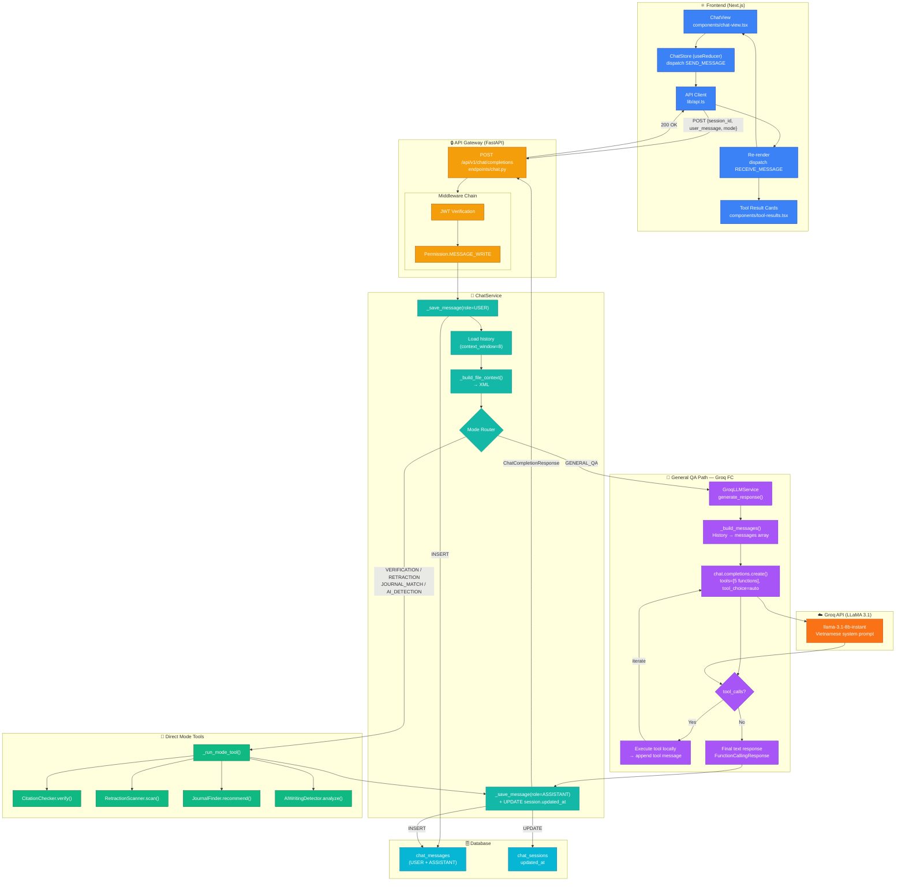
```mermaid
graph TB
    subgraph FRONTEND["⚛️ Frontend (Next.js)"]
        direction TB
        ChatView["ChatView<br/>components/chat-view.tsx"]
        Store["ChatStore (useReducer)<br/>dispatch SEND_MESSAGE"]
        APIClient["API Client<br/>lib/api.ts"]
        Render["Re-render<br/>dispatch RECEIVE_MESSAGE"]
        ToolCards["Tool Result Cards<br/>components/tool-results.tsx"]

        ChatView --> Store
        Store --> APIClient
        Render --> ChatView
        Render --> ToolCards
    end

    subgraph API_GATEWAY["🔒 API Gateway (FastAPI)"]
        direction TB
        ChatEP["POST /api/v1/chat/completions<br/>endpoints/chat.py"]

        subgraph AUTH["Middleware Chain"]
            JWT["JWT Verification"]
            RBAC["Permission.MESSAGE_WRITE"]
        end

        JWT --> RBAC
    end

    subgraph CHAT_SVC["💬 ChatService"]
        direction TB
        SaveUser["_save_message(role=USER)"]
        LoadCtx["Load history<br/>(context_window=8)"]
        FileCtx["_build_file_context()<br/>→ <Attached_Document> XML"]
        ModeRoute{"Mode Router"}
        SaveAssist["_save_message(role=ASSISTANT)<br/>+ UPDATE session.updated_at"]

        SaveUser --> LoadCtx
        LoadCtx --> FileCtx
        FileCtx --> ModeRoute
    end

    subgraph GENERAL_QA["🤖 General QA Path — Groq FC"]
        direction TB
        GroqSvc["GroqLLMService<br/>generate_response()"]
        BuildContent["_build_messages()<br/>History → messages array"]
        GenContent["chat.completions.create()<br/>tools=[5 functions], tool_choice=auto"]
        FCCheck{"tool_calls?"}
        ExecTool["Execute tool locally<br/>→ append tool message"]
        FinalText["Final text response<br/>FunctionCallingResponse"]

        GroqSvc --> BuildContent
        BuildContent --> GenContent
        GenContent --> FCCheck
        FCCheck -->|"Yes"| ExecTool
        ExecTool -->|"iterate"| GenContent
        FCCheck -->|"No"| FinalText
    end

    subgraph DIRECT_TOOLS["🔧 Direct Mode Tools"]
        direction TB
        RunTool["_run_mode_tool()"]
        T_Cite["CitationChecker.verify()"]
        T_Retract["RetractionScanner.scan()"]
        T_Journal["JournalFinder.recommend()"]
        T_AI["AIWritingDetector.analyze()"]

        RunTool --> T_Cite
        RunTool --> T_Retract
        RunTool --> T_Journal
        RunTool --> T_AI
    end

    subgraph GROQ_API["☁️ Groq API (LLaMA 3.1)"]
        GModel["llama-3.1-8b-instant<br/>Vietnamese system prompt"]
    end

    subgraph DATABASE["🗄️ Database"]
        MsgTable["chat_messages<br/>(USER + ASSISTANT)"]
        SessionTable["chat_sessions<br/>updated_at"]
    end

    %% Flow
    APIClient -->|"POST {session_id, user_message, mode}"| ChatEP
    ChatEP --> AUTH
    RBAC --> SaveUser
    SaveUser -->|"INSERT"| MsgTable

    ModeRoute -->|"GENERAL_QA"| GroqSvc
    ModeRoute -->|"VERIFICATION / RETRACTION<br/>JOURNAL_MATCH / AI_DETECTION"| RunTool

    GenContent --> GModel
    GModel --> FCCheck

    FinalText --> SaveAssist
    RunTool --> SaveAssist
    SaveAssist -->|"INSERT"| MsgTable
    SaveAssist -->|"UPDATE"| SessionTable

    SaveAssist -->|"ChatCompletionResponse"| ChatEP
    ChatEP -->|"200 OK"| APIClient
    APIClient --> Render

    %% Styles
    classDef frontend fill:#3b82f6,color:#fff,stroke:#1e40af
    classDef api fill:#f59e0b,color:#fff,stroke:#b45309
    classDef chatsvc fill:#14b8a6,color:#fff,stroke:#0d9488
    classDef llm fill:#a855f7,color:#fff,stroke:#7e22ce
    classDef tools fill:#10b981,color:#fff,stroke:#047857
    classDef cloud fill:#f97316,color:#fff,stroke:#c2410c
    classDef db fill:#06b6d4,color:#fff,stroke:#0e7490

    class ChatView,Store,APIClient,Render,ToolCards frontend
    class ChatEP,JWT,RBAC api
    class SaveUser,LoadCtx,FileCtx,ModeRoute,SaveAssist chatsvc
    class GroqSvc,BuildContent,GenContent,FCCheck,ExecTool,FinalText llm
    class RunTool,T_Cite,T_Retract,T_Journal,T_AI tools
    class GModel cloud
    class MsgTable,SessionTable db
```

#### 5.2.3 Component Diagram — Citation Verification Tool

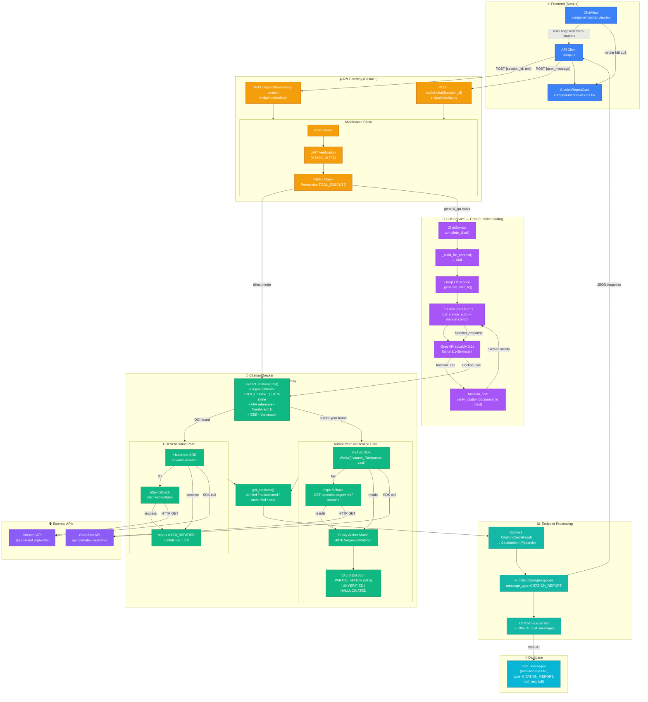
```mermaid
graph TB
    subgraph FRONTEND["⚛️ Frontend (Next.js)"]
        direction TB
        ChatView["ChatView<br/>components/chat-view.tsx"]
        APIClient["API Client<br/>lib/api.ts"]
        CitCard["CitationReportCard<br/>components/tool-results.tsx"]

        ChatView -->|"user nhập text chứa citations"| APIClient
        ChatView -->|"render kết quả"| CitCard
    end

    subgraph API_GATEWAY["🔒 API Gateway (FastAPI)"]
        direction TB
        ToolEP["POST /api/v1/tools/verify-citation<br/>endpoints/tools.py"]
        ChatEP["POST /api/v1/chat/{session_id}<br/>endpoints/chat.py"]

        subgraph AUTH["Middleware Chain"]
            RateLimit["Rate Limiter"]
            JWT["JWT Verification<br/>(HS256, 1h TTL)"]
            RBAC["RBAC Check<br/>Permission.TOOL_EXECUTE"]
        end

        RateLimit --> JWT --> RBAC
    end

    subgraph LLM_LAYER["🤖 LLM Service — Groq Function Calling"]
        direction TB
        ChatSvc["ChatService<br/>complete_chat()"]
        FileCtx["_build_file_context()<br/>→ <Attached_Document> XML"]
        GroqSvc["GroqLLMService<br/>_generate_with_fc()"]
        GroqAPI["Groq API (LLaMA 3.1)<br/>llama-3.1-8b-instant"]
        FCLoop["FC Loop (max 5 iter)<br/>tool_choice=auto — manual control"]
        FnCall["function_call:<br/>verify_citation(document_id | text)"]

        ChatSvc --> FileCtx
        FileCtx --> GroqSvc
        GroqSvc --> FCLoop
        FCLoop --> GroqAPI
        GroqAPI -->|"function_call"| FnCall
        FnCall -->|"execute locally"| FCLoop
    end

    subgraph CHECKER["🔎 CitationChecker<br/>services/tools/citation_checker.py"]
        direction TB
        Extract["extract_citations(text)<br/>6 regex patterns:<br/>• DOI (10.xxxx/...) • APA inline<br/>• APA reference • Numbered [1]<br/>• IEEE • Vancouver"]

        subgraph VERIFY_DOI["DOI Verification Path"]
            HabSDK["Habanero SDK<br/>cr.works(ids=doi)"]
            HabHTTP["httpx fallback<br/>GET /works/{doi}"]
            DOI_OK["status = DOI_VERIFIED<br/>confidence = 1.0"]
            HabSDK -->|"fail"| HabHTTP
            HabSDK -->|"success"| DOI_OK
            HabHTTP -->|"success"| DOI_OK
        end

        subgraph VERIFY_AUTHOR["Author-Year Verification Path"]
            PyAlexSDK["PyAlex SDK<br/>Works().search_filter(author, year)"]
            PyAlexHTTP["httpx fallback<br/>GET openalex.org/works?search="]
            FuzzyMatch["Fuzzy Author Match<br/>difflib.SequenceMatcher"]
            StatusDecide["VALID (≥0.85) | PARTIAL_MATCH (≥0.5)<br/>| UNVERIFIED | HALLUCINATED"]
            PyAlexSDK -->|"fail"| PyAlexHTTP
            PyAlexSDK -->|"results"| FuzzyMatch
            PyAlexHTTP -->|"results"| FuzzyMatch
            FuzzyMatch --> StatusDecide
        end

        Stats["get_statistics()<br/>verified / hallucinated / unverified / total"]
    end

    subgraph PERSIST["📊 Endpoint Processing"]
        Convert["Convert CitationCheckResult<br/>→ CitationItem (Pydantic)"]
        FnResp["FunctionCallingResponse<br/>message_type=CITATION_REPORT"]
        Persist["ChatService.persist<br/>→ INSERT chat_messages"]
    end

    subgraph DATABASE["🗄️ Database"]
        MsgTable["chat_messages<br/>(role=ASSISTANT,<br/>type=CITATION_REPORT,<br/>tool_results🔒)"]
    end

    subgraph EXTERNAL["🌐 External APIs"]
        CrossrefAPI["Crossref API<br/>api.crossref.org/works"]
        OpenAlexAPI["OpenAlex API<br/>api.openalex.org/works"]
    end

    %% Flow connections
    APIClient -->|"POST {session_id, text}"| ToolEP
    APIClient -->|"POST {user_message}"| ChatEP
    ToolEP --> AUTH
    ChatEP --> AUTH
    RBAC -->|"direct mode"| Extract
    RBAC -->|"general_qa mode"| ChatSvc

    GroqAPI -->|"function_call"| Extract
    FCLoop -->|"function_response"| GroqAPI

    Extract -->|"DOI found"| VERIFY_DOI
    Extract -->|"author-year found"| VERIFY_AUTHOR

    HabSDK -->|"SDK call"| CrossrefAPI
    HabHTTP -->|"HTTP GET"| CrossrefAPI
    PyAlexSDK -->|"SDK call"| OpenAlexAPI
    PyAlexHTTP -->|"HTTP GET"| OpenAlexAPI

    VERIFY_DOI --> Stats
    VERIFY_AUTHOR --> Stats
    Stats --> Convert
    Convert --> FnResp
    FnResp --> Persist
    Persist -->|"INSERT"| MsgTable

    FnResp -->|"JSON response"| APIClient
    APIClient --> CitCard

    %% Styles
    classDef frontend fill:#3b82f6,color:#fff,stroke:#1e40af
    classDef api fill:#f59e0b,color:#fff,stroke:#b45309
    classDef llm fill:#a855f7,color:#fff,stroke:#7e22ce
    classDef checker fill:#10b981,color:#fff,stroke:#047857
    classDef source fill:#6366f1,color:#fff,stroke:#4338ca
    classDef db fill:#06b6d4,color:#fff,stroke:#0e7490
    classDef external fill:#8b5cf6,color:#fff,stroke:#6d28d9
    classDef persist fill:#14b8a6,color:#fff,stroke:#0d9488

    class ChatView,APIClient,CitCard frontend
    class ToolEP,ChatEP,RateLimit,JWT,RBAC api
    class ChatSvc,FileCtx,GroqSvc,GroqAPI,FCLoop,FnCall llm
    class Extract,HabSDK,HabHTTP,DOI_OK,PyAlexSDK,PyAlexHTTP,FuzzyMatch,StatusDecide,Stats checker
    class MsgTable db
    class CrossrefAPI,OpenAlexAPI external
    class Convert,FnResp,Persist persist
```

#### 5.2.4 Component Diagram — Journal Recommendation Tool

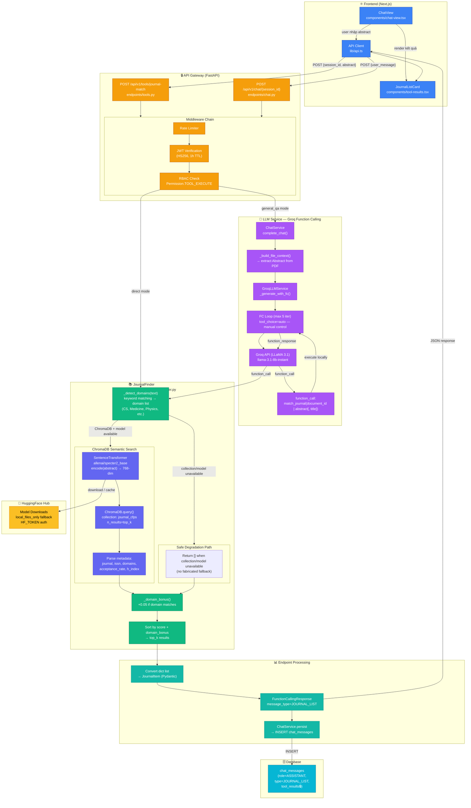
```mermaid
graph TB
    subgraph FRONTEND["⚛️ Frontend (Next.js)"]
        direction TB
        ChatView["ChatView<br/>components/chat-view.tsx"]
        APIClient["API Client<br/>lib/api.ts"]
        JournalCard["JournalListCard<br/>components/tool-results.tsx"]

        ChatView -->|"user nhập abstract"| APIClient
        ChatView -->|"render kết quả"| JournalCard
    end

    subgraph API_GATEWAY["🔒 API Gateway (FastAPI)"]
        direction TB
        ToolEP["POST /api/v1/tools/journal-match<br/>endpoints/tools.py"]
        ChatEP["POST /api/v1/chat/{session_id}<br/>endpoints/chat.py"]

        subgraph AUTH["Middleware Chain"]
            RateLimit["Rate Limiter"]
            JWT["JWT Verification<br/>(HS256, 1h TTL)"]
            RBAC["RBAC Check<br/>Permission.TOOL_EXECUTE"]
        end

        RateLimit --> JWT --> RBAC
    end

    subgraph LLM_LAYER["🤖 LLM Service — Groq Function Calling"]
        direction TB
        ChatSvc["ChatService<br/>complete_chat()"]
        FileCtx["_build_file_context()<br/>→ extract Abstract from PDF"]
        GroqSvc["GroqLLMService<br/>_generate_with_fc()"]
        GroqAPI["Groq API (LLaMA 3.1)<br/>llama-3.1-8b-instant"]
        FCLoop["FC Loop (max 5 iter)<br/>tool_choice=auto — manual control"]
        FnCall["function_call:<br/>match_journal(document_id | abstract[, title])"]

        ChatSvc --> FileCtx
        FileCtx --> GroqSvc
        GroqSvc --> FCLoop
        FCLoop --> GroqAPI
        GroqAPI -->|"function_call"| FnCall
        FnCall -->|"execute locally"| FCLoop
    end

    subgraph FINDER["📚 JournalFinder<br/>services/tools/journal_finder.py"]
        direction TB
        DetectDomain["_detect_domains(text)<br/>keyword matching → domain list<br/>(CS, Medicine, Physics, etc.)"]

        subgraph CHROMA_PATH["ChromaDB Semantic Search"]
            direction TB
            EmbedQuery["SentenceTransformer<br/>allenai/specter2_base<br/>encode(abstract) → 768-dim"]
            QueryDB["ChromaDB.query()<br/>collection: journal_cfps<br/>n_results=top_k"]
            ParseResults["Parse metadata:<br/>journal, issn, domains,<br/>acceptance_rate, h_index"]

            EmbedQuery --> QueryDB
            QueryDB --> ParseResults
        end

        subgraph DEGRADE_PATH["Safe Degradation Path"]
            EmptyResult["Return [] when collection/model unavailable<br/>(no fabricated fallback)"]
        end

        DomainBonus["_domain_bonus()<br/>+0.05 if domain matches"]
        Sort["Sort by score + domain_bonus<br/>→ top_k results"]
    end

    subgraph PERSIST["📊 Endpoint Processing"]
        Convert["Convert dict list<br/>→ JournalItem (Pydantic)"]
        FnResp["FunctionCallingResponse<br/>message_type=JOURNAL_LIST"]
        PersistDB["ChatService.persist<br/>→ INSERT chat_messages"]
    end

    subgraph DATABASE["🗄️ Database"]
        MsgTable["chat_messages<br/>(role=ASSISTANT,<br/>type=JOURNAL_LIST,<br/>tool_results🔒)"]
    end

    subgraph HF_MODELS["🤗 HuggingFace Hub"]
        HFHub["Model Downloads<br/>local_files_only fallback<br/>HF_TOKEN auth"]
    end

    %% Flow connections
    APIClient -->|"POST {session_id, abstract}"| ToolEP
    APIClient -->|"POST {user_message}"| ChatEP
    ToolEP --> AUTH
    ChatEP --> AUTH
    RBAC -->|"direct mode"| DetectDomain
    RBAC -->|"general_qa mode"| ChatSvc

    GroqAPI -->|"function_call"| DetectDomain
    FCLoop -->|"function_response"| GroqAPI

    DetectDomain -->|"ChromaDB + model available"| CHROMA_PATH
    DetectDomain -->|"collection/model unavailable"| DEGRADE_PATH
    EmbedQuery -->|"download / cache"| HFHub

    ParseResults --> DomainBonus
    EmptyResult --> DomainBonus
    DomainBonus --> Sort
    Sort --> Convert
    Convert --> FnResp
    FnResp --> PersistDB
    PersistDB -->|"INSERT"| MsgTable

    FnResp -->|"JSON response"| APIClient
    APIClient --> JournalCard

    %% Styles
    classDef frontend fill:#3b82f6,color:#fff,stroke:#1e40af
    classDef api fill:#f59e0b,color:#fff,stroke:#b45309
    classDef llm fill:#a855f7,color:#fff,stroke:#7e22ce
    classDef finder fill:#10b981,color:#fff,stroke:#047857
    classDef ml fill:#6366f1,color:#fff,stroke:#4338ca
    classDef tfidf fill:#f97316,color:#fff,stroke:#c2410c
    classDef db fill:#06b6d4,color:#fff,stroke:#0e7490
    classDef hf fill:#fbbf24,color:#000,stroke:#d97706
    classDef persist fill:#14b8a6,color:#fff,stroke:#0d9488

    class ChatView,APIClient,JournalCard frontend
    class ToolEP,ChatEP,RateLimit,JWT,RBAC api
    class ChatSvc,FileCtx,GroqSvc,GroqAPI,FCLoop,FnCall llm
    class DetectDomain,DomainBonus,Sort finder
    class EmbedQuery,QueryDB,ParseResults ml
    class TFIDF,TFCosine tfidf
    class MsgTable db
    class HFHub hf
    class Convert,FnResp,PersistDB persist
```

#### 5.2.5 Component Diagram — File Upload & PDF Summary

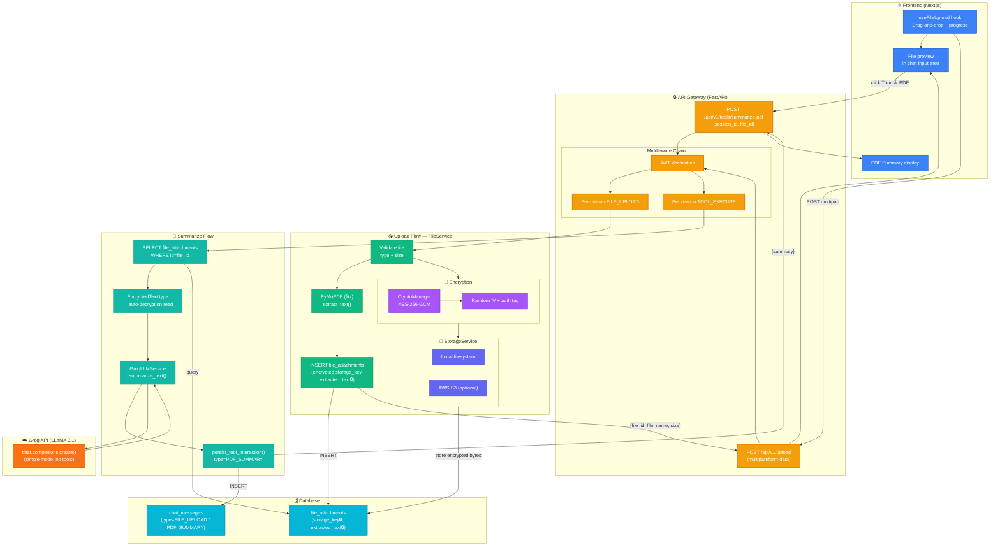
```mermaid
graph TB
    subgraph FRONTEND["⚛️ Frontend (Next.js)"]
        direction TB
        DragDrop["useFileUpload hook<br/>Drag-and-drop + progress"]
        UploadPreview["File preview<br/>in chat input area"]
        SummaryView["PDF Summary display"]

        DragDrop --> UploadPreview
    end

    subgraph API_GATEWAY["🔒 API Gateway (FastAPI)"]
        direction TB
        UploadEP["POST /api/v1/upload<br/>(multipart/form-data)"]
        SummarizeEP["POST /api/v1/tools/summarize-pdf<br/>{session_id, file_id}"]

        subgraph AUTH["Middleware Chain"]
            JWT["JWT Verification"]
            RBAC_UP["Permission.FILE_UPLOAD"]
            RBAC_TOOL["Permission.TOOL_EXECUTE"]
        end
    end

    subgraph UPLOAD_FLOW["📤 Upload Flow — FileService"]
        direction TB
        Validate["Validate file<br/>type + size"]

        subgraph ENCRYPT["🔐 Encryption"]
            CryptoMgr["CryptoManager<br/>AES-256-GCM"]
            GenIV["Random IV + auth tag"]
            CryptoMgr --> GenIV
        end

        subgraph STORAGE["💾 StorageService"]
            LocalStore["Local filesystem"]
            S3Store["AWS S3 (optional)"]
        end

        ExtractText["PyMuPDF (fitz)<br/>extract_text()"]
        SaveMeta["INSERT file_attachments<br/>(encrypted storage_key,<br/>extracted_text🔒)"]

        Validate --> ENCRYPT
        ENCRYPT --> STORAGE
        Validate --> ExtractText
        ExtractText --> SaveMeta
    end

    subgraph SUMMARIZE_FLOW["📝 Summarize Flow"]
        direction TB
        LoadFile["SELECT file_attachments<br/>WHERE id=file_id"]
        DecryptText["EncryptedText type<br/>→ auto-decrypt on read"]
        LLMSummarize["GroqLLMService<br/>summarize_text()"]
        PersistSummary["persist_tool_interaction()<br/>type=PDF_SUMMARY"]

        LoadFile --> DecryptText
        DecryptText --> LLMSummarize
        LLMSummarize --> PersistSummary
    end

    subgraph GROQ_SUM["☁️ Groq API (LLaMA 3.1)"]
        GModel["chat.completions.create()<br/>(simple mode, no tools)"]
    end

    subgraph DATABASE["🗄️ Database"]
        FileTable["file_attachments<br/>(storage_key🔒, extracted_text🔒)"]
        MsgTable["chat_messages<br/>(type=FILE_UPLOAD / PDF_SUMMARY)"]
    end

    %% Upload flow
    DragDrop -->|"POST multipart"| UploadEP
    UploadEP --> JWT --> RBAC_UP
    RBAC_UP --> Validate
    STORAGE -->|"store encrypted bytes"| FileTable
    SaveMeta -->|"INSERT"| FileTable
    SaveMeta -->|"{file_id, file_name, size}"| UploadEP
    UploadEP --> UploadPreview

    %% Summarize flow
    UploadPreview -->|"click Tóm tắt PDF"| SummarizeEP
    SummarizeEP --> JWT
    JWT --> RBAC_TOOL
    RBAC_TOOL --> LoadFile
    LoadFile -->|"query"| FileTable
    LLMSummarize --> GModel
    GModel --> LLMSummarize
    PersistSummary -->|"INSERT"| MsgTable
    PersistSummary -->|"{summary}"| SummarizeEP
    SummarizeEP --> SummaryView

    %% Styles
    classDef frontend fill:#3b82f6,color:#fff,stroke:#1e40af
    classDef api fill:#f59e0b,color:#fff,stroke:#b45309
    classDef upload fill:#10b981,color:#fff,stroke:#047857
    classDef crypto fill:#a855f7,color:#fff,stroke:#7e22ce
    classDef storage fill:#6366f1,color:#fff,stroke:#4338ca
    classDef summarize fill:#14b8a6,color:#fff,stroke:#0d9488
    classDef cloud fill:#f97316,color:#fff,stroke:#c2410c
    classDef db fill:#06b6d4,color:#fff,stroke:#0e7490

    class DragDrop,UploadPreview,SummaryView frontend
    class UploadEP,SummarizeEP,JWT,RBAC_UP,RBAC_TOOL api
    class Validate,ExtractText,SaveMeta upload
    class CryptoMgr,GenIV crypto
    class LocalStore,S3Store storage
    class LoadFile,DecryptText,LLMSummarize,PersistSummary summarize
    class GModel cloud
    class FileTable,MsgTable db
```

#### 5.2.6 Component Diagram — Retraction Scan

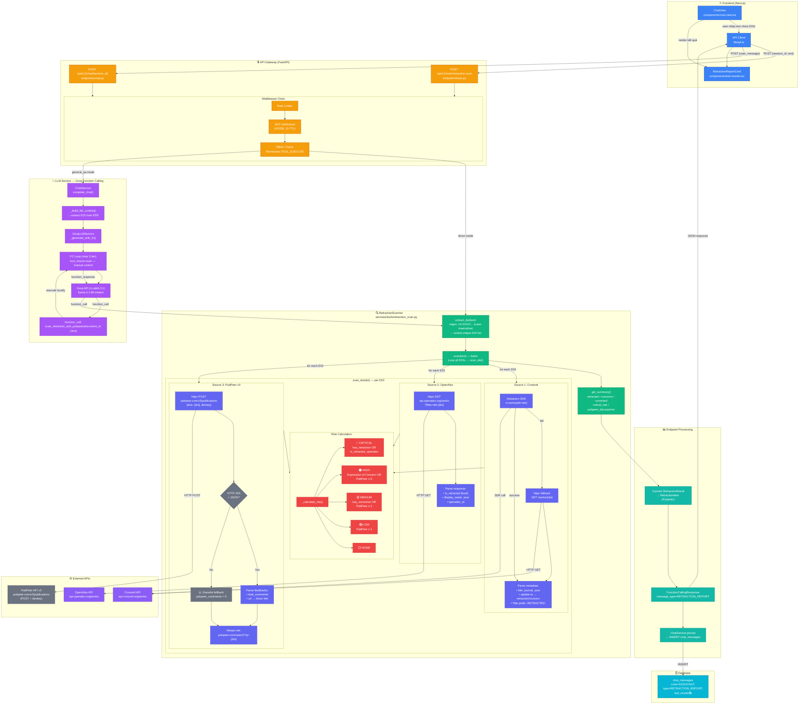
```mermaid
graph TB
    subgraph FRONTEND["⚛️ Frontend (Next.js)"]
        direction TB
        ChatView["ChatView<br/>components/chat-view.tsx"]
        APIClient["API Client<br/>lib/api.ts"]
        RetractCard["RetractionReportCard<br/>components/tool-results.tsx"]

        ChatView -->|"user nhập text chứa DOIs"| APIClient
        ChatView -->|"render kết quả"| RetractCard
    end

    subgraph API_GATEWAY["🔒 API Gateway (FastAPI)"]
        direction TB
        ToolEP["POST /api/v1/tools/retraction-scan<br/>endpoints/tools.py"]
        ChatEP["POST /api/v1/chat/{session_id}<br/>endpoints/chat.py"]

        subgraph AUTH["Middleware Chain"]
            RateLimit["Rate Limiter"]
            JWT["JWT Verification<br/>(HS256, 1h TTL)"]
            RBAC["RBAC Check<br/>Permission.TOOL_EXECUTE"]
        end

        RateLimit --> JWT --> RBAC
    end

    subgraph LLM_LAYER["🤖 LLM Service — Groq Function Calling"]
        direction TB
        ChatSvc["ChatService<br/>complete_chat()"]
        FileCtx["_build_file_context()<br/>→ extract DOI from PDF"]
        GroqSvc["GroqLLMService<br/>_generate_with_fc()"]
        GroqAPI["Groq API (LLaMA 3.1)<br/>llama-3.1-8b-instant"]
        FCLoop["FC Loop (max 5 iter)<br/>tool_choice=auto — manual control"]
        FnCall["function_call:<br/>scan_retraction_and_pubpeer(document_id | text)"]

        ChatSvc --> FileCtx
        FileCtx --> GroqSvc
        GroqSvc --> FCLoop
        FCLoop --> GroqAPI
        GroqAPI -->|"function_call"| FnCall
        FnCall -->|"execute locally"| FCLoop
    end

    subgraph SCANNER["🔍 RetractionScanner<br/>services/tools/retraction_scan.py"]
        direction TB
        ExtractDOI["extract_doi(text)<br/>regex: 10.XXXX/... (case-insensitive)<br/>→ sorted unique DOI list"]
        ScanBatch["scan(text) — batch<br/>Loop all DOIs → scan_doi()"]

        subgraph SCAN_DOI["scan_doi(doi) — per DOI"]
            direction TB

            subgraph SRC1["Source 1: Crossref"]
                CR_Hab["Habanero SDK<br/>cr.works(ids=doi)"]
                CR_HTTP["httpx fallback<br/>GET /works/{doi}"]
                CR_Parse["Parse metadata:<br/>• title, journal, year<br/>• update-to → retraction/concern<br/>• Title prefix: RETRACTED:"]
                CR_Hab -->|"fail"| CR_HTTP
                CR_Hab -->|"success"| CR_Parse
                CR_HTTP --> CR_Parse
            end

            subgraph SRC2["Source 2: OpenAlex"]
                OA_Query["httpx GET<br/>api.openalex.org/works<br/>?filter=doi:{doi}"]
                OA_Parse["Parse response:<br/>• is_retracted (bool)<br/>• display_name, year<br/>• openalex_id"]
                OA_Query --> OA_Parse
            end

            subgraph SRC3["Source 3: PubPeer v3"]
                PP_Query["httpx POST<br/>pubpeer.com/v3/publications<br/>{dois: [doi], devkey}"]
                PP_Check{"HTTP 200<br/>+ JSON?"}
                PP_Parse["Parse feedbacks:<br/>• total_comments<br/>• url → direct link"]
                PP_Dead["⚠️ Graceful fallback<br/>pubpeer_comments = 0"]
                PP_URL["Always set:<br/>pubpeer.com/search?q={doi}"]
                PP_Query --> PP_Check
                PP_Check -->|"Yes"| PP_Parse
                PP_Check -->|"No"| PP_Dead
                PP_Parse --> PP_URL
                PP_Dead --> PP_URL
            end

            subgraph RISK_CALC["Risk Calculation"]
                CalcRisk["_calculate_risk()"]
                R_CRIT["🔴 CRITICAL<br/>has_retraction OR<br/>is_retracted_openalex"]
                R_HIGH["🟠 HIGH<br/>Expression of Concern OR<br/>PubPeer ≥ 5"]
                R_MED["🟡 MEDIUM<br/>has_correction OR<br/>PubPeer ≥ 2"]
                R_LOW["🟢 LOW<br/>PubPeer ≥ 1"]
                R_NONE["⚪ NONE"]
                CalcRisk --> R_CRIT
                CalcRisk --> R_HIGH
                CalcRisk --> R_MED
                CalcRisk --> R_LOW
                CalcRisk --> R_NONE
            end
        end

        Summary["get_summary()<br/>retracted / concerns / corrected<br/>critical_risk / pubpeer_discussions"]
    end

    subgraph PERSIST["📊 Endpoint Processing"]
        Convert["Convert RetractionResult<br/>→ RetractionItem (Pydantic)"]
        FnResp["FunctionCallingResponse<br/>message_type=RETRACTION_REPORT"]
        PersistDB["ChatService.persist<br/>→ INSERT chat_messages"]
    end

    subgraph DATABASE["🗄️ Database"]
        MsgTable["chat_messages<br/>(role=ASSISTANT,<br/>type=RETRACTION_REPORT,<br/>tool_results🔒)"]
    end

    subgraph EXTERNAL["🌐 External APIs"]
        CrossrefAPI["Crossref API<br/>api.crossref.org/works"]
        OpenAlexAPI["OpenAlex API<br/>api.openalex.org/works"]
        PubPeerAPI["PubPeer API v3<br/>pubpeer.com/v3/publications<br/>(POST + devkey)"]
    end

    %% Flow connections
    APIClient -->|"POST {session_id, text}"| ToolEP
    APIClient -->|"POST {user_message}"| ChatEP
    ToolEP --> AUTH
    ChatEP --> AUTH
    RBAC -->|"direct mode"| ExtractDOI
    RBAC -->|"general_qa mode"| ChatSvc

    GroqAPI -->|"function_call"| ExtractDOI
    FCLoop -->|"function_response"| GroqAPI

    ExtractDOI --> ScanBatch
    ScanBatch -->|"for each DOI"| SRC1
    ScanBatch -->|"for each DOI"| SRC2
    ScanBatch -->|"for each DOI"| SRC3

    CR_Hab -->|"SDK call"| CrossrefAPI
    CR_HTTP -->|"HTTP GET"| CrossrefAPI
    OA_Query -->|"HTTP GET"| OpenAlexAPI
    PP_Query -->|"HTTP POST"| PubPeerAPI

    SRC1 --> RISK_CALC
    SRC2 --> RISK_CALC
    SRC3 --> RISK_CALC

    ScanBatch --> Summary
    Summary --> Convert
    Convert --> FnResp
    FnResp --> PersistDB
    PersistDB -->|"INSERT"| MsgTable

    FnResp -->|"JSON response"| APIClient
    APIClient --> RetractCard

    %% Styles
    classDef frontend fill:#3b82f6,color:#fff,stroke:#1e40af
    classDef api fill:#f59e0b,color:#fff,stroke:#b45309
    classDef llm fill:#a855f7,color:#fff,stroke:#7e22ce
    classDef scanner fill:#10b981,color:#fff,stroke:#047857
    classDef source fill:#6366f1,color:#fff,stroke:#4338ca
    classDef risk fill:#ef4444,color:#fff,stroke:#b91c1c
    classDef db fill:#06b6d4,color:#fff,stroke:#0e7490
    classDef external fill:#8b5cf6,color:#fff,stroke:#6d28d9
    classDef persist fill:#14b8a6,color:#fff,stroke:#0d9488
    classDef dead fill:#6b7280,color:#fff,stroke:#4b5563

    class ChatView,APIClient,RetractCard frontend
    class ToolEP,ChatEP,RateLimit,JWT,RBAC api
    class ChatSvc,FileCtx,GroqSvc,GroqAPI,FCLoop,FnCall llm
    class ExtractDOI,ScanBatch,Summary scanner
    class CR_Hab,CR_HTTP,CR_Parse,OA_Query,OA_Parse,PP_Query,PP_Parse,PP_URL source
    class CalcRisk,R_CRIT,R_HIGH,R_MED,R_LOW,R_NONE risk
    class MsgTable db
    class CrossrefAPI,OpenAlexAPI external
    class PubPeerAPI,PP_Dead,PP_Check dead
    class Convert,FnResp,PersistDB persist
```

#### 5.2.7 Component Diagram — AI Writing Detection Tool

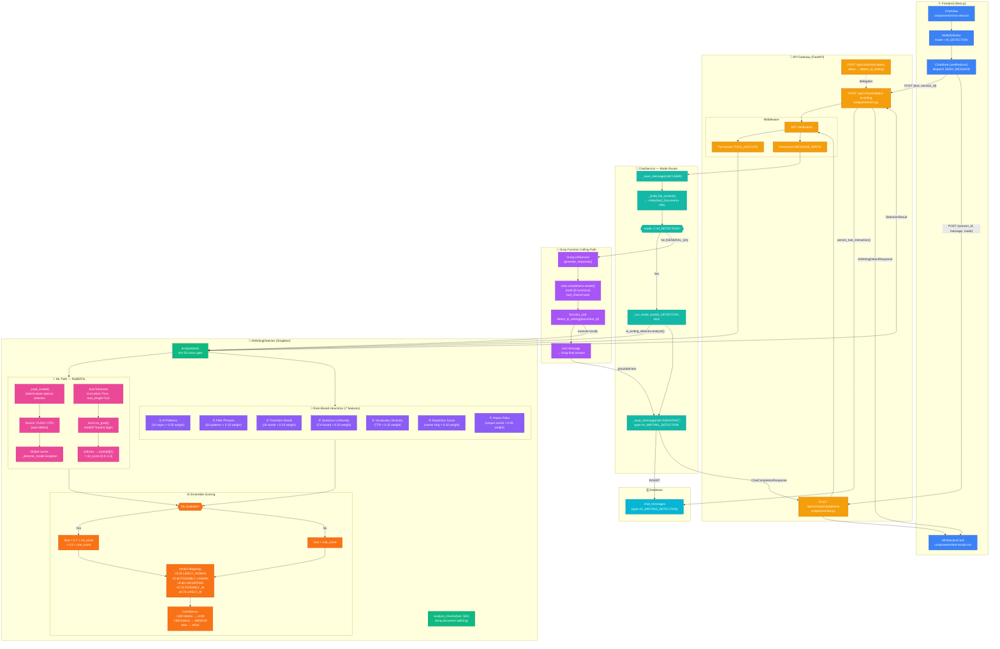
```mermaid
graph TB
    subgraph FRONTEND["⚛️ Frontend (Next.js)"]
        direction TB
        ChatView["ChatView<br/>components/chat-view.tsx"]
        ModeSelect["ModeSelector<br/>mode = AI_DETECTION"]
        Store["ChatStore (useReducer)<br/>dispatch SEND_MESSAGE"]
        RenderResult["AIDetectionCard<br/>components/tool-results.tsx"]

        ChatView --> ModeSelect
        ModeSelect --> Store
    end

    subgraph API_GATEWAY["🔐 API Gateway (FastAPI)"]
        direction TB
        DirectEP["POST /api/v1/tools/detect-ai-writing<br/>endpoints/tools.py"]
        AliasEP["POST /api/v1/tools/ai-detect<br/>(alias → detect_ai_writing)"]
        ChatEP["POST /api/v1/chat/completions<br/>endpoints/chat.py"]

        subgraph AUTH["Middleware"]
            JWT["JWT Verification"]
            RBAC_TOOL["Permission.TOOL_EXECUTE"]
            RBAC_MSG["Permission.MESSAGE_WRITE"]
        end

        AliasEP -.->|"delegates"| DirectEP
    end

    subgraph CHAT_SVC["💬 ChatService — Mode Router"]
        direction TB
        SaveUser["_save_message(role=USER)"]
        FileCtx["_build_file_context()<br/>→ &lt;Attached_Document&gt; XML"]
        ModeCheck{{"mode == AI_DETECTION?"}}
        RunTool["_run_mode_tool(AI_DETECTION, text)"]
        SaveAssist["_save_message(role=ASSISTANT)<br/>type=AI_WRITING_DETECTION"]

        SaveUser --> FileCtx
        FileCtx --> ModeCheck
        ModeCheck -->|"Yes"| RunTool
    end

    subgraph FC_PATH["🤖 Groq Function Calling Path"]
        direction TB
        GroqSvc["GroqLLMService<br/>generate_response()"]
        GenContent["chat.completions.create()<br/>tools=[5 functions]<br/>tool_choice=auto"]
        FCDetect["function_call:<br/>detect_ai_writing(document_id)"]
        FnResp["tool message<br/>→ Groq final answer"]

        GroqSvc --> GenContent
        GenContent --> FCDetect
        FCDetect --> FnResp
    end

    subgraph DETECTOR["🔬 AIWritingDetector (Singleton)"]
        direction TB
        Analyze["analyze(text)<br/>min 50 chars gate"]
        ChunkAPI["analyze_chunks(text, 500)<br/>(long document splitting)"]

        subgraph ML_PATH["🧠 ML Path — RoBERTa"]
            direction TB
            LoadModel["_load_model()<br/>roberta-base-openai-detector"]
            Tokenize["AutoTokenizer<br/>truncation=True, max_length=512"]
            Inference["torch.no_grad()<br/>model(**inputs).logits"]
            Softmax["softmax → probs[0][1]<br/>= ml_score (0.0–1.0)"]
            DeviceSelect["Device: CUDA / CPU<br/>(auto-detect)"]
            GlobalCache["Global cache:<br/>_detector_model singleton"]

            LoadModel --> DeviceSelect
            DeviceSelect --> GlobalCache
            Tokenize --> Inference
            Inference --> Softmax
        end

        subgraph RULE_PATH["📏 Rule-Based Heuristics (7 features)"]
            direction TB
            F1["① AI Patterns<br/>(30 regex × 0.25 weight)"]
            F2["② Filler Phrases<br/>(20 patterns × 0.15 weight)"]
            F3["③ Transition Words<br/>(26 words × 0.10 weight)"]
            F4["④ Sentence Uniformity<br/>(CV-based × 0.20 weight)"]
            F5["⑤ Vocabulary Diversity<br/>(TTR × 0.15 weight)"]
            F6["⑥ Repetition Score<br/>(starter freq × 0.10 weight)"]
            F7["⑦ Hapax Ratio<br/>(unique words × 0.05 weight)"]
        end

        subgraph ENSEMBLE["⚖️ Ensemble Scoring"]
            direction TB
            MLAvail{{"ML available?"}}
            EnsembleCalc["final = 0.7 × ml_score<br/>+ 0.3 × rule_score"]
            RuleOnly["final = rule_score"]
            VerdictMap["Verdict Mapping:<br/>&lt;0.25 LIKELY_HUMAN<br/>&lt;0.40 POSSIBLY_HUMAN<br/>&lt;0.60 UNCERTAIN<br/>&lt;0.75 POSSIBLY_AI<br/>≥0.75 LIKELY_AI"]
            ConfidenceCalc["Confidence:<br/>&lt;100 tokens → LOW<br/>&lt;300 tokens → MEDIUM<br/>else → HIGH"]

            MLAvail -->|"Yes"| EnsembleCalc
            MLAvail -->|"No"| RuleOnly
            EnsembleCalc --> VerdictMap
            RuleOnly --> VerdictMap
            VerdictMap --> ConfidenceCalc
        end

        Analyze --> ML_PATH
        Analyze --> RULE_PATH
        ML_PATH --> MLAvail
        RULE_PATH --> MLAvail
    end

    subgraph DATABASE["🗄️ Database"]
        MsgTable["chat_messages<br/>(type=AI_WRITING_DETECTION)"]
    end

    %% Direct endpoint flow
    Store -->|"POST {text, session_id}"| DirectEP
    DirectEP --> JWT --> RBAC_TOOL
    RBAC_TOOL --> Analyze
    Analyze -->|"DetectionResult"| DirectEP
    DirectEP -->|"persist_tool_interaction()"| MsgTable
    DirectEP -->|"AIWritingDetectResponse"| RenderResult

    %% Chat mode flow
    Store -->|"POST {session_id, message, mode}"| ChatEP
    ChatEP --> JWT
    JWT --> RBAC_MSG
    RBAC_MSG --> SaveUser
    ModeCheck -->|"No (GENERAL_QA)"| GroqSvc
    FCDetect -->|"execute locally"| Analyze
    FnResp -->|"grounded text"| SaveAssist
    RunTool -->|"ai_writing_detector.analyze()"| Analyze
    RunTool --> SaveAssist
    SaveAssist -->|"INSERT"| MsgTable
    SaveAssist -->|"ChatCompletionResponse"| ChatEP
    ChatEP --> RenderResult

    %% Styles
    classDef frontend fill:#3b82f6,color:#fff,stroke:#1e40af
    classDef api fill:#f59e0b,color:#fff,stroke:#b45309
    classDef chatsvc fill:#14b8a6,color:#fff,stroke:#0d9488
    classDef fc fill:#a855f7,color:#fff,stroke:#7e22ce
    classDef ml fill:#ec4899,color:#fff,stroke:#be185d
    classDef rules fill:#8b5cf6,color:#fff,stroke:#6d28d9
    classDef ensemble fill:#f97316,color:#fff,stroke:#c2410c
    classDef db fill:#06b6d4,color:#fff,stroke:#0e7490
    classDef detector fill:#10b981,color:#fff,stroke:#047857

    class ChatView,ModeSelect,Store,RenderResult frontend
    class DirectEP,AliasEP,ChatEP,JWT,RBAC_TOOL,RBAC_MSG api
    class SaveUser,FileCtx,ModeCheck,RunTool,SaveAssist chatsvc
    class GroqSvc,GenContent,FCDetect,FnResp fc
    class LoadModel,Tokenize,Inference,Softmax,DeviceSelect,GlobalCache ml
    class F1,F2,F3,F4,F5,F6,F7 rules
    class MLAvail,EnsembleCalc,RuleOnly,VerdictMap,ConfidenceCalc ensemble
    class MsgTable db
    class Analyze,ChunkAPI detector
```

#### 5.2.8 Component Diagram — Grammar & Spell Checker

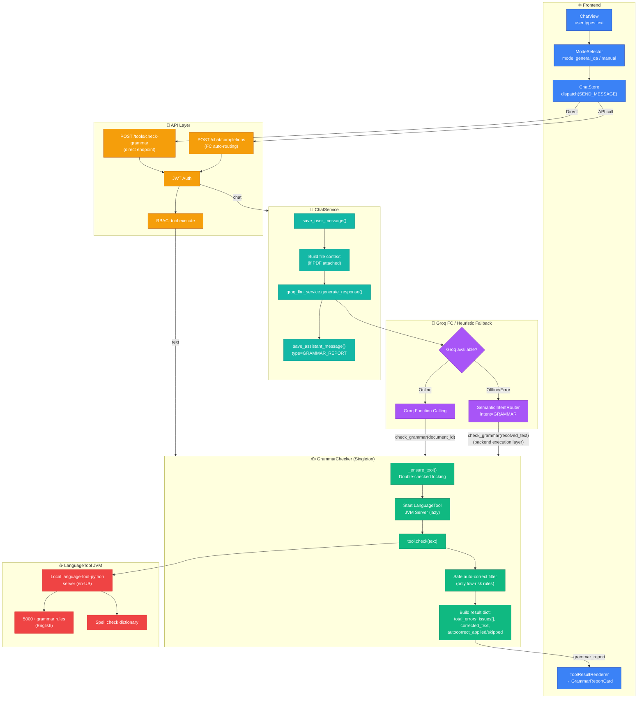
```mermaid
graph TB
    subgraph FRONTEND["⚛️ Frontend"]
        ChatView["ChatView<br/>user types text"]
        ModeSelect["ModeSelector<br/>mode: general_qa / manual"]
        Store["ChatStore<br/>dispatch(SEND_MESSAGE)"]
        RenderResult["ToolResultRenderer<br/>→ GrammarReportCard"]
    end

    subgraph API["🔌 API Layer"]
        DirectEP["POST /tools/check-grammar<br/>(direct endpoint)"]
        ChatEP["POST /chat/completions<br/>(FC auto-routing)"]
        JWT["JWT Auth"]
        RBAC["RBAC: tool:execute"]
    end

    subgraph CHAT_SVC["💬 ChatService"]
        SaveUser["save_user_message()"]
        FileCtx["Build file context<br/>(if PDF attached)"]
        CallLLM["groq_llm_service.generate_response()"]
        SaveAssist["save_assistant_message()<br/>type=GRAMMAR_REPORT"]
    end

    subgraph GROQ_FC["🤖 Groq FC / Heuristic Fallback"]
        GroqFC["Groq Function Calling"]
        HeuristicFB["SemanticIntentRouter<br/>intent=GRAMMAR"]
        FCDecision{"Groq available?"}
    end

    subgraph GRAMMAR_TOOL["✍️ GrammarChecker (Singleton)"]
        direction TB
        EnsureTool["_ensure_tool()<br/>Double-checked locking"]
        JVMStart["Start LanguageTool<br/>JVM Server (lazy)"]
        RunCheck["tool.check(text)"]
        CorrectText["Safe auto-correct filter<br/>(only low-risk rules)"]
        BuildResult["Build result dict:<br/>total_errors, issues[], corrected_text,<br/>autocorrect_applied/skipped"]
    end

    subgraph LANG_TOOL["☕ LanguageTool JVM"]
        LTServer["Local language-tool-python<br/>server (en-US)"]
        Rules["5000+ grammar rules<br/>(English)"]
        SpellDict["Spell check dictionary"]
    end

    %% Frontend flow
    ChatView --> ModeSelect --> Store
    Store -->|"API call"| ChatEP
    Store -->|"Direct"| DirectEP

    %% API routing
    DirectEP --> JWT --> RBAC
    ChatEP --> JWT

    %% Direct endpoint path
    RBAC -->|"text"| GRAMMAR_TOOL

    %% Chat path
    JWT -->|"chat"| CHAT_SVC
    SaveUser --> FileCtx --> CallLLM
    CallLLM --> FCDecision
    FCDecision -->|"Online"| GroqFC
    FCDecision -->|"Offline/Error"| HeuristicFB
    GroqFC -->|"check_grammar(document_id)"| GRAMMAR_TOOL
    HeuristicFB -->|"check_grammar(resolved_text)<br/>(backend execution layer)"| GRAMMAR_TOOL
    CallLLM --> SaveAssist

    %% Grammar tool internals
    EnsureTool --> JVMStart --> RunCheck
    RunCheck --> CorrectText --> BuildResult
    RunCheck --> LTServer
    LTServer --> Rules
    LTServer --> SpellDict

    %% Response
    BuildResult -->|"grammar_report"| RenderResult

    %% Styles
    classDef frontend fill:#3b82f6,color:#fff,stroke:#1e40af
    classDef api fill:#f59e0b,color:#fff,stroke:#b45309
    classDef chatsvc fill:#14b8a6,color:#fff,stroke:#0d9488
    classDef groq fill:#a855f7,color:#fff,stroke:#7e22ce
    classDef grammar fill:#10b981,color:#fff,stroke:#047857
    classDef jvm fill:#ef4444,color:#fff,stroke:#dc2626

    class ChatView,ModeSelect,Store,RenderResult frontend
    class DirectEP,ChatEP,JWT,RBAC api
    class SaveUser,FileCtx,CallLLM,SaveAssist chatsvc
    class GroqFC,HeuristicFB,FCDecision groq
    class EnsureTool,JVMStart,RunCheck,CorrectText,BuildResult grammar
    class LTServer,Rules,SpellDict jvm
```

---

## 6. Thiết kế Cơ sở dữ liệu (ERD)

### 6.1 Lược đồ Quan hệ Thực thể (Entity Relationship Diagram)

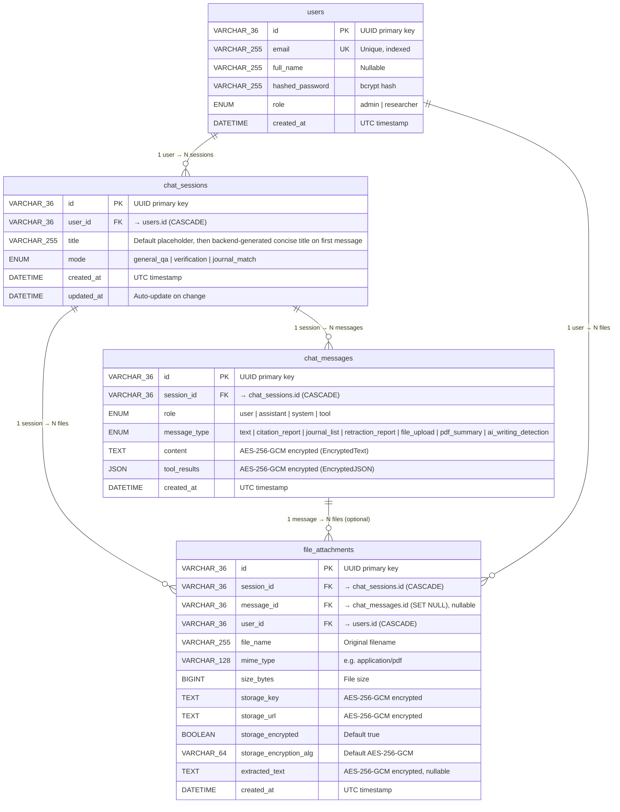
```mermaid
erDiagram
    users {
        VARCHAR_36 id PK "UUID primary key"
        VARCHAR_255 email UK "Unique, indexed"
        VARCHAR_255 full_name "Nullable"
        VARCHAR_255 hashed_password "bcrypt hash"
        ENUM role "admin | researcher"
        DATETIME created_at "UTC timestamp"
    }

    chat_sessions {
        VARCHAR_36 id PK "UUID primary key"
        VARCHAR_36 user_id FK "→ users.id (CASCADE)"
        VARCHAR_255 title "Default placeholder, then backend-generated concise title on first message"
        ENUM mode "general_qa | verification | journal_match"
        DATETIME created_at "UTC timestamp"
        DATETIME updated_at "Auto-update on change"
    }

    chat_messages {
        VARCHAR_36 id PK "UUID primary key"
        VARCHAR_36 session_id FK "→ chat_sessions.id (CASCADE)"
        ENUM role "user | assistant | system | tool"
        ENUM message_type "text | citation_report | journal_list | retraction_report | file_upload | pdf_summary | ai_writing_detection"
        TEXT content "AES-256-GCM encrypted (EncryptedText)"
        JSON tool_results "AES-256-GCM encrypted (EncryptedJSON)"
        DATETIME created_at "UTC timestamp"
    }

    file_attachments {
        VARCHAR_36 id PK "UUID primary key"
        VARCHAR_36 session_id FK "→ chat_sessions.id (CASCADE)"
        VARCHAR_36 message_id FK "→ chat_messages.id (SET NULL), nullable"
        VARCHAR_36 user_id FK "→ users.id (CASCADE)"
        VARCHAR_255 file_name "Original filename"
        VARCHAR_128 mime_type "e.g. application/pdf"
        BIGINT size_bytes "File size"
        TEXT storage_key "AES-256-GCM encrypted"
        TEXT storage_url "AES-256-GCM encrypted"
        BOOLEAN storage_encrypted "Default true"
        VARCHAR_64 storage_encryption_alg "Default AES-256-GCM"
        TEXT extracted_text "AES-256-GCM encrypted, nullable"
        DATETIME created_at "UTC timestamp"
    }

    users ||--o{ chat_sessions : "1 user → N sessions"
    chat_sessions ||--o{ chat_messages : "1 session → N messages"
    chat_sessions ||--o{ file_attachments : "1 session → N files"
    chat_messages ||--o{ file_attachments : "1 message → N files (optional)"
    users ||--o{ file_attachments : "1 user → N files"
```

### 6.2 Chi tiết Bảng & Ràng buộc

#### Bảng `users`

| Column | Type | Constraints | Mô tả |
|--------|------|-------------|-------|
| `id` | VARCHAR(36) | PK, DEFAULT uuid4() | UUID định danh |
| `email` | VARCHAR(255) | UNIQUE, NOT NULL, INDEX | Email đăng nhập |
| `full_name` | VARCHAR(255) | NULLABLE | Tên đầy đủ |
| `hashed_password` | VARCHAR(255) | NOT NULL | bcrypt hash ($2b$12$...) |
| `role` | ENUM('admin','researcher') | NOT NULL, DEFAULT 'researcher' | Vai trò trong hệ thống |
| `created_at` | DATETIME(tz) | NOT NULL, DEFAULT now(UTC) | Thời gian tạo |

#### Bảng `chat_sessions`

| Column | Type | Constraints | Mô tả |
|--------|------|-------------|-------|
| `id` | VARCHAR(36) | PK, DEFAULT uuid4() | UUID phiên chat |
| `user_id` | VARCHAR(36) | FK → users.id, ON DELETE CASCADE, INDEX | Chủ sở hữu |
| `title` | VARCHAR(255) | DEFAULT 'Trò chuyện mới' | Placeholder ban đầu; backend có thể thay bằng title ngắn sinh tự động sau user message đầu tiên |
| `mode` | ENUM('general_qa','verification','journal_match') | NOT NULL, DEFAULT 'general_qa' | Chế độ hoạt động |
| `created_at` | DATETIME(tz) | NOT NULL | Thời gian tạo |
| `updated_at` | DATETIME(tz) | NOT NULL, ON UPDATE now(UTC) | Thời gian cập nhật |

#### Bảng `chat_messages`

| Column | Type | Constraints | Mô tả |
|--------|------|-------------|-------|
| `id` | VARCHAR(36) | PK, DEFAULT uuid4() | UUID tin nhắn |
| `session_id` | VARCHAR(36) | FK → chat_sessions.id, ON DELETE CASCADE, INDEX | Phiên chat chứa message |
| `role` | ENUM('user','assistant','system','tool') | NOT NULL | Vai trò gửi message |
| `message_type` | ENUM(7 types) | NOT NULL, DEFAULT 'text' | Loại nội dung |
| `content` | TEXT (EncryptedText) | NULLABLE | Nội dung — mã hóa AES-256-GCM |
| `tool_results` | JSON (EncryptedJSON) | NULLABLE | Kết quả tool — mã hóa AES-256-GCM |
| `created_at` | DATETIME(tz) | NOT NULL | Thời gian tạo |

**Composite Index**: `ix_chatmsg_session_created(session_id, created_at)` — tối ưu query lấy messages theo session, sắp xếp theo thời gian.

#### Bảng `file_attachments`

| Column | Type | Constraints | Mô tả |
|--------|------|-------------|-------|
| `id` | VARCHAR(36) | PK, DEFAULT uuid4() | UUID file |
| `session_id` | VARCHAR(36) | FK → chat_sessions.id, ON DELETE CASCADE, INDEX | Phiên chat chứa file |
| `message_id` | VARCHAR(36) | FK → chat_messages.id, ON DELETE SET NULL, INDEX, NULLABLE | Message liên kết (optional) |
| `user_id` | VARCHAR(36) | FK → users.id, ON DELETE CASCADE, INDEX | Người upload |
| `file_name` | VARCHAR(255) | NOT NULL | Tên file gốc |
| `mime_type` | VARCHAR(128) | NOT NULL | MIME type (application/pdf, ...) |
| `size_bytes` | BIGINT | NOT NULL | Kích thước file (bytes) |
| `storage_key` | TEXT (EncryptedText) | NOT NULL | Đường dẫn lưu trữ — mã hóa |
| `storage_url` | TEXT (EncryptedText) | NOT NULL | URL truy cập — mã hóa |
| `storage_encrypted` | BOOLEAN | DEFAULT TRUE | File có mã hóa at-rest |
| `storage_encryption_alg` | VARCHAR(64) | DEFAULT 'AES-256-GCM' | Thuật toán mã hóa |
| `extracted_text` | TEXT (EncryptedText) | NULLABLE | Text trích xuất từ PDF — mã hóa |
| `created_at` | DATETIME(tz) | NOT NULL | Thời gian upload |

**Composite Indexes**:
- `ix_fileatt_session_created(session_id, created_at)` — truy vấn files theo session
- `ix_fileatt_user_created(user_id, created_at)` — truy vấn files theo user

### 6.3 Mối quan hệ (Relationships)

| Quan hệ | Loại | ON DELETE | Mô tả |
|----------|------|-----------|-------|
| `users` → `chat_sessions` | 1:N | CASCADE | Xóa user → xóa tất cả sessions |
| `chat_sessions` → `chat_messages` | 1:N | CASCADE | Xóa session → xóa tất cả messages |
| `chat_sessions` → `file_attachments` | 1:N | CASCADE | Xóa session → xóa metadata files |
| `chat_messages` → `file_attachments` | 1:N | SET NULL | Xóa message → giữ file, set message_id = NULL |
| `users` → `file_attachments` | 1:N | CASCADE | Xóa user → xóa tất cả files |

### 6.4 Encryption Schema

Các cột được đánh dấu `EncryptedText` / `EncryptedJSON` sử dụng SQLAlchemy custom types trong `core/encrypted_types.py`:

```
Plaintext → AES-256-GCM encrypt(master_key, random_iv) → Base64 encode → Store in DB
DB read → Base64 decode → AES-256-GCM decrypt(master_key, iv, tag) → Plaintext
```

| Bảng | Cột được mã hóa | Type |
|------|-----------------|------|
| `chat_messages` | `content` | EncryptedText |
| `chat_messages` | `tool_results` | EncryptedJSON |
| `file_attachments` | `storage_key` | EncryptedText |
| `file_attachments` | `storage_url` | EncryptedText |
| `file_attachments` | `extracted_text` | EncryptedText |

### 6.5 Sample Data (JSON Demo)

#### User record
```json
{
  "id": "a1b2c3d4-e5f6-7890-abcd-ef1234567890",
  "email": "researcher@university.edu",
  "full_name": "Nguyễn Văn A",
  "hashed_password": "$2b$12$LJ4kAePz6qG2...",
  "role": "researcher",
  "created_at": "2026-02-28T10:00:00+00:00"
}
```

#### Chat Session record
```json
{
  "id": "s1234567-abcd-ef01-2345-678901234567",
  "user_id": "a1b2c3d4-e5f6-7890-abcd-ef1234567890",
  "title": "Deep learning NLP research",
  "mode": "general_qa",
  "created_at": "2026-02-28T10:05:00+00:00",
  "updated_at": "2026-02-28T10:30:00+00:00"
}
```

#### Chat Message record (tool result)
```json
{
  "id": "m9876543-dcba-0fed-5432-109876543210",
  "session_id": "s1234567-abcd-ef01-2345-678901234567",
  "role": "assistant",
  "message_type": "citation_report",
  "content": "ENC:AES256GCM:base64(iv+ciphertext+tag)...",
  "tool_results": "ENC:AES256GCM:base64({\"type\":\"citation_report\",\"data\":[{\"citation\":\"10.1038/nature12373\",\"status\":\"DOI_VERIFIED\",\"confidence\":1.0,\"doi\":\"10.1038/nature12373\",\"title\":\"Nanometre-scale thermometry in a living cell\",\"authors\":[\"Kucsko G.\",\"Maurer P. C.\"],\"year\":2013,\"source\":\"crossref\"}]})...",
  "created_at": "2026-02-28T10:10:00+00:00"
}
```

#### File Attachment record
```json
{
  "id": "f5678901-2345-6789-0abc-def012345678",
  "session_id": "s1234567-abcd-ef01-2345-678901234567",
  "message_id": null,
  "user_id": "a1b2c3d4-e5f6-7890-abcd-ef1234567890",
  "file_name": "research_paper.pdf",
  "mime_type": "application/pdf",
  "size_bytes": 2458624,
  "storage_key": "ENC:AES256GCM:base64(...)...",
  "storage_url": "ENC:AES256GCM:base64(...)...",
  "storage_encrypted": true,
  "storage_encryption_alg": "AES-256-GCM",
  "extracted_text": "ENC:AES256GCM:base64(Introduction: This paper presents...)...",
  "created_at": "2026-02-28T10:08:00+00:00"
}
```

---

## 7. Tích hợp API & Dịch vụ bên ngoài (API Integrations & Third-Party Services)

Phần này mô tả chi tiết tất cả các tích hợp với dịch vụ/API bên ngoài mà hệ thống AIRA sử dụng, bao gồm: vai trò, phương thức tích hợp, cơ chế fallback, và trạng thái hiện tại.

### 7.1 Tổng quan Integrations

```mermaid
graph TB
    subgraph AIRA["🏗️ AIRA Backend"]
        LLM["LLM Service<br/>(GroqLLMService)"]
        CC["Citation Checker"]
        JF["Journal Finder"]
        RS["Retraction Scanner"]
        AW["AI Writing Detector"]
        GC["Grammar Checker"]
        FS["File Service"]
        SS["Storage Service"]
        AUTH["Auth Service"]
    end

    subgraph External_APIs["🌐 External APIs"]
        GROQ["Groq API<br/>LLaMA 3.1-8b-instant<br/>+ Function Calling (OpenAI-compatible)"]
        OA["OpenAlex API<br/>api.openalex.org"]
        CR["Crossref API<br/>api.crossref.org"]
        PP["PubPeer API v3<br/>pubpeer.com/v3"]
    end

    subgraph ML_Models["🧠 ML Models (HuggingFace)"]
        MINILM["all-MiniLM-L6-v2<br/>(ChromaDB embeddings +<br/>Intent Routing)"]
        RB["RoBERTa<br/>roberta-base-openai-detector"]
        HF["HuggingFace Hub<br/>Model Downloads"]
    end

    subgraph Data_Pipeline["📦 Data Pipeline"]
        CHROMA["ChromaDB (PersistentClient)<br/>journal_cfps collection"]
        CRAWLER["UniversalScraper<br/>(cloudscraper + sources.json)"]
        DBBUILDER["DbBuilder<br/>(SentenceTransformer → ChromaDB)"]
    end

    subgraph Infrastructure["⚙️ Infrastructure"]
        DB["SQLAlchemy<br/>SQLite / PostgreSQL"]
        S3["AWS S3<br/>boto3"]
        CRYPTO["PyCryptodome<br/>AES-256-GCM"]
        JWT_LIB["python-jose<br/>JWT HS256"]
        BCRYPT["bcrypt<br/>Password Hashing"]
    end

    subgraph Document["📄 Document Processing"]
        PDF["PyMuPDF (fitz)<br/>PDF Text Extraction"]
    end

    LLM -->|groq SDK| GROQ
    CC -->|pyalex SDK| OA
    CC -->|habanero SDK| CR
    RS -->|habanero SDK| CR
    RS -->|httpx| OA
    RS -->|httpx POST| PP
    JF -->|query| CHROMA
    CRAWLER -->|cloudscraper| Publishers2["Publisher Sites<br/>(Elsevier, MDPI, IEEE)"]
    CRAWLER --> DBBUILDER
    DBBUILDER -->|sentence-transformers| MINILM
    DBBUILDER -->|upsert| CHROMA
    AW -->|transformers| RB
    FS --> PDF
    SS --> S3
    AUTH --> JWT_LIB
    AUTH --> BCRYPT

    classDef dead fill:#ff6b6b,stroke:#c0392b,color:#fff
    classDef ok fill:#2ecc71,stroke:#27ae60,color:#fff
    classDef warn fill:#f39c12,stroke:#e67e22,color:#fff
    classDef ml fill:#9b59b6,stroke:#8e44ad,color:#fff

    class PP ok
    class GROQ,OA,CR ok
    class MINILM,RB,HF ml
    class CHROMA,CRAWLER,DBBUILDER ml
    class DB,S3,CRYPTO,JWT_LIB,BCRYPT,PDF ok
```

### 7.2 Groq API (LLaMA 3.1) — Function Calling Architecture

| Thuộc tính | Chi tiết |
|-----------|---------|
| **Vai trò** | LLM chính — tạo phản hồi chat, **gọi tool tự động qua Function Calling**, tóm tắt PDF |
| **SDK** | `groq` ≥ 0.12.0 (OpenAI-compatible chat completions API) |
| **Model** | `llama-3.1-8b-instant` (cấu hình qua `settings.groq_model`) |
| **Auth** | API Key qua biến môi trường `GROQ_API_KEY` |
| **File** | `backend/app/services/llm_service.py` |
| **Function Calling** | ✅ 5 tool functions registered, manual FC loop (tool_choice=auto, max 5 iterations) |
| **System Prompt** | Vietnamese anti-hallucination prompt (SYSTEM_PROMPT constant) |
| **Trạng thái** | ✅ Hoạt động — tool calls verified end-to-end |

#### 7.2.1 Function Calling — Tổng quan

Groq (LLaMA 3.1) **không bao giờ tự bịa dữ liệu học thuật**. Thay vào đó, khi user hỏi về retraction, citation, journal, AI detection, hoặc grammar, Groq sẽ tự động gọi tool functions thực thi ở backend, nhận kết quả thực, rồi tổng hợp câu trả lời dựa trên dữ liệu đó.

**5 Tool Functions đã đăng ký:**

| Tên Function | Mô tả | Backend Tool |
|-------------|-------|-------------|
| `scan_retraction_and_pubpeer(document_id\|text)` | Hybrid contract: ưu tiên `document_id`, fallback text ngắn chứa DOI | `retraction_scanner.scan()` |
| `verify_citation(document_id\|text)` | Hybrid contract: ưu tiên `document_id`, fallback text ngắn chứa citation | `citation_checker.verify()` |
| `match_journal(document_id\|abstract[, title])` | Hybrid contract: ưu tiên `document_id`, fallback abstract/title inline | `journal_finder.recommend()` |
| `detect_ai_writing(document_id)` | Phát hiện AI viết bằng RoBERTa ensemble qua pass-by-reference routing | `ai_writing_detector.analyze(resolved_text)` |
| `check_grammar(document_id)` | Kiểm tra ngữ pháp/chính tả bằng LanguageTool qua pass-by-reference routing | `grammar_checker.check_grammar(resolved_text)` |

#### 7.2.2 Function Calling Flow

```mermaid
graph TB
    subgraph USER_INPUT["📥 User Input"]
        Prompt["User Prompt<br/>+ Chat History"]
        FileCtx["File Context Injection<br/><Attached_Document> XML"]
    end

    subgraph CHAT_SVC["💬 ChatService"]
        BuildCtx["_build_file_context()<br/>Attach file context; router gets metadata-only for oversized docs"]
        LoadHist["Load history<br/>(DB window=chat_context_window, router keeps last 4)"]
        SaveMsg["_save_message()<br/>role=ASSISTANT"]
    end

    subgraph GROQ_SVC["🤖 GroqLLMService — _generate_with_fc()"]
        BuildContent["_build_messages()<br/>History → messages array"]
        GenContent["chat.completions.create()<br/>tools=_GROQ_TOOLS<br/>tool_choice=auto"]
        CheckResp{"Response has<br/>tool_calls?"}
        ExecTool["_execute_tool_call()<br/>Run Python tool locally"]
        AppendFR["Append compact tool feedback<br/>(non-terminal tools only)"]
        TerminalExit["Terminal tool early-exit<br/>(AI detection / grammar)"]
        IterCheck{"Iteration < 5?"}
        ExtractText["Extract final text<br/>+ determine MessageType"]
        BudgetExc["⚠️ Budget exceeded<br/>(max 5 iterations)"]
    end

    subgraph TOOLS["🔧 Tool Functions (Local Execution)"]
        T1["scan_retraction_and_pubpeer(document_id|text)"]
        T2["verify_citation(document_id|text)"]
        T3["match_journal(document_id|abstract[, title])"]
        T4["detect_ai_writing(document_id)"]
        T5["check_grammar(document_id)"]
    end

    subgraph GROQ_CLOUD["☁️ Groq API (LPU Inference)"]
        GModel["llama-3.1-8b-instant<br/>System Prompt: Vietnamese<br/>anti-hallucination"]
    end

    subgraph RESPONSE["📤 Response"]
        FCResp["FunctionCallingResponse<br/>text + message_type<br/>+ tool_results"]
    end

    %% Flow
    Prompt --> BuildCtx
    FileCtx --> BuildCtx
    BuildCtx --> LoadHist
    LoadHist --> BuildContent
    BuildContent --> GenContent
    GenContent --> GModel
    GModel --> CheckResp

    CheckResp -->|"Yes"| ExecTool
    ExecTool --> T1
    ExecTool --> T2
    ExecTool --> T3
    ExecTool --> T4
    ExecTool --> T5
    T1 --> AppendFR
    T2 --> AppendFR
    T3 --> AppendFR
    T4 --> TerminalExit
    T5 --> TerminalExit
    AppendFR --> IterCheck
    IterCheck -->|"Yes"| GenContent
    IterCheck -->|"No"| BudgetExc

    CheckResp -->|"No (final text)"| ExtractText
    ExtractText --> FCResp
    TerminalExit --> FCResp
    BudgetExc --> FCResp
    FCResp --> SaveMsg

    %% Styles
    classDef input fill:#3b82f6,color:#fff,stroke:#1e40af
    classDef chatsvc fill:#14b8a6,color:#fff,stroke:#0d9488
    classDef groq fill:#a855f7,color:#fff,stroke:#7e22ce
    classDef tools fill:#10b981,color:#fff,stroke:#047857
    classDef cloud fill:#f59e0b,color:#fff,stroke:#b45309
    classDef response fill:#06b6d4,color:#fff,stroke:#0e7490
    classDef error fill:#ef4444,color:#fff,stroke:#b91c1c

    class Prompt,FileCtx input
    class BuildCtx,LoadHist,SaveMsg chatsvc
    class BuildContent,GenContent,CheckResp,ExecTool,AppendFR,TerminalExit,IterCheck,ExtractText groq
    class T1,T2,T3,T4 tools
    class GModel cloud
    class FCResp response
    class BudgetExc error
```

#### 7.2.3 Phương thức tích hợp

```python
from groq import Groq

# Khởi tạo client
client = Groq(api_key=settings.groq_api_key)

# Tool definitions — JSON schemas (OpenAI-compatible)
_GROQ_TOOLS = [
    {
        "type": "function",
        "function": {
            "name": "scan_retraction_and_pubpeer",
            "description": "Scan DOIs for retraction status and PubPeer comments.",
            "parameters": {
                "type": "object",
                "properties": {
                    "document_id": {"type": "string"},
                    "text": {"type": "string"},
                },
                "anyOf": [{"required": ["document_id"]}, {"required": ["text"]}],
                "additionalProperties": False,
            },
        },
    },
    # ... verify_citation, match_journal, detect_ai_writing, check_grammar
]

# FC loop (manual control, max 5 iterations)
messages = [{"role": "system", "content": SYSTEM_PROMPT}, ...]

response = client.chat.completions.create(
    model="llama-3.1-8b-instant",
    messages=messages,
    tools=_GROQ_TOOLS,
    tool_choice="auto",
)

# Check for tool_calls in response
for tool_call in response.choices[0].message.tool_calls or []:
    result = _execute_tool_call(tool_call.function.name, tool_call.function.arguments)
    # Append tool message back → Groq synthesises final answer
    messages.append({"role": "tool", "tool_call_id": tool_call.id, "content": json.dumps(result)})
```

#### 7.2.4 FC Loop Architecture

```mermaid
flowchart TD
    A[User Prompt + History] --> B[Build messages array<br/>system + history + user]
    B --> C[chat.completions.create<br/>with tools + tool_choice=auto]
    C --> D{Response has<br/>tool_calls?}

    D -->|Yes| E[Execute tool locally]
    E --> F[Append assistant message<br/>+ tool message to messages]
    F --> G{Iteration < 5?}
    G -->|Yes| C
    G -->|No| H[Return budget-exceeded message]

    D -->|No| I[Extract final text]
    I --> J{Any tools<br/>called earlier?}
    J -->|Yes| K[Build FunctionCallingResponse<br/>with message_type + tool_results]
    J -->|No| L[Build FunctionCallingResponse<br/>message_type=TEXT]
    K --> M[Return to ChatService]
    L --> M

    style E fill:#3498db,stroke:#2980b9,color:#fff
    style K fill:#2ecc71,stroke:#27ae60
    style L fill:#95a5a6,stroke:#7f8c8d
    style H fill:#e74c3c,stroke:#c0392b,color:#fff
```

#### 7.2.5 System Prompt (Anti-Hallucination)

```
Bạn là AIRA — trợ lý nghiên cứu học thuật chuyên nghiệp.

### QUY TẮC BẮT BUỘC:
1. KHÔNG BAO GIỜ bịa dữ liệu học thuật (DOI, citation, journal, PubPeer...)
2. LUÔN gọi tool khi cần dữ liệu thực:
   - Retraction/PubPeer → scan_retraction_and_pubpeer
   - Citation → verify_citation
   - Journal matching → match_journal
   - AI detection → detect_ai_writing
   - Kiểm tra ngữ pháp / chính tả / sửa lỗi văn bản → check_grammar
3. Nếu không có tool phù hợp → ghi rõ "kiến thức chung, chưa xác minh"
4. Kết quả tool = DỮ LIỆU THỰC — trình bày chính xác
5. Trả lời tiếng Việt (trừ khi user viết tiếng Anh)
6. Ngắn gọn, chính xác, học thuật
```

#### 7.2.6 Cơ chế Resilience & Fallback (3 tầng)

AIRA triển khai kiến trúc **3 tầng chịu lỗi** để đảm bảo hệ thống không bao giờ trả lỗi trắng cho người dùng:

```mermaid
graph TB
    A["User gửi message<br/>(generate_response)"] --> B["_generate_with_fc()"]

    subgraph TIER1["Tầng 1: Tenacity Retry"]
        B --> C["_call_generate_content()"]
        C --> D{Groq trả 503/429?}
        D -->|"Có"| E["Retry (exp backoff)<br/>4s → 10s, tối đa 3 lần"]
        E --> C
        D -->|"Không"| F["Response OK"]
    end

    subgraph TIER2["Tầng 2: Heuristic Fallback Engine"]
        direction TB
        G["_try_heuristic_fallback()"] --> H["SemanticIntentRouter<br/>(all-MiniLM-L6-v2, 384-dim)"]
        H --> I["3-layer intent detection"]
        I --> I1["Layer 1: Smart Defaults<br/>DOI→Retraction, >350 chars→AI/Grammar"]
        I --> I2["Layer 2: Semantic Routing<br/>cosine similarity ≥ 0.35"]
        I --> I3["Layer 3: Keyword Fallback<br/>exact substring matching"]
        I1 --> J["Intent detected?"]
        I2 --> J
        I3 --> J
        J -->|"Có"| K["Direct Tool Execution<br/>(bypass Groq entirely)"]
        K --> L["Template Response Generator<br/>+ FunctionCallingResponse"]
    end

    subgraph TIER3["Tầng 3: Static Error Message"]
        M["Thông báo lỗi thân thiện<br/>(KHÔNG crash, KHÔNG lộ stack trace)"]
    end

    F --> N{RetryError /<br/>SDK Exception?}
    N -->|"Có"| G
    N -->|"Không"| O["Return FC Response"]
    J -->|"Không"| M
    L --> O

    style E fill:#f59e0b,stroke:#d97706,color:#fff
    style K fill:#3b82f6,stroke:#2563eb,color:#fff
    style M fill:#ef4444,stroke:#dc2626,color:#fff
    style O fill:#10b981,stroke:#059669,color:#fff
```

**Chi tiết các tầng:**

| Tầng | Component | File | Hành vi |
|------|-----------|------|---------|
| **Tầng 1** — Retry | `tenacity` decorator trên `_call_chat_completions()` | `llm_service.py` | 3 lần retry, exponential backoff (4s→10s), retry nhóm lỗi SDK status/rate/internal |
| **Tầng 2** — Heuristic | `_try_heuristic_fallback()` → `fallback_process_request()` | `heuristic_router.py` | Trích user_text + file_context từ messages → SemanticIntentRouter xác định intent → gọi trực tiếp tool Python → template response |
| **Tầng 3** — Static | Hard-coded error message | `llm_service.py` | Luôn trả `FunctionCallingResponse` hợp lệ, KHÔNG raise exception |

**SemanticIntentRouter — Intent Detection (5 intents):**

| Intent | Mô tả | Threshold |
|--------|-------|-----------|
| `RETRACTION` | Kiểm tra thu hồi bài báo | Default khi có DOI |
| `CITATION` | Xác minh trích dẫn/tài liệu tham khảo | ≥ 0.35 |
| `JOURNAL` | Gợi ý tạp chí phù hợp | ≥ 0.35 |
| `AI_DETECT` | Phát hiện văn bản AI | ≥ 0.35 (hoặc >350 chars) |
| `GRAMMAR` | Kiểm tra ngữ pháp/chính tả | ≥ 0.35 (hoặc grammar hints) |

**Cơ chế bổ sung:**
- Nếu `GROQ_API_KEY` không set → log warning, disable Groq, trả message mặc định
- Nếu SDK `groq` không cài → disable Groq
- Nếu tool execution fail → trả `{"error": "..."}` → Groq nhận lỗi, thông báo cho user
- Nếu FC loop vượt 5 iterations → trả budget-exceeded message
- `summarize_text()` sử dụng `generate_simple()` (không có tools) với fallback cắt text

#### 7.2.7 FunctionCallingResponse Dataclass

```python
@dataclass
class FunctionCallingResponse:
    text: str                            # Final synthesised answer
    tool_calls: list[dict] = field(default_factory=list)  # [{name, args, result}, ...]
    message_type: str = "text"           # single-tool: report type; multi-tool grouped: "text"
    tool_results: dict | None = None     # single: {type,data,...} OR grouped: {type:"multi_tool_report",groups:[...]}
```

`ChatService` sử dụng `message_type` và `tool_results` để lưu tin nhắn với đúng `MessageType` enum; frontend ưu tiên structured `tool_results` để render rich cards/group-cards (JournalListCard, CitationReportCard, RetractionReportCard, ...).

### 7.3 OpenAlex API

| Thuộc tính | Chi tiết |
|-----------|---------|
| **Vai trò** | Cơ sở dữ liệu học thuật mở — xác minh citation, kiểm tra retraction status |
| **SDK chính** | `pyalex` ≥ 0.13 (Python wrapper cho OpenAlex REST API) |
| **HTTP fallback** | `httpx` gọi trực tiếp `https://api.openalex.org/works` |
| **Auth** | Không yêu cầu (public API, polite pool qua email) |
| **Base URL** | `https://api.openalex.org` |
| **Sử dụng bởi** | `citation_checker.py`, `retraction_scan.py` |
| **Trạng thái** | ✅ Hoạt động (latency ~2.0s, 2.6M+ works indexed) |

**Phương thức tích hợp — Citation Checker:**

```python
# Cách 1: PyAlex SDK (ưu tiên)
from pyalex import Works

works = Works().search(title_query).get(per_page=5)
for work in works:
    # work["doi"], work["title"], work["authorships"]

# Cách 2: httpx fallback (khi PyAlex fail)
import httpx
r = httpx.get(
    "https://api.openalex.org/works",
    params={"search": title_query, "per_page": 5},
    timeout=10.0,
)
data = r.json()["results"]
```

**Phương thức tích hợp — Retraction Scanner:**

```python
# Kiểm tra retraction status qua OpenAlex
import httpx
r = httpx.get(
    f"https://api.openalex.org/works/https://doi.org/{doi}",
    timeout=12.0,
)
work = r.json()
is_retracted = work.get("is_retracted", False)
```

**Cơ chế Fallback:**
- PyAlex SDK failure → chuyển sang httpx HTTP trực tiếp
- httpx failure → trả `UNVERIFIED` status, không crash
- `httpx.Client(timeout=10.0)` với transport `retries=2`

### 7.4 Crossref API

| Thuộc tính | Chi tiết |
|-----------|---------|
| **Vai trò** | Metadata DOI — xác minh citation qua DOI, kiểm tra retraction/correction |
| **SDK chính** | `habanero` ≥ 1.2.0 (Python wrapper cho Crossref REST API) |
| **HTTP fallback** | `httpx` gọi trực tiếp `https://api.crossref.org/works/{doi}` |
| **Auth** | Không yêu cầu (public API, polite pool qua `mailto`) |
| **Base URL** | `https://api.crossref.org` |
| **Sử dụng bởi** | `citation_checker.py`, `retraction_scan.py` |
| **Trạng thái** | ✅ Hoạt động (latency ~1.0s) |

**Phương thức tích hợp — Citation Checker (DOI verification):**

```python
# Cách 1: Habanero SDK (ưu tiên)
from habanero import Crossref
cr = Crossref()
result = cr.works(ids=doi)
metadata = result["message"]
# metadata["title"], metadata["author"], metadata["DOI"]

# Cách 2: httpx fallback
import httpx
r = httpx.get(f"https://api.crossref.org/works/{doi}", timeout=10.0)
metadata = r.json()["message"]
```

**Phương thức tích hợp — Retraction Scanner (update-to check):**

```python
from habanero import Crossref
cr = Crossref()
result = cr.works(ids=doi)
msg = result["message"]

# Kiểm tra retraction/correction qua "update-to" field
for update in msg.get("update-to", []):
    if update.get("type") == "retraction":
        # Paper đã bị retract
    elif update.get("type") == "correction":
        # Paper có correction

# Fallback: kiểm tra title prefix "RETRACTED:"
title = msg.get("title", [""])[0]
if title.upper().startswith("RETRACTED:"):
    # Paper đã bị retract (phát hiện qua title)
```

**Cơ chế Fallback:**
- Habanero SDK failure → chuyển sang httpx HTTP trực tiếp
- httpx failure → trả `UNVERIFIED`, không crash
- `httpx.HTTPTransport(retries=2)` cho reliability
- Crossref `update-to` field không đáng tin (rỗng cho nhiều paper đã retract) → bổ sung title-based detection

### 7.5 PubPeer API

| Thuộc tính | Chi tiết |
|-----------|---------|
| **Vai trò** | Kiểm tra post-publication peer review comments |
| **HTTP Client** | `httpx` — **POST** request |
| **Endpoint** | `POST https://pubpeer.com/v3/publications?devkey=PubMedChrome` |
| **Auth** | Public devkey `PubMedChrome` (query parameter) |
| **Sử dụng bởi** | `retraction_scan.py` |
| **Trạng thái** | ✅ **Hoạt động** (latency ~0.4s) |

> **Lưu ý lịch sử**: API v1 (`GET /v1/publications`) đã ngừng hoạt động (trả 404 HTML). Hệ thống hiện dùng API v3 với `POST` method và JSON body.

**Phương thức tích hợp:**

```python
import httpx

PUBPEER_API_URL = "https://pubpeer.com/v3/publications"
PUBPEER_DEVKEY = "PubMedChrome"

resp = client.post(
    f"{PUBPEER_API_URL}?devkey={PUBPEER_DEVKEY}",
    json={"dois": [doi]},
    headers={
        "User-Agent": "AIRA-ResearchAssistant/1.0 (mailto:24521236@gm.uit.edu.vn)",
        "Content-Type": "application/json",
    },
)
data = resp.json()
feedbacks = data.get("feedbacks", [])

if not feedbacks:
    # Paper sạch — không có bình luận trên PubPeer
    result = {"has_comments": False, "total_comments": 0, "url": None}
else:
    fb = feedbacks[0]
    result = {
        "has_comments": True,
        "total_comments": fb.get("total_comments", 0),
        "url": fb.get("url"),  # Direct link đến bài trên PubPeer
    }
```

**Cấu trúc Response từ PubPeer v3:**
```json
{
  "feedbacks": [
    {
      "id": 12345,
      "total_comments": 4,
      "url": "https://pubpeer.com/publications/ABC123...",
      "title": "Paper Title...",
      "comments": [...]
    }
  ]
}
```

- `feedbacks` rỗng (`[]`) → paper không có bình luận → an toàn
- `feedbacks[0].total_comments > 0` → paper có bình luận → cần xem xét
- `feedbacks[0].url` → link trực tiếp đến trang thảo luận trên PubPeer

**Cơ chế Fallback:**
- HTTP error (4xx, 5xx) → `pubpeer_comments = 0`, log warning
- Network error → `pubpeer_comments = 0`, log warning  
- Luôn cung cấp manual search URL backup: `https://pubpeer.com/search?q={doi}`
- Bắt riêng `httpx.RequestError` và `httpx.HTTPStatusError` — KHÔNG crash app

```mermaid
flowchart LR
    A[scan_doi] --> B["httpx POST<br/>pubpeer.com/v3/publications<br/>?devkey=PubMedChrome<br/>{dois: [doi]}"]
    B --> C{status == 200?}
    C -->|Yes| D{feedbacks<br/>not empty?}
    D -->|Yes| E["✅ has_comments=True<br/>total_comments=N<br/>url=direct_link"]
    D -->|No| F["✅ has_comments=False<br/>total_comments=0<br/>(paper sạch)"]
    C -->|No| G["⚠️ pubpeer_comments=0<br/>url=manual search link"]
    B -->|Exception| G

    style E fill:#e74c3c,stroke:#c0392b,color:#fff
    style F fill:#2ecc71,stroke:#27ae60
    style G fill:#f39c12,stroke:#e67e22
```

### 7.6 HuggingFace Hub & Model Downloads

| Thuộc tính | Chi tiết |
|-----------|---------|
| **Vai trò** | Tải và cache ML models từ HuggingFace Model Hub |
| **SDK** | `huggingface-hub` ≥ 0.20 |
| **Auth** | `HF_TOKEN` (optional, cho private/gated models) |
| **Sử dụng bởi** | `journal_finder.py` (SPECTER2 for ChromaDB), `ai_writing_detector.py` (RoBERTa) |
| **Cache** | `~/.cache/huggingface/hub/` (auto-cached sau lần tải đầu) |
| **Trạng thái** | ✅ Hoạt động |

**Phương thức tích hợp:**

```python
import os
from dotenv import load_dotenv
load_dotenv()  # Load HF_TOKEN từ .env

from huggingface_hub import login
token = os.environ.get("HF_TOKEN", "").strip()
if token:
    login(token=token, add_to_git_credential=False)
    # "HF_TOKEN is set and is the current active token"
```

**Cơ chế Model Load — Online/Cache Mode:**
```python
try:
    model = SentenceTransformer("allenai/specter2_base", trust_remote_code=False)
except Exception:
    # Nếu model không load được, journal_finder degrade an toàn:
    # recommend() trả [] thay vì fabricate fallback data
    model = None
```

### 7.7 ChromaDB — Journal Vector Database

| Thuộc tính | Chi tiết |
|-----------|---------|
| **Vai trò** | Persistent vector store cho journal CFP data → semantic search |
| **Database** | ChromaDB PersistentClient (`backend/data/chroma_db/`) |
| **Collection** | `journal_cfps`, cosine HNSW space, MD5 hash IDs |
| **Embedding Model** | `allenai/specter2_base` (768 dimensions) via SentenceTransformer |
| **Data Source** | `backend/crawler/` pipeline (UniversalScraper → DbBuilder) |
| **File** | `backend/app/services/tools/journal_finder.py` |
| **Latency** | ~0.05s (query) / ~30s (full DB rebuild) |
| **Trạng thái** | ✅ Hoạt động |

**Phương thức tích hợp:**

```python
import chromadb
from sentence_transformers import SentenceTransformer

# ChromaDB persistent client
client = chromadb.PersistentClient(path="backend/data/chroma_db")
collection = client.get_collection("journal_cfps")

# Embedding model (shared with db_builder)
model = SentenceTransformer("all-MiniLM-L6-v2")

# Query: encode abstract → search collection
query_emb = model.encode([abstract_text]).tolist()
results = collection.query(
    query_embeddings=query_emb,
    n_results=top_k,
)
# Parse results: metadatas contain journal, issn, domains, h_index, etc.
```

**Data Pipeline (ETL):**

```mermaid
flowchart TD
    A[sources.json<br/>Publisher configs] --> B[UniversalScraper<br/>cloudscraper + CSS selectors]
    B --> C{Scrape OK?}
    C -->|Yes| D[DbBuilder<br/>SentenceTransformer encode]
    C -->|No / Blocked| E[Skip publisher<br/>zero hallucination]
    D --> F[ChromaDB upsert<br/>collection: journal_cfps]
    F --> G[✅ Persistent DB<br/>backend/data/chroma_db/]

    style B fill:#2ecc71,stroke:#27ae60
    style E fill:#f39c12,stroke:#e67e22
    style G fill:#e74c3c,stroke:#c0392b,color:#fff
```

### 7.7.1 Data Engineering Pipeline — Crawler → ChromaDB

AIRA sử dụng pipeline ETL tự động để thu thập dữ liệu Call-for-Papers (CFP) từ các nhà xuất bản học thuật và đưa vào ChromaDB vector store.

| Thuộc tính | Chi tiết |
|-----------|---------|
| **Mục đích** | Thu thập CFP data → embed → lưu ChromaDB cho `JournalFinder` |
| **Thư mục** | `backend/crawler/` |
| **Scraper** | `UniversalScraper` — configuration-driven, dùng `cloudscraper` (bypass Cloudflare) |
| **Config** | `sources.json` — CSS selectors cho Elsevier, MDPI, IEEE |
| **DB Builder** | `db_builder.py` — SentenceTransformer `all-MiniLM-L6-v2` → ChromaDB upsert |
| **Runner** | `run.py` — orchestrator: scrape → seed → log statistics |
| **Chính sách** | **Zero Hallucination** — nếu publisher block request → skip, KHÔNG inject fake data |

**Pipeline Architecture:**

```mermaid
graph TB
    subgraph CONFIG["📋 Configuration"]
        Sources["sources.json<br/>3 publisher configs:<br/>• Elsevier (ScienceDirect)<br/>• MDPI<br/>• IEEE Computer Society"]
        Selectors["CSS Selectors per publisher:<br/>item_container, title,<br/>deadline, scope, link"]
    end

    subgraph SCRAPER["🕷️ UniversalScraper"]
        direction TB
        LoadConfig["Load sources.json"]
        CloudScraper["cloudscraper.create_scraper()<br/>browser: Chrome/Windows"]
        FetchPage["GET publisher URL<br/>+ random delay 1-3s"]
        ParseHTML["BeautifulSoup(html, 'html.parser')<br/>→ CSS selector extraction"]
        NormalizeURL["urljoin(base_url, relative_link)"]
        ZeroHallucination{"HTTP 200<br/>+ items found?"}
        SkipPublisher["Skip publisher<br/>log warning, continue"]
        CollectRecords["Collect CFP records:<br/>{title, scope, url,<br/>publisher, deadline}"]

        LoadConfig --> CloudScraper
        CloudScraper --> FetchPage
        FetchPage --> ParseHTML
        ParseHTML --> NormalizeURL
        NormalizeURL --> ZeroHallucination
        ZeroHallucination -->|"No"| SkipPublisher
        ZeroHallucination -->|"Yes"| CollectRecords
    end

    subgraph BUILDER["🏗️ DbBuilder"]
        direction TB
        LoadModel["SentenceTransformer<br/>all-MiniLM-L6-v2"]
        MakeID["MD5 hash(url or title)<br/>→ deterministic ID"]
        BuildDoc["doc = title + scope<br/>(concatenated text)"]
        Encode["model.encode(documents)<br/>→ 384-dim embeddings"]
        Upsert["ChromaDB collection.upsert()<br/>ids, documents, embeddings,<br/>metadatas"]
    end

    subgraph CHROMADB["💾 ChromaDB"]
        Collection["Collection: journal_cfps<br/>Space: cosine (HNSW)<br/>Path: backend/data/chroma_db/"]
    end

    subgraph RUNNER["🚀 run.py"]
        Orchestrate["1. scraper.scrape_all()<br/>2. seed_database(records)<br/>3. Log: X records from Y publishers"]
    end

    Sources --> LoadConfig
    Selectors --> ParseHTML
    CollectRecords --> Orchestrate
    Orchestrate --> BUILDER
    LoadModel --> Encode
    MakeID --> Upsert
    BuildDoc --> Encode
    Encode --> Upsert
    Upsert --> Collection

    %% Styles
    classDef config fill:#f59e0b,color:#fff,stroke:#b45309
    classDef scraper fill:#3b82f6,color:#fff,stroke:#1e40af
    classDef builder fill:#10b981,color:#fff,stroke:#047857
    classDef db fill:#8b5cf6,color:#fff,stroke:#6d28d9
    classDef runner fill:#06b6d4,color:#fff,stroke:#0e7490
    classDef error fill:#ef4444,color:#fff,stroke:#b91c1c

    class Sources,Selectors config
    class LoadConfig,CloudScraper,FetchPage,ParseHTML,NormalizeURL,ZeroHallucination,CollectRecords scraper
    class SkipPublisher error
    class LoadModel,MakeID,BuildDoc,Encode,Upsert builder
    class Collection db
    class Orchestrate runner
```

**Cách chạy pipeline:**

```bash
cd backend && python -m crawler.run
# Output: Scraped X records from [Elsevier, MDPI, IEEE]
# Output: Seeded ChromaDB with X documents
```

### 7.8 RoBERTa — AI Writing Detection

| Thuộc tính | Chi tiết |
|-----------|---------|
| **Vai trò** | Phát hiện văn bản được tạo bởi AI (GPT-2 detector) |
| **Model** | `roberta-base-openai-detector` (OpenAI GPT-2 Output Detector) |
| **SDK** | `transformers` + `torch` (PyTorch CPU) |
| **File** | `backend/app/services/tools/ai_writing_detector.py` |
| **Ensemble** | 70% ML score + 30% rule-based score |
| **Latency** | ~0.1s (cached) / ~4.8s (first load) |
| **Trạng thái** | ✅ Hoạt động |

**Phương thức tích hợp:**

```python
from transformers import AutoTokenizer, AutoModelForSequenceClassification
import torch

# Load model
tokenizer = AutoTokenizer.from_pretrained("roberta-base-openai-detector")
model = AutoModelForSequenceClassification.from_pretrained("roberta-base-openai-detector")

# Inference
inputs = tokenizer(text, return_tensors="pt", truncation=True, max_length=512)
with torch.no_grad():
    logits = model(**inputs).logits
    probs = torch.softmax(logits, dim=-1)
    ai_prob = probs[0][0].item()  # P(AI-generated)

# Ensemble: 70% ML + 30% rule-based
final_score = 0.7 * ai_prob + 0.3 * rule_based_score
```

**Rule-based Features (7 chỉ số):**

| # | Feature | Mô tả | Ngưỡng AI |
|---|---------|--------|-----------|
| 1 | TTR (Type-Token Ratio) | Đa dạng từ vựng | < 0.4 |
| 2 | Hapax Ratio | Tỷ lệ từ xuất hiện 1 lần | < 0.3 |
| 3 | Sentence Uniformity | Độ đồng đều chiều dài câu | > 0.85 |
| 4 | AI Pattern Count | 30+ mẫu câu AI đặc trưng | ≥ 3 |
| 5 | Filler Phrase Count | 20+ cụm từ "filler" | ≥ 2 |
| 6 | Transition Word Density | Mật độ từ nối | > 15% |
| 7 | Repetition Score | Cấu trúc câu lặp lại | > 0.3 |

**Cơ chế Fallback:**
- Nếu `transformers` / `torch` không cài → chỉ dùng rule-based (7 features)
- Nếu model load fail → rule-based only, `method = "rule_based_heuristics"`
- Verdict scale: LIKELY_HUMAN → POSSIBLY_HUMAN → UNCERTAIN → POSSIBLY_AI → LIKELY_AI

**Singleton & Long-Document Chunking:**

```python
# Module-level singleton — loaded once, reused globally
ai_writing_detector = AIWritingDetector(use_ml=True)

# Long-document analysis: splits into 500-word chunks
def analyze_chunks(self, text: str, chunk_size: int = 500) -> list[DetectionResult]:
    words = text.split()
    chunks = [" ".join(words[i:i + chunk_size])
              for i in range(0, len(words), chunk_size)
              if len(words[i:i + chunk_size]) >= 50]
    return [self.analyze(c) for c in chunks]
```

- Singleton `ai_writing_detector` được import bởi `chat_service.py`, `llm_service.py`, và `endpoints/tools.py`
- `analyze_chunks()` chia văn bản dài thành đoạn 500 từ, phân tích từng đoạn riêng biệt
- Global cache cho RoBERTa model (`_detector_model`, `_detector_tokenizer`) — chỉ load lần đầu

**Endpoint Alias:**

| Endpoint | Method | Vai trò |
|----------|--------|--------|
| `/api/v1/tools/detect-ai-writing` | POST | Primary endpoint |
| `/api/v1/tools/ai-detect` | POST | Alias → delegates to primary `detect-ai-writing` handler |

### 7.9 PyMuPDF (fitz) — PDF Processing

| Thuộc tính | Chi tiết |
|-----------|---------|
| **Vai trò** | Trích xuất text từ file PDF để tóm tắt và phân tích |
| **Package** | `PyMuPDF` (import name: `fitz`) |
| **File** | `backend/app/services/file_service.py` |
| **Input** | Binary PDF data (từ upload hoặc storage) |
| **Trạng thái** | ✅ Hoạt động |

**Phương thức tích hợp:**

```python
import fitz  # PyMuPDF
from io import BytesIO

def extract_text_from_pdf(file_bytes: bytes) -> str:
    doc = fitz.open(stream=BytesIO(file_bytes), filetype="pdf")
    text_parts = []
    for page in doc:
        text_parts.append(page.get_text())
    doc.close()
    return "\n".join(text_parts)
```

### 7.10 SQLAlchemy — ORM & Database

| Thuộc tính | Chi tiết |
|-----------|---------|
| **Vai trò** | ORM cho database — quản lý users, sessions, messages, files |
| **Version** | SQLAlchemy ≥ 2.0.30 (async-compatible) |
| **Database** | SQLite (dev) / PostgreSQL (production) |
| **Encryption** | Custom `EncryptedText` / `EncryptedJSON` types (AES-256-GCM) |
| **File** | `backend/app/core/database.py`, `backend/app/core/encrypted_types.py` |
| **Trạng thái** | ✅ Hoạt động |

**Bảng dữ liệu:**

| Table | Model | Mô tả |
|-------|-------|--------|
| `users` | `User` | Thông tin tài khoản, bcrypt password hash, role |
| `chat_sessions` | `ChatSession` | Phiên chat, title, mode, user_id |
| `chat_messages` | `ChatMessage` | Nội dung message, role, message_type, tool_payload |
| `file_attachments` | `FileAttachment` | Metadata file upload, storage_key, extracted_text |

**Composite Indexes (tối ưu performance):**
```python
# chat_messages: truy vấn messages theo session + thời gian
Index("idx_chatmsg_session_created", "session_id", "created_at")

# file_attachments: listing files theo session hoặc user
Index("idx_fileatt_session_created", "session_id", "created_at")
Index("idx_fileatt_user_created", "user_id", "created_at")
```

### 7.11 AWS S3 — Cloud Storage (boto3)

| Thuộc tính | Chi tiết |
|-----------|---------|
| **Vai trò** | Lưu trữ file upload trên cloud (production) |
| **SDK** | `boto3` ≥ 1.28 |
| **Auth** | AWS credentials (`AWS_ACCESS_KEY_ID`, `AWS_SECRET_ACCESS_KEY`) |
| **Pattern** | Strategy pattern: `LocalStorage` ↔ `S3Storage` switchable |
| **File** | `backend/app/services/storage_service.py` |
| **Trạng thái** | ✅ Sẵn sàng (dev dùng LocalStorage) |

**Phương thức tích hợp:**

```python
import boto3

# S3Storage class
class S3Storage:
    def __init__(self):
        self.client = boto3.client("s3",
            aws_access_key_id=settings.aws_access_key_id,
            aws_secret_access_key=settings.aws_secret_access_key,
            region_name=settings.aws_region,
        )
        self.bucket = settings.s3_bucket_name

    def upload(self, key: str, data: bytes) -> str:
        self.client.put_object(Bucket=self.bucket, Key=key, Body=data)
        return key

    def generate_presigned_url(self, key: str, expires: int = 3600) -> str:
        return self.client.generate_presigned_url(
            "get_object",
            Params={"Bucket": self.bucket, "Key": key},
            ExpiresIn=expires,
        )
```

### 7.12 Authentication Libraries

#### bcrypt — Password Hashing

| Thuộc tính | Chi tiết |
|-----------|---------|
| **Vai trò** | Hash mật khẩu user khi đăng ký, verify khi login |
| **Algorithm** | bcrypt (adaptive cost factor) |
| **File** | `backend/app/core/security.py` |

```python
import bcrypt

# Hash password
hashed = bcrypt.hashpw(password.encode(), bcrypt.gensalt())

# Verify password
is_valid = bcrypt.checkpw(password.encode(), hashed)
```

#### python-jose — JWT Token Management

| Thuộc tính | Chi tiết |
|-----------|---------|
| **Vai trò** | Tạo và xác thực JWT access tokens |
| **Algorithm** | HS256 (HMAC-SHA256) |
| **Claims** | `sub` (user_id), `role`, `iat` (issued-at), `jti` (unique ID), `exp` (1h TTL) |
| **File** | `backend/app/core/security.py` |

```python
from jose import jwt
import uuid
from datetime import datetime, timezone, timedelta

# Tạo token
payload = {
    "sub": str(user.id),
    "role": user.role,
    "iat": datetime.now(timezone.utc),
    "jti": str(uuid.uuid4()),
    "exp": datetime.now(timezone.utc) + timedelta(minutes=60),
}
token = jwt.encode(payload, settings.jwt_secret_key, algorithm="HS256")

# Verify token
decoded = jwt.decode(token, settings.jwt_secret_key, algorithms=["HS256"])
```

### 7.13 Bảng tổng hợp trạng thái tích hợp

| # | Service | Type | SDK/Client | Fallback | Status | Latency |
|---|---------|------|-----------|----------|--------|---------|
| 1 | Groq (LLaMA 3.1) | LLM API | `groq` | Heuristic Fallback → Static message | ✅ OK | ~0.8s |
| 2 | OpenAlex | REST API | `pyalex` + `httpx` | SDK → HTTP → UNVERIFIED | ✅ OK | ~2.0s |
| 3 | Crossref | REST API | `habanero` + `httpx` | SDK → HTTP → UNVERIFIED | ✅ OK | ~1.0s |
| 4 | PubPeer | REST API | `httpx` (POST) | Graceful degrade → 0 comments | ✅ OK | ~0.4s |
| 5 | HuggingFace Hub | Model Repo | `huggingface-hub` | Online → Local cache | ✅ OK | — |
| 6 | ChromaDB | Vector DB | `chromadb` + `sentence-transformers` | Empty DB → return [] | ✅ OK | ~0.05s |
| 7 | RoBERTa | ML Model | `transformers` + `torch` | ML → Rule-based only | ✅ OK | ~0.1s |
| 8 | PyMuPDF | Library | `fitz` | — (required) | ✅ OK | <0.1s |
| 9 | SQLAlchemy | ORM | `sqlalchemy` | — (required) | ✅ OK | <0.01s |
| 10 | AWS S3 | Cloud Storage | `boto3` | LocalStorage fallback | ✅ Ready | — |
| 11 | bcrypt | Library | `bcrypt` | — (required) | ✅ OK | <0.01s |
| 12 | python-jose | Library | `jose` | — (required) | ✅ OK | <0.01s |
| 13 | PyCryptodome | Library | `Crypto` | — (required) | ✅ OK | <0.01s |

### 7.14 Component Diagram — Citation Verification với Fallback Chain

```mermaid
graph LR
    subgraph INPUT["📥 Input"]
        UserText["User text containing<br/>citations / DOIs"]
    end

    subgraph EXTRACT["🔎 Citation Extraction"]
        RegexEngine["6 Regex Patterns"]
        DOI_Pat["DOI: 10.xxxx/..."]
        APA_Pat["APA: Author (Year)"]
        IEEE_Pat["IEEE: [1] Author..."]
        Num_Pat["Numbered: [1]-[99]"]
        Van_Pat["Vancouver format"]
        Paren_Pat["Parenthetical (Author, Year)"]

        RegexEngine --> DOI_Pat
        RegexEngine --> APA_Pat
        RegexEngine --> IEEE_Pat
        RegexEngine --> Num_Pat
        RegexEngine --> Van_Pat
        RegexEngine --> Paren_Pat
    end

    subgraph CROSSREF_CHAIN["🔗 Crossref Verification (DOI path)"]
        Hab["Habanero SDK<br/>cr.works(ids=doi)"]
        HabFail{"Success?"}
        HTTPX_CR["httpx fallback<br/>GET api.crossref.org<br/>/works/{doi}"]
        CR_Result["DOI_VERIFIED<br/>confidence = 1.0"]

        Hab --> HabFail
        HabFail -->|"Yes"| CR_Result
        HabFail -->|"No"| HTTPX_CR
        HTTPX_CR --> CR_Result
    end

    subgraph OPENALEX_CHAIN["🔬 OpenAlex Verification (Author path)"]
        PyAlexSDK["PyAlex SDK<br/>Works().search_filter()"]
        PyAlexFail{"Success?"}
        HTTPX_OA["httpx fallback<br/>GET api.openalex.org<br/>/works?search="]
        FuzzyMatch["Fuzzy Author Match<br/>SequenceMatcher"]
        OA_Result["VALID (≥0.85)<br/>PARTIAL_MATCH (≥0.5)<br/>UNVERIFIED / HALLUCINATED"]

        PyAlexSDK --> PyAlexFail
        PyAlexFail -->|"Yes"| FuzzyMatch
        PyAlexFail -->|"No"| HTTPX_OA
        HTTPX_OA --> FuzzyMatch
        FuzzyMatch --> OA_Result
    end

    subgraph OUTPUT["📤 Output"]
        Merge["Merge results<br/>get_statistics()"]
        Schema["CitationCheckResult<br/>→ CitationItem (Pydantic)"]
    end

    %% Flow
    UserText --> RegexEngine
    DOI_Pat -->|"has DOI"| Hab
    APA_Pat -->|"author-year"| PyAlexSDK
    IEEE_Pat -->|"author-year"| PyAlexSDK
    Num_Pat -->|"author-year"| PyAlexSDK
    Van_Pat -->|"author-year"| PyAlexSDK
    Paren_Pat -->|"author-year"| PyAlexSDK

    CR_Result --> Merge
    OA_Result --> Merge
    Merge --> Schema

    %% Styles
    classDef input fill:#3b82f6,color:#fff,stroke:#1e40af
    classDef extract fill:#f59e0b,color:#fff,stroke:#b45309
    classDef crossref fill:#10b981,color:#fff,stroke:#047857
    classDef openalex fill:#6366f1,color:#fff,stroke:#4338ca
    classDef output fill:#06b6d4,color:#fff,stroke:#0e7490
    classDef fail fill:#ef4444,color:#fff,stroke:#b91c1c

    class UserText input
    class RegexEngine,DOI_Pat,APA_Pat,IEEE_Pat,Num_Pat,Van_Pat,Paren_Pat extract
    class Hab,HTTPX_CR,CR_Result crossref
    class PyAlexSDK,HTTPX_OA,FuzzyMatch,OA_Result openalex
    class Merge,Schema output
    class HabFail,PyAlexFail fail
```

### 7.15 Component Diagram — Retraction Scan đa nguồn

```mermaid
graph LR
    subgraph INPUT["📥 Input"]
        DOI["Extracted DOI<br/>10.xxxx/..."]
    end

    subgraph SRC1["🔗 Source 1: Crossref"]
        CR_SDK["Habanero SDK<br/>cr.works(ids=doi)"]
        CR_HTTP["httpx fallback<br/>GET /works/{doi}"]
        CR_Parse["Parse:<br/>• title, journal, year<br/>• update-to field<br/>• RETRACTED: prefix"]
        CR_SDK -->|"fail"| CR_HTTP
        CR_SDK -->|"success"| CR_Parse
        CR_HTTP --> CR_Parse
    end

    subgraph SRC2["🔬 Source 2: OpenAlex"]
        OA_GET["httpx GET<br/>api.openalex.org/works<br/>?filter=doi:{doi}"]
        OA_Parse["Parse:<br/>• is_retracted (bool)<br/>• display_name<br/>• publication_year"]
        OA_GET --> OA_Parse
    end

    subgraph SRC3["💬 Source 3: PubPeer v3"]
        PP_POST["httpx POST<br/>pubpeer.com/v3/publications<br/>{dois: [doi], devkey: PubMedChrome}"]
        PP_Check{"HTTP 200<br/>+ JSON?"}
        PP_OK["Parse feedbacks:<br/>• total_comments<br/>• url"]
        PP_Fail["⚠️ Fallback:<br/>comments = 0"]
        PP_Link["Always set:<br/>pubpeer.com/search?q={doi}"]

        PP_POST --> PP_Check
        PP_Check -->|"Yes"| PP_OK
        PP_Check -->|"No"| PP_Fail
        PP_OK --> PP_Link
        PP_Fail --> PP_Link
    end

    subgraph RISK["⚖️ Risk Engine"]
        Combine["Combine all sources"]
        Calc["_calculate_risk()"]
        CRIT["🔴 CRITICAL"]
        HIGH["🟠 HIGH"]
        MED["🟡 MEDIUM"]
        LOW["🟢 LOW"]
        NONE["⚪ NONE"]
        Status["Status: RETRACTED →<br/>CONCERN → CORRECTED →<br/>ACTIVE → UNKNOWN"]

        Combine --> Calc
        Calc --> CRIT
        Calc --> HIGH
        Calc --> MED
        Calc --> LOW
        Calc --> NONE
        Calc --> Status
    end

    subgraph OUTPUT["📤 Output"]
        Result["RetractionResult<br/>dataclass"]
    end

    %% Flow
    DOI --> CR_SDK
    DOI --> OA_GET
    DOI --> PP_POST

    CR_Parse --> Combine
    OA_Parse --> Combine
    PP_Link --> Combine

    Status --> Result

    %% Styles
    classDef input fill:#3b82f6,color:#fff,stroke:#1e40af
    classDef crossref fill:#10b981,color:#fff,stroke:#047857
    classDef openalex fill:#6366f1,color:#fff,stroke:#4338ca
    classDef pubpeer fill:#f97316,color:#fff,stroke:#c2410c
    classDef risk fill:#ef4444,color:#fff,stroke:#b91c1c
    classDef output fill:#06b6d4,color:#fff,stroke:#0e7490
    classDef dead fill:#6b7280,color:#fff,stroke:#4b5563

    class DOI input
    class CR_SDK,CR_HTTP,CR_Parse crossref
    class OA_GET,OA_Parse openalex
    class PP_POST,PP_OK,PP_Link pubpeer
    class PP_Check,PP_Fail dead
    class Combine,Calc,CRIT,HIGH,MED,LOW,NONE,Status risk
    class Result output
```

---

## Phụ lục: Tổng hợp API Endpoints

| Method | Endpoint | Auth | Chức năng |
|--------|----------|------|-----------|
| POST | `/api/v1/auth/register` | ❌ | Đăng ký tài khoản mới |
| POST | `/api/v1/auth/login` | ❌ | Đăng nhập (OAuth2 form) |
| GET | `/api/v1/auth/me` | ✅ JWT | Lấy thông tin user hiện tại |
| POST | `/api/v1/auth/promote` | ✅ Admin | Promote user → admin |
| POST | `/api/v1/sessions` | ✅ JWT | Tạo phiên chat mới |
| GET | `/api/v1/sessions` | ✅ JWT | Liệt kê sessions (pagination) |
| GET | `/api/v1/sessions/{id}` | ✅ JWT | Chi tiết 1 session |
| PATCH | `/api/v1/sessions/{id}` | ✅ JWT | Cập nhật title/mode |
| DELETE | `/api/v1/sessions/{id}` | ✅ JWT | Xóa session |
| POST | `/api/v1/chat/completions` | ✅ JWT | Gửi message → nhận AI response |
| POST | `/api/v1/chat/{session_id}` | ✅ JWT | Chat theo session cụ thể |
| GET | `/api/v1/chat/{session_id}/messages` | ✅ JWT | Lấy lịch sử messages |
| POST | `/api/v1/tools/verify-citation` | ✅ JWT | Kiểm tra trích dẫn |
| POST | `/api/v1/tools/journal-match` | ✅ JWT | Gợi ý tạp chí |
| POST | `/api/v1/tools/retraction-scan` | ✅ JWT | Quét retraction |
| POST | `/api/v1/tools/summarize-pdf` | ✅ JWT | Tóm tắt PDF |
| POST | `/api/v1/tools/detect-ai-writing` | ✅ JWT | Phát hiện văn bản AI |
| POST | `/api/v1/tools/ai-detect` | ✅ JWT | Alias detect-ai-writing |
| POST | `/api/v1/tools/check-grammar` | ✅ JWT | Kiểm tra ngữ pháp & chính tả (LanguageTool) |
| POST | `/api/v1/upload` | ✅ JWT | Upload file |
| GET | `/api/v1/upload/{file_id}` | ✅ JWT | Download file |
| GET | `/api/v1/upload/list_files` | ✅ JWT | Liệt kê files (pagination) |
| GET | `/api/v1/admin/overview` | ✅ Admin | Dashboard tổng quan |
| GET | `/api/v1/admin/users` | ✅ Admin | Liệt kê users |
| GET | `/api/v1/admin/files` | ✅ Admin | Liệt kê files hệ thống |
