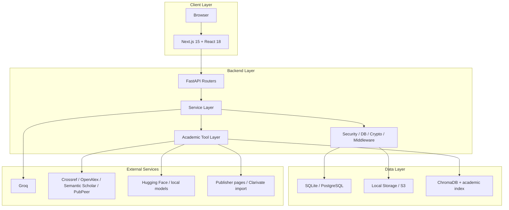
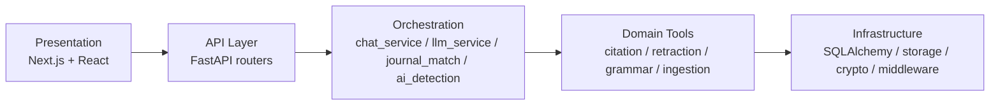
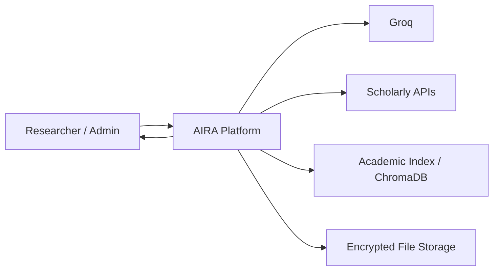
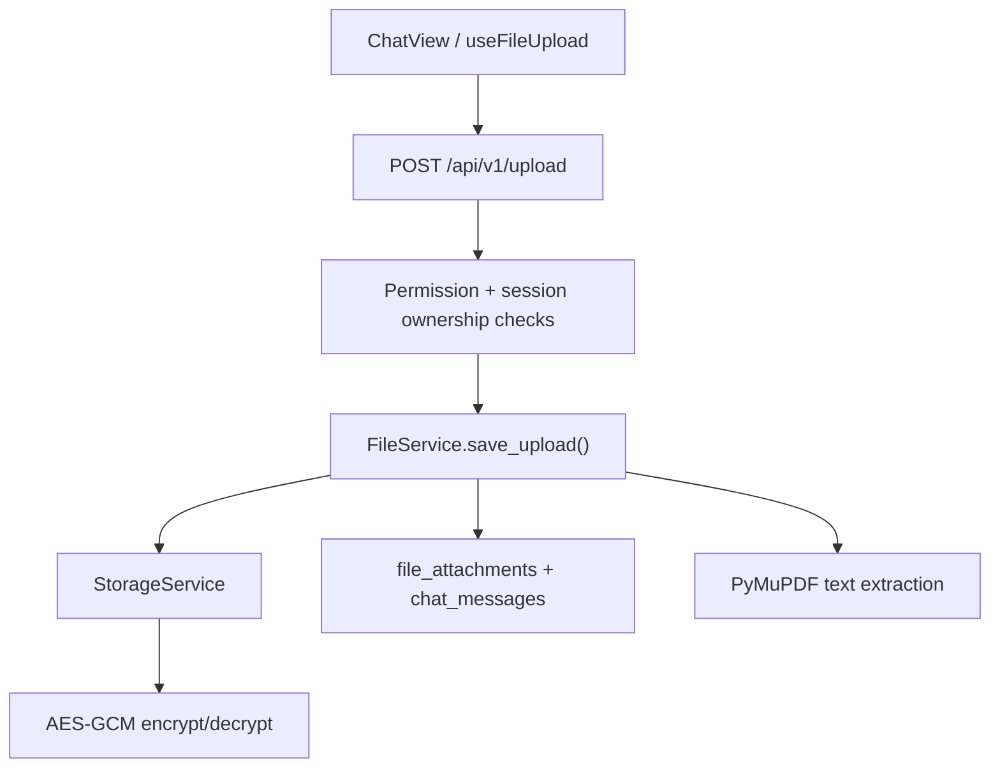
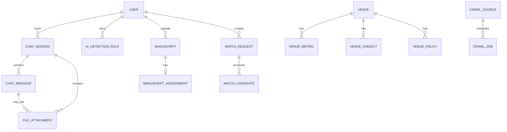

# 📐 AIRA — Kiến trúc Hệ thống & Thiết kế Chi tiết

> **AIRA** (Academic Integrity & Research Assistant) — nền tảng hỗ trợ nghiên cứu học thuật tích hợp AI
> Phiên bản snapshot: 2026-06-29

---

## 0. Verified Implementation Snapshot (Authoritative)

Snapshot dưới đây đã được đối chiếu trực tiếp với mã nguồn hiện tại vào ngày **2026-06-29**. Nếu bất kỳ diagram hoặc ghi chú cũ nào mâu thuẫn, ưu tiên snapshot này và `CODEX.md`.

- Frontend: Next.js 15 + React 18 + TypeScript, App Router, same-origin rewrite proxy.
- Backend: FastAPI với router module hiện tại gồm `auth`, `admin`, `sessions`, `chat`, `tools`, `ai_detection`, `upload`, `manuscripts`, `journal_match`, `venues`, `crawl_admin`.
- Session mode hiện có: `auto`, `general_qa`, `verification`, `journal_match`, `retraction`, `ai_detection`.
- Message type hiện có: `text`, `citation_report`, `journal_list`, `retraction_report`, `file_upload`, `pdf_summary`, `ai_writing_detection`, `grammar_report`.
- Lifespan startup có thể:
  - tạo schema bằng `Base.metadata.create_all()` nếu setting cho phép,
  - bootstrap admin account,
  - bootstrap default crawl sources,
  - khởi tạo academic index collections,
  - log warning nếu SPECTER2 đang ở degraded mode.
- LLM layer dùng Groq function calling, với giới hạn đã xác minh trong `llm_service.py`:
  - `_MAX_HISTORY_MESSAGES = 4`
  - `_MAX_HISTORY_MESSAGE_CHARS = 2000`
  - `_MAX_ROUTER_INPUT_CHARS = 10000`
  - `_DOCUMENT_CACHE_TRIGGER_CHARS = 1500`
  - `_MAX_FC_ITERATIONS = 5`
- Pass-by-reference hiện là behavior chính cho long text / attached document:
  - router chỉ nhận `document_id` + metadata thay vì raw body,
  - `detect_ai_writing` và `check_grammar` là document-only ở Groq-facing schema,
  - `verify_citation`, `scan_retraction_and_pubpeer`, `match_journal` hỗ trợ `document_id`.
- Terminal tools ở FC loop hiện gồm: `detect_ai_writing`, `check_grammar`, và `match_journal`.
- Chat completion response hiện luôn trả `session`, `user_message`, `assistant_message` để frontend sync lại sidebar/session state.
- Citation verification hiện chạy qua `citation_batch_service` cho cả batch path và legacy compatibility path.
- Journal matching không còn chỉ là “vector search card đơn giản”; backend hiện có domain riêng `services/journal_match/*` và APIs `manuscripts`, `journal-match`, `venues`.
- AI detection hiện có 2 lớp:
  - phrase preferences trên `/auth/me/ai-detection-rules`
  - structured custom rules trên `/ai-detection/rules*`

---

## Mục lục

1. [Sơ đồ Kiến trúc Hệ thống (System Architecture)](#1-sơ-đồ-kiến-trúc-hệ-thống)
2. [Mô tả Module chính](#2-mô-tả-module-chính)
3. [Thiết kế Luồng dữ liệu (DFD)](#3-thiết-kế-luồng-dữ-liệu-dfd)
4. [Sơ đồ Component — Luồng Upload & Xử lý file PDF](#4-sơ-đồ-component--luồng-upload--xử-lý-file-pdf)
5. [Sơ đồ UML](#5-sơ-đồ-uml)
6. [Thiết kế Cơ sở dữ liệu (ERD)](#6-thiết-kế-cơ-sở-dữ-liệu-erd)
7. [Tích hợp API & Dịch vụ bên ngoài](#7-tích-hợp-api--dịch-vụ-bên-ngoài-api-integrations--third-party-services)

---

## 1. Sơ đồ Kiến trúc Hệ thống

### 1.1 Kiến trúc Tổng quan (System Architecture Overview)



### 1.2 Kiến trúc Phân tầng (Layered Architecture)



### 1.3 Boundary hiện tại giữa Chat và Domain APIs

- `chat` và `tools` vẫn là bề mặt chính mà frontend chat đang dùng.
- `ai_detection`, `manuscripts`, `journal_match`, `venues`, `crawl_admin` là các domain APIs chuyên biệt đã có trong backend.
- `journal_match` domain mới là lớp chi tiết hơn so với `POST /tools/journal-match`.

---

## 2. Mô tả Module chính

### 2.1 Frontend Modules

| Module | File/Folder chính | Chức năng |
|--------|-------------------|-----------|
| **App Router** | `frontend/app/*` | Landing, Login, Chat, Admin, route redirect `chat/citation-checker` |
| **Auth/UI Guards** | `frontend/components/auth-guard.tsx` | Bảo vệ route chat và admin |
| **Chat Shell** | `frontend/components/chat-shell.tsx` | Sidebar session list, search, theme toggle, logout |
| **Chat View** | `frontend/components/chat-view.tsx` | Input area, bibliography import, file upload, tool-card rendering |
| **Tool Cards** | `frontend/components/tool-results.tsx`, `frontend/components/citation-report.tsx` | Render structured tool payloads từ backend |
| **AI Rule UI** | `frontend/components/topbar.tsx`, `frontend/components/ai-detect-rule-manager.tsx` | Mode selector, phrase rule panel, structured AI rule manager |
| **Client State** | `frontend/lib/chat-store.tsx`, `frontend/lib/auth.tsx`, `frontend/lib/theme.tsx` | Session/message state, auth token/user state, theme state |
| **Typed API Client** | `frontend/lib/api.ts` | Wrapper cho auth, chat, tools, upload, admin, AI-detection APIs |

### 2.2 Backend API Modules

| Router | File | Chức năng |
|--------|------|-----------|
| **Auth** | `backend/app/api/v1/endpoints/auth.py` | register, login, `me`, AI phrase-rule prefs, admin promote |
| **Sessions** | `backend/app/api/v1/endpoints/sessions.py` | CRUD sessions, list messages |
| **Chat** | `backend/app/api/v1/endpoints/chat.py` | completions, session-targeted completion, encrypted completion |
| **Tools** | `backend/app/api/v1/endpoints/tools.py` | legacy chat-facing citation, journal-match, retraction, summarize-pdf, AI detect, grammar |
| **AI Detection** | `backend/app/api/v1/endpoints/ai_detection.py` | compile/list/create/update/delete structured rules, analyze text |
| **Upload** | `backend/app/api/v1/endpoints/upload.py` | upload, list, stats, presigned URLs, download/delete |
| **Manuscripts** | `backend/app/api/v1/endpoints/manuscripts.py` | manuscript upload + parse |
| **Journal Match** | `backend/app/api/v1/endpoints/journal_match.py` | request creation, run, fetch results |
| **Venues** | `backend/app/api/v1/endpoints/venues.py` | venue search from local DB |
| **Crawl Admin** | `backend/app/api/v1/endpoints/crawl_admin.py` | run crawl, reindex, inspect jobs/sources |
| **Admin** | `backend/app/api/v1/endpoints/admin.py` | overview, users, files, storage, storage health |

### 2.3 Service Layer

| Service | File | Vai trò |
|---------|------|---------|
| **ChatService** | `backend/app/services/chat_service.py` | Session lifecycle, message persistence, mode routing, tool orchestration, auto-title |
| **GroqLLMService** | `backend/app/services/llm_service.py` | Function-calling loop, pass-by-reference routing, heuristic fallback handoff |
| **FileService** | `backend/app/services/file_service.py` | Save upload, extract text, download/delete, stats |
| **StorageService** | `backend/app/services/storage_service.py` | Local/S3 strategy abstraction |
| **AI Detection Service** | `backend/app/services/ai_detection_service.py` | Analyze text with model + rule evidence |
| **AI Detection Rule Service** | `backend/app/services/ai_detection_rule_service.py` | Compile and persist structured rules |
| **Academic Query Services** | `backend/app/services/academic_query_service.py`, `external_academic_search.py` | Scholarly lookup helpers |
| **Journal Match Domain** | `backend/app/services/journal_match/*` | Manuscript parsing, retrieval, reranking, explanation, topic profile |
| **Ingestion/Index Services** | `backend/app/services/ingestion/*` | Normalize, dedupe, build academic index |

### 2.4 ML / Academic Tool Services

| Tool / Domain | File/Folder | Mô tả |
|---------------|-------------|-------|
| **Citation Batch** | `services/tools/citation_batch_service.py` | Batch bibliography verification + summary/report payload |
| **Citation Core** | `services/tools/citation_checker.py`, `services/tools/citation/*` | Exact identifier verification + metadata scoring + exports |
| **Retraction Scan** | `services/tools/retraction_scan.py` | DOI-based retraction/community-signal scan |
| **AI Detection** | `services/tools/ai_writing_detector.py`, `services/ai_detection_service.py` | ML + rules + evidence output |
| **Grammar** | `services/tools/grammar_checker.py` | LanguageTool-backed grammar check |
| **Journal Match** | `services/journal_match/*` | Manuscript parse -> retrieval -> rerank -> explain |
| **Embeddings** | `services/embeddings/specter2_service.py` | SPECTER2 loading / degraded fallback state |

### 2.5 Security & Middleware

| Component | File | Vai trò |
|-----------|------|---------|
| **Config Safety** | `backend/app/core/config.py` | Validate insecure defaults and runtime safety |
| **Authorization Gateway** | `backend/app/core/authorization.py` | RBAC + ABAC checks |
| **Security** | `backend/app/core/security.py` | JWT + password auth helpers |
| **Crypto** | `backend/app/core/crypto.py`, `encrypted_types.py` | AES-GCM encryption for file/DB payloads |
| **Middleware** | `backend/app/core/middleware.py`, `rate_limit.py` | Security headers + rate limiting |
| **Audit** | `backend/app/core/audit.py` | Audit event logging |

---

## 3. Thiết kế Luồng dữ liệu (DFD)

### 3.1 DFD Level 0 — Context Diagram



### 3.2 DFD Level 1 — Main Processes

1. Người dùng đăng nhập hoặc truy cập session.
2. Frontend gọi API cùng JWT.
3. Backend kiểm tra permission và ownership.
4. Nếu là chat:
   - `ChatService` lưu user message,
   - chọn mode trực tiếp hoặc auto-intent,
   - gọi `GroqLLMService` hoặc domain tool deterministic path.
5. Nếu là tool/domain API trực tiếp:
   - endpoint gọi service tương ứng,
   - trả structured payload,
   - có thể persist vào chat history nếu flow là chat-compatible.
6. Frontend render card theo `message_type` và `tool_results`.

### 3.3 DFD Level 2 — Academic Processing Paths

| Flow | Input | Core xử lý | Output |
|------|-------|------------|--------|
| **Citation Verification** | DOI / identifier / bibliography | `citation_batch_service` + `citation_checker` + scholarly sources | `citation_report` |
| **Journal Match** | abstract hoặc manuscript file | parse manuscript -> retrieve -> rerank -> explain | journal list hoặc match payload |
| **Retraction Scan** | DOI/text | DOI extraction + Crossref/OpenAlex/PubPeer checks | `retraction_report` |
| **AI Detection** | text / document | ML detector + phrase prefs + structured rules | `ai_writing_detection` |
| **Grammar** | text / document | LanguageTool analysis | `grammar_report` |
| **Upload / PDF** | file | validate -> encrypt -> persist -> optional PDF extract text | `file_upload` / `pdf_summary` |

---

## 4. Sơ đồ Component — Luồng Upload & Xử lý file PDF

### 4.1 Component Diagram — Tổng quan luồng Upload PDF



### 4.2 Runtime Behavior hiện tại

- Upload cần `session_id` và `Permission.FILE_UPLOAD`.
- Nếu upload không gắn với `message_id`, backend tạo system/tool message file-upload tương ứng.
- PDF upload có thể được trích text để dùng cho summary hoặc downstream analysis.
- Download path đi qua access-control check rồi mới decrypt/read file bytes.
- Upload module còn hỗ trợ pre-signed upload/download khi storage backend là S3.

---

## 5. Sơ đồ UML

### 5.1 Use-case Diagram

| Actor | Use cases chính |
|-------|------------------|
| **Researcher** | đăng nhập, tạo session, chat theo mode, upload file, verify citation, match journal, scan retraction, detect AI, check grammar |
| **Admin** | toàn bộ quyền của researcher + quản lý user role, file/storage, health, crawl/reindex |

### 5.2 Component Flow Diagrams

#### 5.2.1 Chat auto-mode

```text
frontend ChatView
  -> /chat/{session_id}
  -> ChatService.complete_chat()
  -> auto intent / explicit deterministic path / Groq FC loop
  -> structured assistant message
  -> frontend ToolResultsRenderer
```

#### 5.2.2 Citation verification

```text
user text
  -> /tools/verify-citations hoặc chat deterministic path
  -> citation_batch_service
  -> citation_checker + sources/*
  -> summary + evidence + exports
  -> citation-report UI
```

#### 5.2.3 Journal matching

```text
manuscript text/file
  -> manuscripts parse/upload hoặc /journal-match/*
  -> journal_match.service
  -> retriever + reranker + explainer
  -> result payload hoặc legacy journal cards
```

#### 5.2.4 AI detection

```text
text
  -> ai_detection_service
  -> ML score + rule score + evidence
  -> assistant card + optional custom rules context
```

#### 5.2.5 Crawl / reindex admin

```text
admin request
  -> /crawl/run hoặc /crawl/reindex
  -> crawl_scheduler
  -> crawl_job + crawl_source state
  -> academic ingest / index refresh
```

---

## 6. Thiết kế Cơ sở dữ liệu (ERD)

### 6.1 Core domain groups

- **Auth & chat**: `users`, `chat_sessions`, `chat_messages`, `file_attachments`
- **Academic match**: `manuscripts`, `manuscript_assessments`, `match_requests`, `match_candidates`
- **Venue corpus**: `venues`, `venue_aliases`, `venue_metrics`, `venue_subjects`, `venue_policies`
- **Crawl pipeline**: `crawl_sources`, `crawl_jobs`, `raw_source_snapshots`, `entity_fingerprints`
- **AI detection rules**: `ai_detection_rules`

### 6.2 Simplified ERD



### 6.3 Ghi chú thiết kế

- `chat_messages.content` và `chat_messages.tool_results` dùng encrypted SQLAlchemy types.
- `file_attachments` lưu metadata storage và liên kết session/message.
- `ai_detection_rules` hỗ trợ rule cá nhân hoặc global.
- Venue corpus được thiết kế như local academic knowledge base, không chỉ là cache tạm.

---

## 7. Tích hợp API & Dịch vụ bên ngoài (API Integrations & Third-Party Services)

### 7.1 LLM / Reasoning

| Service | Vai trò |
|---------|---------|
| **Groq** | chat completions, function calling, simple title generation, structured AI-rule compilation |

### 7.2 Scholarly / Academic

| Service | Vai trò |
|---------|---------|
| **Crossref** | DOI resolution, scholarly metadata, retraction-related signals |
| **OpenAlex** | scholarly metadata and work lookup |
| **Semantic Scholar** | fallback/enrichment for no-DOI citation matching |
| **PubPeer** | community signal for retraction-related scan |
| **Tavily** | optional constrained citation web fallback |
| **Clarivate API / manual imports** | venue enrichment pipeline |

### 7.3 Models / Runtime

| Service / Package | Vai trò |
|-------------------|---------|
| **Hugging Face** | model download/authentication |
| **SPECTER2** | academic embedding model |
| **RoBERTa detector** | AI-writing detection model |
| **LanguageTool** | grammar/spell checking |

### 7.4 Storage / Infra

| Service | Vai trò |
|---------|---------|
| **AWS S3** | optional object storage backend |
| **Local filesystem** | default/local storage backend |

### 7.5 Fallback & safety rules

- Citation web fallback chỉ là hint path, không thay exact verification.
- Journal matching có degraded path khi embedding runtime không sẵn sàng, nhưng vẫn log warning rõ ràng.
- Health endpoint chỉ trả detail mở rộng khi `HEALTH_INCLUDE_DETAILS=true`.
- Startup validators chặn một số cấu hình không an toàn ở staging/production.

---

## Phụ lục: Tổng hợp API Endpoints

### Auth

- `POST /api/v1/auth/register`
- `POST /api/v1/auth/login`
- `GET /api/v1/auth/me`
- `GET /api/v1/auth/me/ai-detection-rules`
- `PUT /api/v1/auth/me/ai-detection-rules`
- `DELETE /api/v1/auth/me/ai-detection-rules`
- `POST /api/v1/auth/admin/promote`

### Sessions / Chat

- `POST /api/v1/sessions`
- `GET /api/v1/sessions`
- `GET /api/v1/sessions/{session_id}`
- `PATCH /api/v1/sessions/{session_id}`
- `DELETE /api/v1/sessions/{session_id}`
- `GET /api/v1/sessions/{session_id}/messages`
- `POST /api/v1/chat/completions`
- `POST /api/v1/chat/{session_id}`
- `POST /api/v1/chat/completions/encrypted`

### Tools / AI Detection

- `POST /api/v1/tools/verify-citations`
- `POST /api/v1/tools/verify-citation`
- `POST /api/v1/tools/journal-match`
- `POST /api/v1/tools/retraction-scan`
- `POST /api/v1/tools/summarize-pdf`
- `POST /api/v1/tools/detect-ai-writing`
- `POST /api/v1/tools/ai-detect`
- `POST /api/v1/tools/check-grammar`
- `POST /api/v1/ai-detection/rules/compile`
- `POST /api/v1/ai-detection/rules`
- `GET /api/v1/ai-detection/rules`
- `PATCH /api/v1/ai-detection/rules/{rule_id}`
- `DELETE /api/v1/ai-detection/rules/{rule_id}`
- `POST /api/v1/ai-detection/analyze`

### Files / Manuscripts / Journal Match / Venues

- `POST /api/v1/upload`
- `GET /api/v1/upload`
- `GET /api/v1/upload/stats/me`
- `GET /api/v1/upload/stats/storage`
- `GET /api/v1/upload/{file_id}`
- `DELETE /api/v1/upload/{file_id}`
- `POST /api/v1/upload/presigned-upload`
- `GET /api/v1/upload/{file_id}/presigned-download`
- `POST /api/v1/manuscripts/upload`
- `POST /api/v1/manuscripts/parse`
- `POST /api/v1/journal-match/requests`
- `POST /api/v1/journal-match/run/{request_id}`
- `GET /api/v1/journal-match/results/{request_id}`
- `GET /api/v1/venues/search`

### Admin / Crawl

- `GET /api/v1/admin/overview`
- `GET /api/v1/admin/users`
- `PATCH /api/v1/admin/users/{user_id}/role`
- `GET /api/v1/admin/files`
- `GET /api/v1/admin/storage`
- `DELETE /api/v1/admin/files/{file_id}`
- `GET /api/v1/admin/storage/health`
- `POST /api/v1/crawl/run`
- `POST /api/v1/crawl-admin/run`
- `POST /api/v1/crawl/reindex`
- `POST /api/v1/crawl-admin/reindex`
- `GET /api/v1/crawl/runs/{job_id}`
- `GET /api/v1/crawl-admin/jobs/{job_id}`
- `GET /api/v1/crawl/sources`
- `GET /api/v1/crawl-admin/sources`
