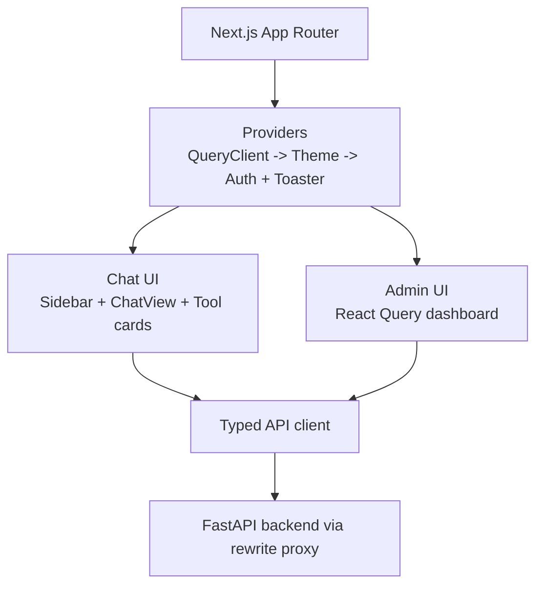
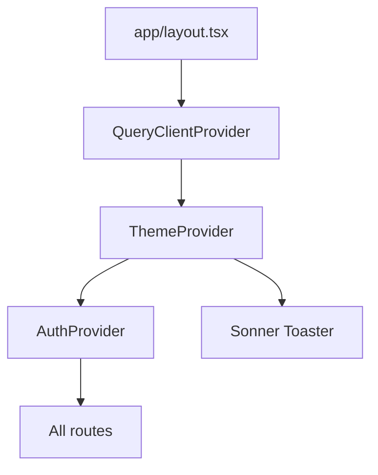
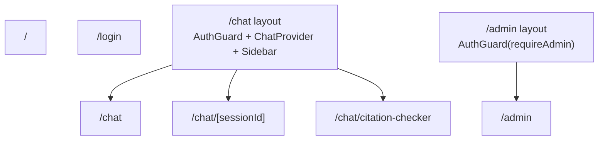

# 🏗️ AIRA Frontend Architecture

> **Project**: AIRA — Academic Integrity & Research Assistant  
> **Version**: 0.1.0
> **Last Updated**: 2026-06-29
> **Stack**: Next.js 15 (App Router) · React 18 · TypeScript · Tailwind CSS v4 · TanStack React Query

---

## 0. Verified Sync Notes (2026-06-29)

Các hành vi dưới đây đã được đối chiếu với mã nguồn hiện tại:

- `ChatStore` khởi tạo với `mode = "auto"`, không phải `general_qa`.
- Session title mặc định là `Trò chuyện mới`; backend có thể đổi title sau message đầu tiên và frontend sync lại bằng `UPSERT_SESSION`.
- Frontend gửi request theo same-origin path `/api/v1/...`; `NEXT_PUBLIC_API_BASE_URL` chỉ dùng để cấu hình rewrite proxy trong `next.config.mjs`.
- Route `/chat/citation-checker` hiện chỉ redirect sang `/chat?mode=verification`.
- `ModeSelector` hiện có 6 mode: `auto`, `general_qa`, `verification`, `journal_match`, `retraction`, `ai_detection`.
- Khi vào mode `ai_detection`, UI hiển thị `AIDetectionRulesPanel`, trong đó có cả phrase-rule controls và `AIDetectionRuleManager`.
- `ChatView` hỗ trợ import bibliography file ở mode verification và giới hạn input verification ở `4000` từ.
- `ToolResultsRenderer` hiện hỗ trợ `multi_tool_report`, `file_upload`, `journal_list`, `journal_match`, `citation_report`, `retraction_report`, `ai_writing_detection`, `grammar_report`, `pdf_summary`, cùng một số academic lookup payload phụ trợ.

---

## 📑 Table of Contents

1. [Frontend Architecture Overview](#1-frontend-architecture-overview)
2. [Technology Stack & Dependencies](#2-technology-stack--dependencies)
3. [Directory Structure](#3-directory-structure)
4. [Provider & Context Architecture](#4-provider--context-architecture)
5. [Routing & Page Architecture](#5-routing--page-architecture)
6. [State Management — ChatStore](#6-state-management--chatstore)
7. [Component Deep Dives](#7-component-deep-dives)
8. [API Client Layer](#8-api-client-layer)
9. [Authentication & Authorization](#9-authentication--authorization)
10. [Custom Hooks](#10-custom-hooks)
11. [Theming & Design System](#11-theming--design-system)
12. [Next.js Configuration](#12-nextjs-configuration)
13. [Admin Dashboard](#13-admin-dashboard)

---

## 1. Frontend Architecture Overview



### Current frontend responsibilities

- render landing, login, chat, and admin screens;
- persist auth token in localStorage and hydrate current user;
- maintain session/message UI state for chat;
- call typed backend APIs;
- render structured tool payloads into domain-specific cards instead of raw JSON.

---

## 2. Technology Stack & Dependencies

| Package | Version | Purpose |
|---------|---------|---------|
| `next` | `^15.0.4` | App Router framework |
| `react`, `react-dom` | `^18.3.1` | UI runtime |
| `typescript` | `^5.6.3` | Static typing |
| `tailwindcss` | `^4.1.18` | Styling and theme tokens |
| `@tailwindcss/postcss` | `^4.1.18` | Tailwind PostCSS integration |
| `@tanstack/react-query` | `^5.62.9` | Admin-side query cache |
| `sonner` | `^2.0.7` | Toast notifications |
| `lucide-react` | `^0.564.0` | Icon system |
| `clsx` | `^2.1.1` | Conditional classnames |
| `vitest`, `@testing-library/*`, `jsdom` | dev | Frontend tests |

---

## 3. Directory Structure

```text
frontend/
├── app/
│   ├── layout.tsx                     # RootLayout + extension-attr cleanup script
│   ├── providers.tsx                  # QueryClientProvider + ThemeProvider + AuthProvider + Toaster
│   ├── page.tsx                       # Landing page
│   ├── login/page.tsx                 # Login/Register UI
│   ├── admin/layout.tsx               # AuthGuard(requireAdmin)
│   ├── admin/page.tsx                 # Admin dashboard
│   └── chat/
│       ├── layout.tsx                 # AuthGuard + ChatProvider + Sidebar
│       ├── page.tsx                   # New chat
│       ├── citation-checker/page.tsx  # Redirect to verification mode
│       ├── citation-checker/page.test.tsx
│       └── [sessionId]/page.tsx       # Existing session
├── components/
│   ├── auth-guard.tsx
│   ├── chat-shell.tsx
│   ├── chat-view.tsx
│   ├── tool-results.tsx
│   ├── citation-report.tsx
│   ├── topbar.tsx
│   └── ai-detect-rule-manager.tsx
├── lib/
│   ├── api.ts
│   ├── auth.tsx
│   ├── chat-store.tsx
│   ├── theme.tsx
│   ├── types.ts
│   ├── useAutoScroll.ts
│   ├── useFileUpload.ts
│   ├── citation-file-import.ts
│   └── citation-report-export.ts
├── next.config.mjs
├── postcss.config.mjs
├── vitest.config.ts
└── package.json
```

---

## 4. Provider & Context Architecture

### 4.1 Provider Tree



### 4.2 Context Deep Dive

| Context / Provider | File | Value / Behavior |
|--------------------|------|------------------|
| **AuthProvider** | `lib/auth.tsx` | token, user, loading, login, registerAndLogin, logout |
| **ThemeProvider** | `lib/theme.tsx` | `theme`, `toggleTheme()`, sync with `localStorage("aira-theme")` |
| **ChatProvider** | `lib/chat-store.tsx` | sessions, activeSessionId, messages, sending/loading flags, mode, chat actions |
| **QueryClientProvider** | `app/providers.tsx` | Admin dashboard query cache with `retry: 1`, `staleTime: 30000` |

---

## 5. Routing & Page Architecture

### 5.1 App Router Layout



### 5.2 Route Responsibilities

| Route | Main behavior |
|-------|---------------|
| `/` | Nếu đã có token hợp lệ thì redirect sang `/chat`; nếu không thì hiển thị landing page |
| `/login` | Tabbed `Sign In` / `Sign Up` form, hỗ trợ `?tab=register` |
| `/chat` | Empty-state chat hoặc new conversation |
| `/chat/[sessionId]` | Load active session và render message history |
| `/chat/citation-checker` | Redirect đến `/chat?mode=verification` |
| `/admin` | Admin dashboard, chỉ cho role `admin` |

### 5.3 Guard flow

- `app/chat/layout.tsx` bọc toàn bộ chat bằng `AuthGuard`.
- `app/admin/layout.tsx` bọc admin bằng `AuthGuard requireAdmin`.
- `AuthGuard` hiển thị spinner khi auth đang hydrate, redirect về `/login` hoặc `/chat` khi không đủ quyền.

---

## 6. State Management — ChatStore

### 6.1 State Shape

```ts
interface ChatState {
  sessions: Session[];
  activeSessionId: string | null;
  messages: Message[];
  isLoadingSessions: boolean;
  isLoadingMessages: boolean;
  isSending: boolean;
  mode: Session["mode"];
}
```

Giá trị khởi tạo hiện tại:

- `sessions = []`
- `activeSessionId = null`
- `messages = []`
- `mode = "auto"`

### 6.2 Action set hiện tại

Reducer đang xử lý các action:

- `SET_SESSIONS`
- `SET_ACTIVE_SESSION`
- `SET_MESSAGES`
- `ADD_MESSAGES`
- `SET_LOADING_SESSIONS`
- `SET_LOADING_MESSAGES`
- `SET_SENDING`
- `SET_MODE`
- `NEW_CHAT`
- `ADD_SESSION`
- `UPSERT_SESSION`
- `REMOVE_SESSION`

### 6.3 Auto-session creation flow

Khi chưa có `activeSessionId`, `sendMessage()` sẽ:

1. gọi `api.createSession(token, "Trò chuyện mới", state.mode)`,
2. thêm optimistic user message vào state,
3. gọi `api.sendChat(...)`,
4. `UPSERT_SESSION` bằng `response.session`,
5. reload message list bằng `api.listMessages(...)`.

### 6.4 Sync rules đáng chú ý

- Sidebar title không tự cắt từ text client; nó nhận từ `response.session.title`.
- Nếu session bị xóa và đang active, state reset về `activeSessionId = null` và `messages = []`.
- Mode có thể được set từ session đang chọn hoặc do người dùng chọn thủ công trước khi gửi message đầu tiên.

---

## 7. Component Deep Dives

### 7.1 ChatView — Core chat screen

**File**: `frontend/components/chat-view.tsx`

Chức năng chính:

- render top mode selector;
- hiển thị `AIDetectionRulesPanel` khi mode là `ai_detection`;
- empty-state prompts theo mode hiện tại;
- input area với auto-resize textarea;
- bibliography import cho mode verification;
- file upload chỉ khi đã có active session;
- typing indicator và render message list.

### 7.2 Verification-specific UX

Trong mode `verification`:

- input có word-count check `MAX_VERIFICATION_WORDS = 4000`;
- người dùng có thể import bibliography file qua `citation-file-import`;
- empty state gợi ý DOI, PMID, PMCID, bibliography text;
- route shortcut `/chat/citation-checker` dẫn thẳng vào mode này.

### 7.3 AI Detection Rules Panel

**Files**: `components/topbar.tsx`, `components/ai-detect-rule-manager.tsx`

Panel này gồm hai lớp:

- **phrase preferences** lấy từ `/auth/me/ai-detection-rules`,
- **structured rule manager** để compile natural-language rule thành JSON rule rồi lưu qua `/ai-detection/rules`.

### 7.4 ToolResultsRenderer

**File**: `components/tool-results.tsx`

Dispatcher hiện tại có thể render:

- `multi_tool_report`
- `file_upload`
- `journal_list`
- `journal_match`
- `citation_report`
- `retraction_report`
- `ai_writing_detection` / `ai_detection`
- `grammar_report`
- `pdf_summary`
- academic lookup helper payloads như `academic_lookup`, `doi_metadata`, `intent_disambiguation`

### 7.5 CitationReportCard

**File**: `components/citation-report.tsx`

Card này chịu trách nhiệm:

- chia citations thành verified / review / problem / temporary issue,
- show field evidence và source diagnostics,
- show candidate list,
- export CSV / JSON / BibTeX thông qua `citation-report-export.ts`.

### 7.6 Sidebar

**File**: `components/chat-shell.tsx`

Sidebar hiện có:

- nút `New Chat`,
- search/filter sessions,
- theme toggle,
- admin link khi `user.role === "admin"`,
- session delete button,
- shortcut focus search bằng `Ctrl/Cmd + K`.

---

## 8. API Client Layer

### 8.1 Request pipeline

`frontend/lib/api.ts` hiện dùng:

- `API_BASE = ""`
- `fetch()` cùng same-origin path
- inject `Authorization: Bearer <token>` khi có token
- parse JSON hoặc text dựa trên `content-type`
- chuẩn hóa lỗi thành `ApiError`

### 8.2 API groups hiện có

| Group | Ví dụ method |
|-------|--------------|
| **Auth** | `register`, `login`, `me` |
| **AI phrase rules** | `getAiDetectionRules`, `updateAiDetectionRules`, `clearAiDetectionRules` |
| **Structured AI rules** | `compileAIDetectionRule`, `createAIDetectionRule`, `listAIDetectionRules`, `updateAIDetectionRule`, `deleteAIDetectionRule` |
| **AI analyze** | `analyzeAIDetection` |
| **Chat / sessions** | `listSessions`, `getSession`, `createSession`, `updateSession`, `deleteSession`, `listMessages`, `sendChat` |
| **Citation / tools** | `verifyCitation`, `verifyCitations`, `journalMatch`, `retractionScan`, `summarizePdf`, `detectAiWriting`, `checkGrammar` |
| **Upload** | `uploadFile`, `listFiles`, `deleteFile`, `downloadFile`, stats APIs |
| **Admin** | `adminOverview`, `adminUsers`, `adminFiles`, `adminStorage`, `adminStorageHealth`, role/file mutations |

### 8.3 Error handling strategy

`getApiErrorMessage()` hiện map các status phổ biến như:

- `401` -> session hết hạn
- `403` -> không có quyền
- `404` -> không tìm thấy
- `413` -> file quá lớn
- `415` -> file type không hỗ trợ
- `429` -> throttled
- `>=500` -> lỗi server

---

## 9. Authentication & Authorization

### 9.1 AuthContext lifecycle

`AuthProvider` hiện:

1. đọc token từ `localStorage("aira-token")`,
2. gọi `api.me(token)` để hydrate user,
3. xóa token nếu profile fetch thất bại,
4. expose `login`, `registerAndLogin`, `logout`.

### 9.2 AuthGuard behavior

- Khi `loading=true`, guard hiển thị spinner.
- Không có token -> redirect `/login`.
- `requireAdmin=true` nhưng user không phải admin -> redirect `/chat`.

### 9.3 UX behavior hiện tại

- `logout()` xóa token localStorage và hiển thị toast.
- Login page và landing page đều tự redirect vào `/chat` nếu token đã hợp lệ.

---

## 10. Custom Hooks

### 10.1 `useAutoScroll`

**File**: `lib/useAutoScroll.ts`

Vai trò:

- giữ ref cuối message list,
- auto-scroll khi số lượng message thay đổi,
- tránh việc chat view phải tự lặp logic scroll.

### 10.2 `useFileUpload`

**File**: `lib/useFileUpload.ts`

Vai trò:

- bọc upload API call,
- theo dõi trạng thái upload,
- callback `onSuccess` để reload messages sau khi file upload xong.

---

## 11. Theming & Design System

### 11.1 Theme architecture

- Theme hiện có `light` và `dark`.
- Key lưu trong localStorage: `aira-theme`.
- `ThemeProvider` dùng `matchMedia("(prefers-color-scheme: dark)")` để chọn giá trị ban đầu khi chưa có key lưu.
- `<html>` được toggle class `dark` trực tiếp trong provider.

### 11.2 Styling approach

- CSS tokens được định nghĩa trong `app/globals.css`.
- Hầu hết component dùng Tailwind utility classes trực tiếp.
- Sidebar, auth pages, admin dashboard và tool cards chia sẻ cùng token palette hiện tại.

---

## 12. Next.js Configuration

### 12.1 API rewrites

`frontend/next.config.mjs` hiện proxy:

- `/api/v1/:path*` -> `${NEXT_PUBLIC_API_BASE_URL}/api/v1/:path*`
- `/health` -> `${NEXT_PUBLIC_API_BASE_URL}/health`

### 12.2 Root layout behavior

`app/layout.tsx` hiện:

- đặt `lang="vi"` và `suppressHydrationWarning`,
- inject script để xóa một số extension-injected attrs (`bis_skin_checked`, Grammarly markers),
- bọc toàn app bằng `Providers`.

---

## 13. Admin Dashboard

### 13.1 Current scope

Admin UI hiện có trong `frontend/app/admin/page.tsx` và dùng React Query cho:

- overview metrics,
- users list,
- files list,
- storage stats.

### 13.2 Mutations đang hỗ trợ

- đổi role user giữa `admin` và `researcher`,
- xóa file,
- invalidate toàn bộ query admin để refresh dữ liệu.

### 13.3 Current limitation

Backend đã có crawl-admin, manuscripts, venue-search và journal-match domain APIs, nhưng frontend hiện chưa có màn hình quản trị/khai thác riêng cho các domain này ngoài chat flow và admin overview/files/users.
