# 🏗️ AIRA Frontend Architecture

> **Project**: AIRA — Academic Integrity & Research Assistant  
> **Version**: 1.0.0  
> **Last Updated**: 2026-06-06  
> **Stack**: Next.js 15 (App Router) · React 18 · TypeScript · Tailwind CSS v4 · TanStack React Query

---

## 📑 Table of Contents

1. [Frontend Architecture Overview](#1-frontend-architecture-overview)
2. [Technology Stack & Dependencies](#2-technology-stack--dependencies)
3. [Directory Structure](#3-directory-structure)
4. [Provider & Context Architecture](#4-provider--context-architecture)
   - 4.1 [Provider Tree](#41-provider-tree)
   - 4.2 [Context Deep Dive](#42-context-deep-dive)
5. [Routing & Page Architecture](#5-routing--page-architecture)
   - 5.1 [App Router Layout](#51-app-router-layout)
   - 5.2 [Route Protection Flow](#52-route-protection-flow)
6. [State Management — ChatStore](#6-state-management--chatstore)
   - 6.1 [State Shape](#61-state-shape)
   - 6.2 [Action → Reducer → Re-render Flow](#62-action--reducer--re-render-flow)
   - 6.3 [Auto-Session Creation Flow](#63-auto-session-creation-flow)
7. [Component Deep Dives](#7-component-deep-dives)
   - 7.1 [ChatView — The Core UI](#71-chatview--the-core-ui)
   - 7.2 [ToolResultsRenderer — Dynamic Card Dispatch](#72-toolresultsrenderer--dynamic-card-dispatch)
   - 7.3 [Sidebar — Session Management](#73-sidebar--session-management)
   - 7.4 [ModeSelector — Tool Routing](#74-modeselector--tool-routing)
   - 7.5 [MessageBubble — Smart Rendering](#75-messagebubble--smart-rendering)
8. [API Client Layer](#8-api-client-layer)
   - 8.1 [Request Pipeline](#81-request-pipeline)
   - 8.2 [Error Handling Strategy](#82-error-handling-strategy)
   - 8.3 [API Method Inventory](#83-api-method-inventory)
9. [Authentication & Authorization](#9-authentication--authorization)
   - 9.1 [AuthContext Lifecycle](#91-authcontext-lifecycle)
   - 9.2 [AuthGuard Component](#92-authguard-component)
   - 9.3 [Login-to-Chat Redirection Flow](#93-login-to-chat-redirection-flow)
10. [Custom Hooks](#10-custom-hooks)
    - 10.1 [useAutoScroll](#101-useautoscroll)
    - 10.2 [useFileUpload](#102-usefileupload)
11. [Theming & Design System](#11-theming--design-system)
    - 11.1 [Tailwind CSS v4 Theme Tokens](#111-tailwind-css-v4-theme-tokens)
    - 11.2 [Dark Mode Architecture](#112-dark-mode-architecture)
12. [Next.js Configuration](#12-nextjs-configuration)
    - 12.1 [API Proxy Rewrites](#121-api-proxy-rewrites)
    - 12.2 [Hydration Safety](#122-hydration-safety)
13. [Admin Dashboard](#13-admin-dashboard)
    - 13.1 [Route Protection](#131-route-protection)
    - 13.2 [Dashboard Page Architecture](#132-dashboard-page-architecture)

---

## 1. Frontend Architecture Overview

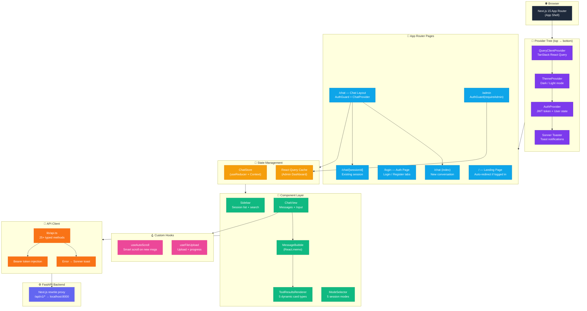

---

## 2. Technology Stack & Dependencies

| Package | Version | Purpose |
|---------|---------|---------|
| `next` | ^15.0.4 | React framework (App Router, SSR, rewrites) |
| `react` / `react-dom` | ^18.3.1 | UI library |
| `typescript` | ^5.6.3 | Type safety |
| `tailwindcss` | ^4.1.18 | Utility-first CSS with `@theme` tokens |
| `@tailwindcss/postcss` | ^4.1.18 | PostCSS integration for Tailwind v4 |
| `@tanstack/react-query` | ^5.62.9 | Server state (Admin dashboard) |
| `sonner` | ^2.0.7 | Toast notification system |
| `lucide-react` | ^0.564.0 | Icon library (~20 icons used) |
| `clsx` | ^2.1.1 | Conditional class names |

---

## 3. Directory Structure

```
frontend/
├── app/                            # Next.js App Router
│   ├── globals.css                 # Tailwind v4 @theme tokens (light + dark)
│   ├── layout.tsx                  # RootLayout: <html>, Inter font, Providers
│   ├── page.tsx                    # Landing page (auto-redirect if authenticated)
│   ├── providers.tsx               # Provider composition: RQ → Theme → Auth → Toaster
│   ├── login/
│   │   └── page.tsx                # Login/Register form (tabbed UI)
│   ├── chat/
│   │   ├── layout.tsx              # AuthGuard → ChatProvider → Sidebar + <main>
│   │   ├── page.tsx                # ChatView (new conversation)
│   │   └── [sessionId]/
│   │       └── page.tsx            # ChatView (existing session via URL param)
│   └── admin/
│       └── page.tsx                # Admin dashboard (React Query, requireAdmin)
│
├── components/                     # Reusable UI components
│   ├── auth-guard.tsx              # Route protection (login redirect + admin check)
│   ├── chat-shell.tsx              # Sidebar: session list, search, theme toggle, logout
│   ├── chat-view.tsx               # Main chat UI: empty state, messages, InputArea
│   ├── tool-results.tsx            # 6 specialized cards + master dispatcher (~520 LOC)
│   └── topbar.tsx                  # ModeSelector dropdown (5 modes)
│
├── lib/                            # Core business logic
│   ├── api.ts                      # Typed fetch wrappers (25+ methods), ApiError class
│   ├── auth.tsx                    # AuthContext + AuthProvider (JWT + localStorage)
│   ├── chat-store.tsx              # ChatStore: useReducer + Context (11 action types)
│   ├── theme.tsx                   # ThemeProvider (light/dark + system preference)
│   ├── types.ts                    # 10 TypeScript interfaces (User, Session, Message, …)
│   ├── useAutoScroll.ts            # Smart scroll: only on message count increase
│   └── useFileUpload.ts            # File selection, upload, progress, reset
│
├── package.json                    # Dependencies & scripts
├── next.config.mjs                 # API proxy rewrites → FastAPI backend
├── postcss.config.mjs              # Tailwind v4 PostCSS plugin
└── tsconfig.json                   # TypeScript config with @/ path alias
```

---

## 4. Provider & Context Architecture

### 4.1 Provider Tree

The application wraps all pages in a strict nesting order. Each provider is responsible for exactly one concern:

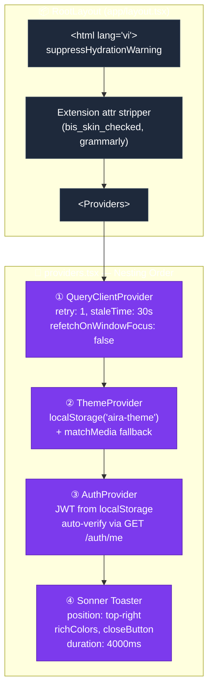

### 4.2 Context Deep Dive

| Context | File | Value Shape | Consumers |
|---------|------|-------------|-----------|
| `AuthContext` | `lib/auth.tsx` | `{ token, user, loading, login(), registerAndLogin(), logout() }` | All authenticated pages |
| `ThemeContext` | `lib/theme.tsx` | `{ theme: 'light'\|'dark', toggleTheme() }` | Sidebar, Login, Admin |
| `ChatContext` | `lib/chat-store.tsx` | `{ state, loadSessions(), loadMessages(), selectSession(), startNewChat(), setMode(), sendMessage(), deleteSession() }` | ChatView, Sidebar, ModeSelector |
| `QueryClient` | `providers.tsx` | TanStack React Query cache | Admin Dashboard only |

---

## 5. Routing & Page Architecture

### 5.1 App Router Layout

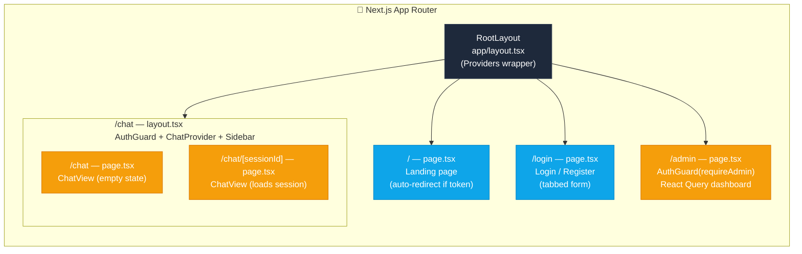

**Page Responsibilities:**

| Route | Component | Guard | Key Logic |
|-------|-----------|-------|-----------|
| `/` | `HomePage` | None | Checks `token` → auto `router.replace("/chat")` if logged in |
| `/login` | `LoginPage` | None | Tabbed Login/Register form, `?tab=register` URL param support |
| `/chat` | `ChatView` | `AuthGuard` | Empty state with suggestion buttons, auto-creates session on first message |
| `/chat/[sessionId]` | `ChatView` | `AuthGuard` | Calls `selectSession(params.sessionId)` on mount via `useEffect` |
| `/admin` | `AdminContent` | `AuthGuard(requireAdmin)` | React Query for overview, users, files, storage stats |

### 5.2 Route Protection Flow

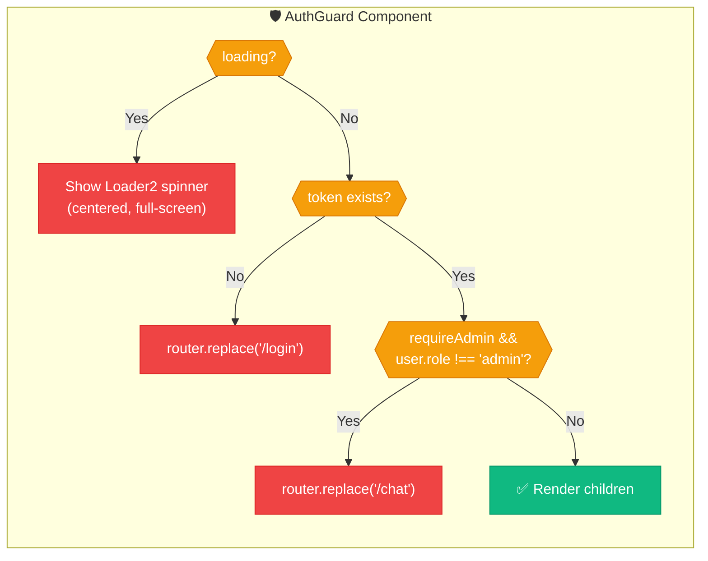

---

## 6. State Management — ChatStore

### 6.1 State Shape

```typescript
interface ChatState {
  sessions: Session[];           // All user sessions from backend
  activeSessionId: string | null; // Currently viewed session
  messages: Message[];            // Messages for active session
  isLoadingSessions: boolean;
  isLoadingMessages: boolean;
  isSending: boolean;             // True while awaiting backend response
  mode: SessionMode;              // Current tool routing mode
}
```

Initial state: `mode = "general_qa"`, all arrays empty, all loading flags `false`.

### 6.2 Action → Reducer → Re-render Flow

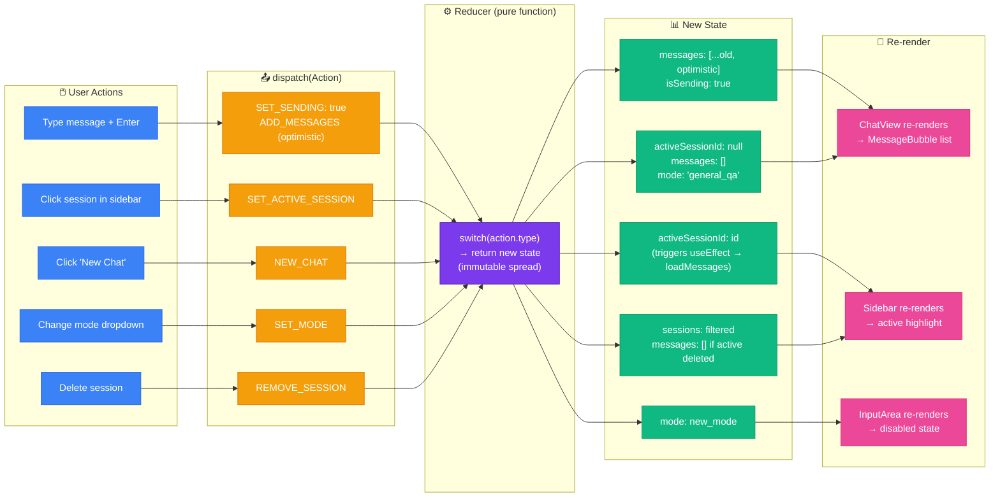

### 6.3 Auto-Session Creation Flow

When a user sends their first message without an active session, `ChatStore.sendMessage()` automatically creates a session:

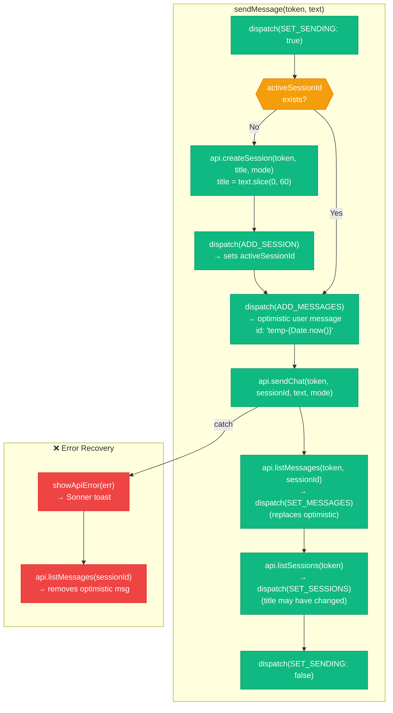

**Key design decisions:**
- **Optimistic updates**: User message appears instantly with a `temp-` prefixed ID
- **Stale closure fix**: Uses local `sessionId` variable (not `state.activeSessionId`) for error recovery
- **Session title**: Derived from first 60 characters of the first message

---

## 7. Component Deep Dives

### 7.1 ChatView — The Core UI

**File**: `components/chat-view.tsx` (~320 LOC)

The main chat interface has two distinct visual states:

| State | Condition | UI |
|-------|-----------|-----|
| **Empty** | `!activeSessionId && messages.length === 0` | Centered logo, prompt suggestions, ModeSelector in topbar |
| **Active** | Session selected or messages exist | Message list, typing indicator, file upload, input area |

**Internal sub-components** (not exported):

| Component | Responsibility |
|---|---|
| `InputArea` | Textarea with auto-resize (max 200px), attach button, send button, file preview |
| `MessageBubble` | `React.memo()` wrapped — user (right-aligned, accent bg) vs assistant (left, gray bg) |
| `TypingIndicator` | Three bouncing dots with staggered animation delays |

**Textarea behavior:**
- Auto-resizes via `useEffect` on `input` change: `scrollHeight` capped at 200px
- `Enter` sends, `Shift+Enter` inserts newline
- Submit clears input and resets height to `auto`

### 7.2 ToolResultsRenderer — Dynamic Card Dispatch

**File**: `components/tool-results.tsx` (~520 LOC)

The `ToolResultsRenderer` is a **dispatcher component** that inspects `message_type` and `tool_results` to render the correct specialized card:

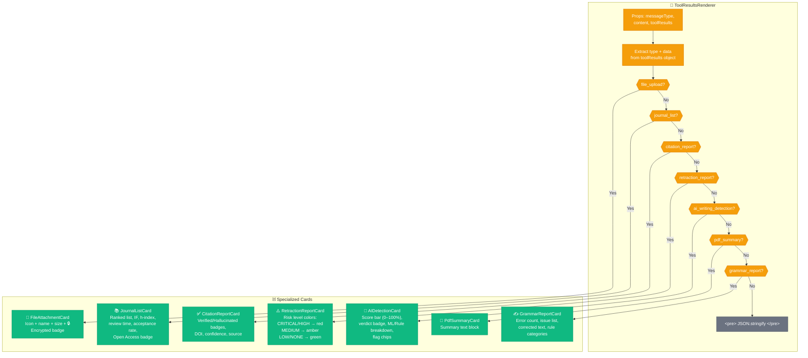

**Data extraction logic:**
```typescript
// From toolResults: { type: "citation_report", data: [...] }
const type = toolResults?.type;   // "citation_report"
const rows = toolResults?.data;    // array of items
```

The dispatch matches on **both** `messageType` prop and `toolResults.type` field for robustness.

### 7.3 Sidebar — Session Management

**File**: `components/chat-shell.tsx` (~170 LOC)

| Section | Content |
|---|---|
| **Header** | "AIRA" brand + theme toggle (Sun/Moon) |
| **New Chat** | `startNewChat()` → resets state to empty |
| **Search** | `Ctrl+K` → focus filter input. Client-side title filtering |
| **Session List** | Scrollable list, active session highlighted with `accent-light` bg. Hover reveals delete (Trash2) icon |
| **Footer** | User avatar (first letter of email), email, role badge, admin link (Settings icon, admin only), logout |

### 7.4 ModeSelector — Tool Routing

**File**: `components/topbar.tsx` (~40 LOC)

A native `<select>` dropdown with 5 options. Changes `state.mode` in ChatStore, which is sent to the backend as `mode` parameter in `sendChat()` and `createSession()`.

| Mode Value | Display Label | Backend Routing |
|---|---|---|
| `general_qa` | General Chat | Gemini FC (auto-routes to tools) |
| `verification` | Citation Check | `CitationChecker.verify()` direct |
| `journal_match` | Journal Match | `JournalFinder.recommend()` direct |
| `retraction` | Retraction Scan | `RetractionScanner.scan()` direct |
| `ai_detection` | AI Detection | `AIWritingDetector.analyze()` direct |

### 7.5 MessageBubble — Smart Rendering

Wrapped in `React.memo()` for performance (prevents re-render when other messages change).

**Rendering logic:**

| Condition | Rendering |
|---|---|
| `role=system && type=file_upload` | Centered `ToolResultsRenderer` card (no bubble) |
| `role=user` | Right-aligned, accent-colored bubble, User icon |
| `role=assistant && type=text` | Left-aligned, gray bubble, Bot icon, plain text |
| `role=assistant && type≠text && tool_results` | Left-aligned bubble with embedded `ToolResultsRenderer` card |

**Meta footer**: Timestamp (`toLocaleTimeString()`) + message type badge (if not `text` or `file_upload`).

---

## 8. API Client Layer

### 8.1 Request Pipeline

**File**: `lib/api.ts` (~280 LOC)

```mermaid
graph LR
    subgraph CALL["📞 api.method(token, …)"]
        direction TB
        BuildHeaders["Build Headers<br/>Content-Type: application/json<br/>(skip for FormData)"]
        InjectJWT["Authorization:<br/>Bearer {token}"]
        MakeRequest["fetch(API_BASE + path,<br/>{method, headers, body})"]

        BuildHeaders --> InjectJWT --> MakeRequest
    end

    subgraph RESPONSE["📨 Response Processing"]
        direction TB
        CheckStatus{{"response.ok?"}}
        ParseJSON["parseResponse()<br/>JSON or text based on<br/>Content-Type header"]
        ExtractDetail["Extract 'detail' field<br/>from error body"]
        ThrowError["throw new ApiError(<br/>status, message, body)"]
        ReturnData["return payload as T"]

        CheckStatus -->|"Yes"| ReturnData
        CheckStatus -->|"No"| ParseJSON
        ParseJSON --> ExtractDetail
        ExtractDetail --> ThrowError
    end

    MakeRequest --> CheckStatus

    %% Styles
    classDef call fill:#3b82f6,color:#fff,stroke:#2563eb
    classDef ok fill:#10b981,color:#fff,stroke:#059669
    classDef err fill:#ef4444,color:#fff,stroke:#dc2626

    class BuildHeaders,InjectJWT,MakeRequest call
    class ReturnData ok
    class ParseJSON,ExtractDetail,ThrowError,CheckStatus err
```

**Key details:**
- `API_BASE = ""` — all requests go to same origin, proxied by Next.js rewrites
- `FormData` bodies (file upload) skip `Content-Type` header (browser sets multipart boundary)
- `204 No Content` returns `null` without parsing

### 8.2 Error Handling Strategy

```typescript
class ApiError extends Error {
  status: number;    // HTTP status code
  body: unknown;     // Raw response body
}
```

| Status | User-Facing Message (Vietnamese) |
|--------|----------------------------------|
| 401 | "Phiên đăng nhập hết hạn." |
| 403 | "Không có quyền truy cập." |
| 404 | "Không tìm thấy tài nguyên." |
| 413 | "File vượt giới hạn kích thước." |
| 415 | "Loại file không được hỗ trợ." |
| 429 | "Thao tác quá nhanh, thử lại sau." |
| 5xx | "Lỗi server, vui lòng thử lại sau." |
| `TypeError` (fetch) | "Không thể kết nối đến server." |

`showApiError(err)` wraps this into a `toast.error()` call via Sonner.

### 8.3 API Method Inventory

| Method | HTTP | Path | Used By |
|--------|------|------|---------|
| `register` | POST | `/api/v1/auth/register` | LoginPage |
| `login` | POST | `/api/v1/auth/login` | AuthProvider |
| `me` | GET | `/api/v1/auth/me` | AuthProvider (token verification) |
| `listSessions` | GET | `/api/v1/sessions` | Sidebar |
| `getSession` | GET | `/api/v1/sessions/:id` | — |
| `createSession` | POST | `/api/v1/sessions` | ChatStore (auto-create) |
| `updateSession` | PATCH | `/api/v1/sessions/:id` | — |
| `deleteSession` | DELETE | `/api/v1/sessions/:id` | Sidebar |
| `listMessages` | GET | `/api/v1/sessions/:id/messages` | ChatStore |
| `sendChat` | POST | `/api/v1/chat/:sessionId` | ChatStore |
| `verifyCitation` | POST | `/api/v1/tools/verify-citation` | — |
| `journalMatch` | POST | `/api/v1/tools/journal-match` | — |
| `retractionScan` | POST | `/api/v1/tools/retraction-scan` | — |
| `summarizePdf` | POST | `/api/v1/tools/summarize-pdf` | — |
| `detectAiWriting` | POST | `/api/v1/tools/ai-detect` | — |
| `uploadFile` | POST | `/api/v1/upload` | useFileUpload |
| `listFiles` | GET | `/api/v1/upload` | — |
| `downloadFile` | GET | `/api/v1/upload/:fileId` | — |
| `adminOverview` | GET | `/api/v1/admin/overview` | AdminDashboard |
| `adminUsers` | GET | `/api/v1/admin/users` | AdminDashboard |
| `adminFiles` | GET | `/api/v1/admin/files` | AdminDashboard |
| `adminDeleteFile` | DELETE | `/api/v1/admin/files/:id` | AdminDashboard |
| `promoteUser` | POST | `/api/v1/auth/admin/promote` | AdminDashboard |
| `adminStorage` | GET | `/api/v1/admin/storage` | AdminDashboard |
| `adminStorageHealth` | GET | `/api/v1/admin/storage/health` | AdminDashboard |

---

## 9. Authentication & Authorization

### 9.1 AuthContext Lifecycle

**File**: `lib/auth.tsx` (~90 LOC)

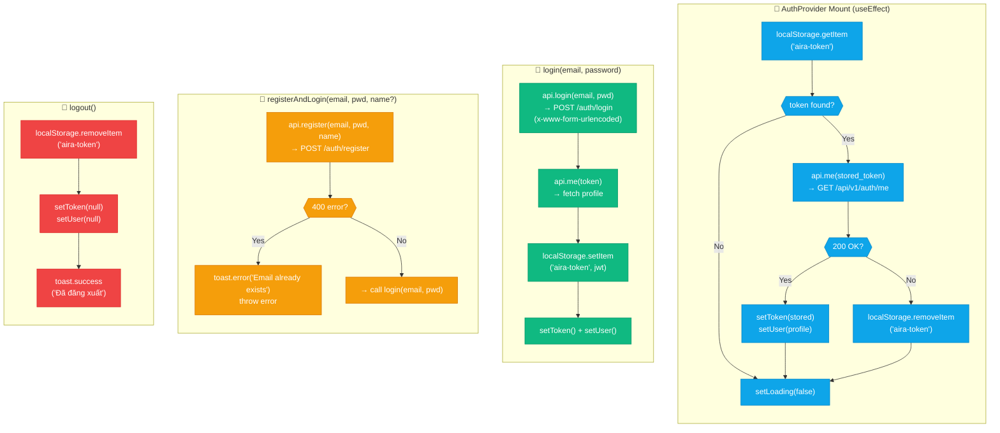

**Memoization**: The context value is wrapped in `useMemo()` — re-renders only when `token`, `user`, `loading`, or callbacks change.

### 9.2 AuthGuard Component

**File**: `components/auth-guard.tsx` (~45 LOC)

| Prop | Type | Default | Effect |
|------|------|---------|--------|
| `children` | `ReactNode` | required | Content to protect |
| `requireAdmin` | `boolean` | `false` | Additional admin role check |

**Guard states:**
1. `loading` → Full-screen Loader2 spinner
2. `!token` → `router.replace("/login")` + render `null`
3. `requireAdmin && user.role !== 'admin'` → `router.replace("/chat")` + render `null`
4. Otherwise → render `children`

### 9.3 Login-to-Chat Redirection Flow

```mermaid
graph LR
    subgraph FLOW["🔄 Complete Auth Flow"]
        direction LR
        Visit["User visits /chat"]
        Guard["AuthGuard<br/>loading: true"]
        CheckLS["Read localStorage<br/>('aira-token')"]
        NoToken{{"token?"}}
        ToLogin["Redirect → /login"]
        LoginForm["LoginPage<br/>email + password"]
        Submit["onSubmit()"]
        AuthAPI["api.login()<br/>→ JWT token"]
        StoreJWT["localStorage<br/>.setItem(token)"]
        FetchMe["api.me(token)<br/>→ User profile"]
        SetState["AuthContext updated<br/>token + user"]
        ToChat["Redirect → /chat"]
        ChatReady["ChatLayout renders<br/>Sidebar + ChatView"]

        Visit --> Guard --> CheckLS --> NoToken
        NoToken -->|"No"| ToLogin --> LoginForm --> Submit --> AuthAPI --> StoreJWT --> FetchMe --> SetState --> ToChat --> ChatReady
        NoToken -->|"Yes"| FetchMe
    end

    %% Styles
    classDef start fill:#6366f1,color:#fff,stroke:#4f46e5
    classDef guard fill:#f59e0b,color:#fff,stroke:#d97706
    classDef auth fill:#10b981,color:#fff,stroke:#059669
    classDef done fill:#3b82f6,color:#fff,stroke:#2563eb

    class Visit,Guard,CheckLS,NoToken guard
    class ToLogin,LoginForm,Submit start
    class AuthAPI,StoreJWT,FetchMe,SetState auth
    class ToChat,ChatReady done
```

---

## 10. Custom Hooks

### 10.1 useAutoScroll

**File**: `lib/useAutoScroll.ts` (~25 LOC)

**Problem**: Naive `scrollIntoView` on every render causes jarring scroll on initial page load or when switching sessions.

**Solution**: Track array length via `useRef`. Only scroll when count **increases** past the initial load.

```typescript
function useAutoScroll(deps: unknown[]): RefObject<HTMLDivElement> {
  const endRef = useRef<HTMLDivElement>(null);
  const countRef = useRef(0);

  useEffect(() => {
    const currentCount = Array.isArray(deps[0]) ? deps[0].length : 0;
    // Only scroll when count INCREASES (not initial load or deletion)
    if (currentCount > countRef.current && countRef.current > 0) {
      endRef.current?.scrollIntoView({ behavior: "smooth" });
    }
    countRef.current = currentCount;
  }, deps);

  return endRef; // Attach to <div ref={endRef} /> sentinel
}
```

| Scenario | countRef.current | currentCount | Scrolls? |
|---|---|---|---|
| Initial load (10 msgs) | 0 | 10 | ❌ (countRef was 0) |
| New message arrives | 10 | 11 | ✅ |
| Delete message | 11 | 10 | ❌ (decreased) |
| Switch session (8 msgs) | 10 | 8 | ❌ (decreased) |

### 10.2 useFileUpload

**File**: `lib/useFileUpload.ts` (~70 LOC)

**Input:** `{ token, sessionId, onSuccess? }`  
**Output:** Object with file state + actions.

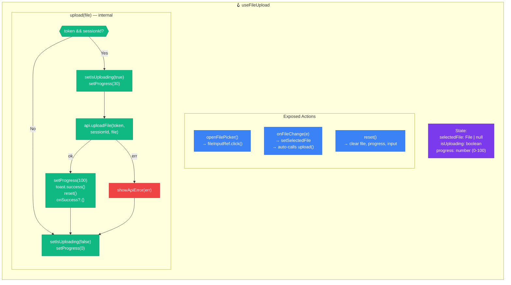

**Accepted file types** (enforced in InputArea `accept` attr):
`.pdf`, `.doc`, `.docx`, `.txt`, `.png`, `.jpg`, `.jpeg`

---

## 11. Theming & Design System

### 11.1 Tailwind CSS v4 Theme Tokens

**File**: `app/globals.css`

AIRA uses Tailwind CSS v4's `@theme` directive to define a complete dual-theme design system:

| Token Category | Light | Dark |
|---|---|---|
| **Background** | `bg-primary: #f9fafb` / `bg-secondary: #f3f4f6` | `dark-bg-primary: #0f0f0f` / `dark-bg-secondary: #171717` |
| **Surface** | `surface: #ffffff` / `surface-hover: #f9fafb` | `dark-surface: #1e1e1e` / `dark-surface-hover: #262626` |
| **Border** | `border: #e5e7eb` / `border-hover: #d1d5db` | `dark-border: #2e2e2e` / `dark-border-hover: #404040` |
| **Text** | `text-primary: #111827` / `secondary: #6b7280` / `tertiary: #9ca3af` | `dark-text-primary: #fafafa` / `secondary: #a1a1aa` / `tertiary: #71717a` |
| **Accent** | `accent: #0b6b53` (teal-green) / `hover: #0f7a5f` | `dark-accent: #10b981` (emerald) / `hover: #34d399` |
| **Danger** | `danger: #dc2626` / `hover: #b91c1c` | Same |

**Typography**: Inter font (Latin + Vietnamese subsets) loaded via `next/font/google` with `display: swap`.

### 11.2 Dark Mode Architecture

**File**: `lib/theme.tsx`

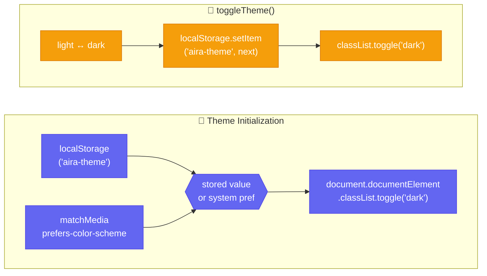

**CSS mechanism**: `html.dark` class toggles `color-scheme: dark`. All components use dual classnames: `bg-surface dark:bg-dark-surface`.

**Custom scrollbar**: 6px width, `border` color thumb, transparent track, dark mode override.

---

## 12. Next.js Configuration

### 12.1 API Proxy Rewrites

**File**: `next.config.mjs`

```javascript
async rewrites() {
  const backend = process.env.NEXT_PUBLIC_API_BASE_URL || "http://localhost:8000";
  return [
    { source: "/api/v1/:path*", destination: `${backend}/api/v1/:path*` },
    { source: "/health",        destination: `${backend}/health` },
  ];
}
```

**Why**: Frontend is served on `:3000`, backend on `:8000`. The rewrite proxy:
- Eliminates CORS issues entirely
- Works seamlessly with ngrok/custom domains (single origin)
- `api.ts` uses `API_BASE = ""` — all requests go to same origin

### 12.2 Hydration Safety

**Problem**: Browser extensions (Grammarly, Bitdefender) inject attributes (`bis_skin_checked`, `data-gr-ext-installed`) into the DOM, causing React hydration mismatches.

**Solution** (in `app/layout.tsx`):
1. `suppressHydrationWarning` on `<html>` and `<body>` tags
2. Inline `<Script strategy="beforeInteractive">` that strips known extension attributes on load, `DOMContentLoaded`, `setTimeout(0)`, and `requestAnimationFrame`

---

## 13. Admin Dashboard

### 13.1 Route Protection

**Files**: `app/admin/layout.tsx`, `components/auth-guard.tsx`

The admin area uses a dedicated layout wrapper that enforces admin-only access:

```tsx
// app/admin/layout.tsx
export default function AdminLayout({ children }) {
  return <AuthGuard requireAdmin>{children}</AuthGuard>;
}
```

`AuthGuard` with `requireAdmin=true` performs a **3-state check**:

| State | Behavior |
|-------|----------|
| `loading` | Full-screen `Loader2` spinner |
| `!token` | Redirect → `/login` |
| `user.role !== 'admin'` | Redirect → `/chat` (non-admin cannot even see the page) |
| Valid admin | Render `children` |

**Self-protection**: The admin dashboard prevents administrators from toggling their own role or deleting their own account (checked via `currentUserId` comparison).

### 13.2 Dashboard Page Architecture

**File**: `app/admin/page.tsx` (~496 LOC)

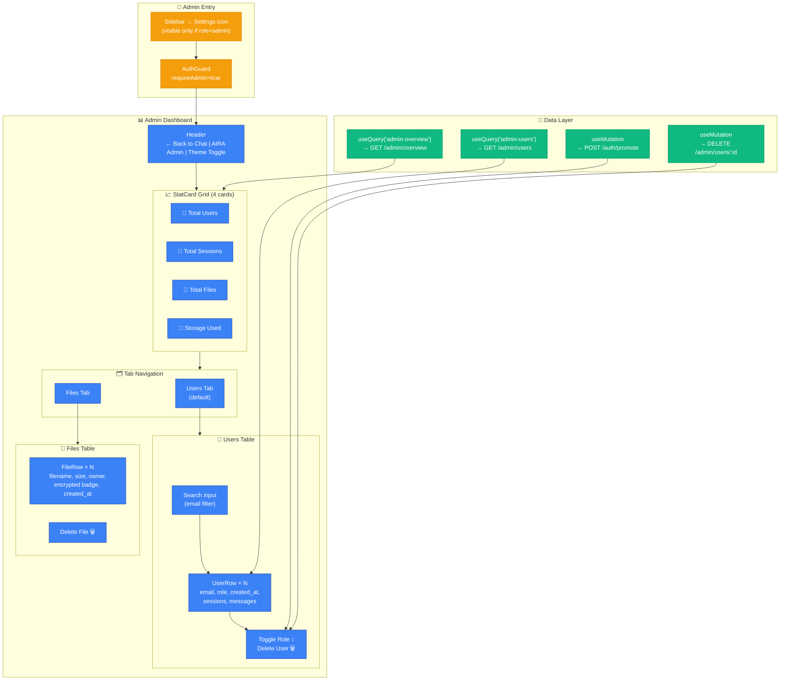

**Key components:**

| Component | Purpose | Props |
|-----------|---------|-------|
| `StatCard` | Displays metric with icon and subtitle | `label`, `value`, `sub`, `icon`, `color` |
| `RoleBadge` | Amber (Admin) or blue (Researcher) pill | `role: UserRole` |
| `UserRow` | Table row with role toggle + delete actions | `user`, `currentUserId`, `onToggleRole`, `isPending` |

**Data fetching**: Uses TanStack React Query with `refetchOnWindowFocus: false`. Mutations call `queryClient.invalidateQueries()` to refresh the overview and user list after role changes or deletions.

---

> **Document generated from codebase analysis** — reflects the state of the frontend application as of 2026-06-06.
